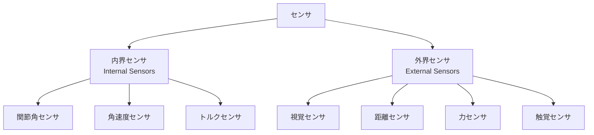
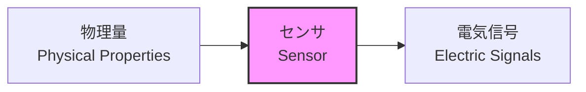
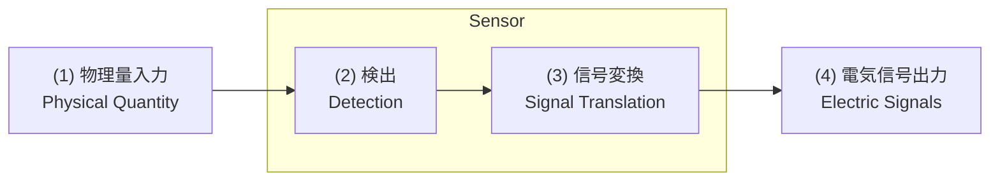
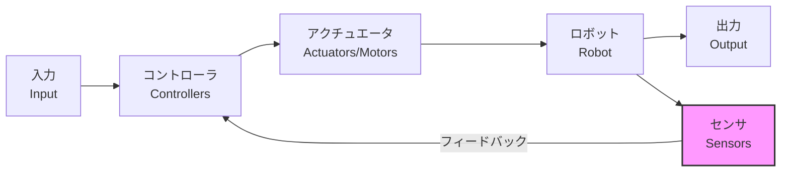

# 第1週：講義概要・センサの基礎

> ⏱️ 読了時間：約30分 | 📝 確認問題：5問

## 学習目標

この週の講義を終えると、以下のことができるようになります：

- [ ] センサの定義と役割を説明できる
- [ ] 内界センサと外界センサを区別できる
- [ ] センサによる物理量変換の原理を理解できる
- [ ] フィードバック制御におけるセンサの役割を説明できる

---

## 1. 講義概要

### 1.1 科目情報

| 項目 | 内容 |
|------|------|
| 科目名 | 計測工学 |
| 科目区分 | 選択 |
| 単位数 | 2単位 |
| 授業形態 | 講義 |
| 担当教員 | 曹 晟 |
| E-mail | cao@bene.fit.ac.jp |

### 1.2 授業概要

計測とは外界および内界の情報を取得・分析し、その状態を知ることです。ロボットシステムを正しく機能させるためには計測技術が不可欠であり、計測に用いるデバイスである**センサ**も多種多様です。

本科目では、ロボットシステムにおけるセンサの役割について、その目的と原理を学びます。

### 1.3 到達目標

| 能力 | 目標 |
|------|------|
| 専門知識 | 広く電気回路、電子材料について知見を深める |
| 課題解決力 | 機械式接触計測と非接触計測の長所・短所を理解し、相補完して利用できる |

### 1.4 成績評価

| 評価項目 | 割合 |
|---------|------|
| 理解度確認テスト・中間試験 | 60% |
| 課題・レポート | 40% |

::: warning 履修上の注意
- 講義時間内に提出するレポートがあります
- PC・スマホなど myFIT への提出ができるデバイスを用意してください
- 提出期限を厳守してください（遅延提出は認められません）
:::

---

## 2. 予備知識：単位系

### 2.1 基本単位

| 単位 | 読み方 | 意味 |
|------|--------|------|
| V | ボルト | 電圧（電位差） |
| A | アンペア | 電流の大きさ |
| N | ニュートン | 力の大きさ |
| s | セカンド | 秒（時間） |

### 2.2 接頭辞

| 記号 | 読み方 | 倍率 |
|------|--------|------|
| p | ピコ | $10^{-12}$ |
| n | ナノ | $10^{-9}$ |
| μ | マイクロ | $10^{-6}$ |
| m | ミリ | $10^{-3}$ |
| k | キロ | $10^{3}$ |
| M | メガ | $10^{6}$ |
| G | ギガ | $10^{9}$ |
| T | テラ | $10^{12}$ |

---

## 3. ロボットとセンサ

### 3.1 なぜセンサを学ぶのか？

ロボットが「見て」「感じて」「動く」ためには、外界の情報を取得する必要があります。
**センサはロボットにとっての「感覚器」** です。

::: tip 💡 ポイント
センサのないロボットにとって、世界は未知すぎる...
:::

### 3.2 ロボット応用事例

以下は、センサを活用したロボットシステムの実例です：

#### ライントレースカー
最もシンプルなセンサ応用例。光センサで線を検出して追従します。

🎬 <a href="https://youtu.be/4aW3TpHLYvY" target="_blank">ライントレースカーの動画</a>

#### つくばチャレンジ
市街地の歩道を自律走行する技術チャレンジ。LiDARやカメラを用いた屋外自律ナビゲーションの実証実験です。

🎬 <a href="https://youtu.be/bDOln9GNpjU" target="_blank">つくばチャレンジの動画</a>

#### マイクロマウス
高速・精密制御が求められる迷路探索ロボット。距離センサとエンコーダを組み合わせて使用します。

🎬 <a href="https://youtu.be/s8R-C5-6AWY" target="_blank">マイクロマウスの動画</a>

#### 自動運転バス（TierIV）
LiDAR、カメラ、GPSなど複数センサの統合（**センサフュージョン**）を実現しています。

#### Amazon物流ロボット
ピンチグリッピングロボットによるeコマース倉庫での自動仕分け。

🎬 <a href="https://youtu.be/7lW1-RkfVcc" target="_blank">Amazon物流ロボットの動画</a>

#### 6D物体姿勢推定によるロボット組立
RGB画像のみから物体の6D姿勢を推定し、組立作業を行います。

🎬 <a href="https://www.youtube.com/watch?v=rH5832ATDBk" target="_blank">6Dロボット組立の動画</a>

#### お片付けロボット（Preferred Networks）
家庭環境での物体認識と操作を実現したロボット。

🎬 <a href="https://youtu.be/204F_uo_huk" target="_blank">お片付けロボットの動画</a>

#### Kachaka（Preferred Robotics）
家庭用自律移動ロボット。

🎬 <a href="https://www.youtube.com/watch?v=pl9vgBEsX80" target="_blank">Kachakaの動画（内閣府公式）</a>

---

## 4. センサとは何か

### 4.1 センサの定義

::: info 定義
**センサ（Sensor）** とは：

> A device which detects or measures a **physical property** and records, indicates, or otherwise **responds** to it.
> 
> — Oxford Advanced Learner's Dictionary

つまり、**Physical property（物理量）を検出または計測して、それを記録したり指し示したりする、もしくはそれに反応する device（装置・素子）** のこと。
:::

### 4.2 センサの分類

#### 内界センサ（Internal Sensors）

ロボットや機械システムの**内部の情報**を計測するセンサ

- 関節角（Joint angle）
- 関節角速度（Angular velocity）
- モータ電流・トルク

#### 外界センサ（External Sensors）

ロボットの**周辺環境の情報**を計測するセンサ

- 視覚（Vision）
- 距離（Range）
- 力（Force）
- 触覚（Tactile）

---

## 5. センサ＝感覚器

### 5.1 人間の五感との対比

ロボットにとってのセンサ ＝ 人間にとっての感覚器（五感）

| 人間の感覚 | 対応するセンサ例 |
|-----------|-----------------|
| 視覚 👁️ | カメラ、光センサ |
| 聴覚 👂 | マイク、超音波センサ |
| 触覚 ✋ | 力センサ、圧力センサ |
| 嗅覚 👃 | ガスセンサ |
| 味覚 👅 | 化学センサ |

::: tip 🧠 脳の感覚マッピング（ホムンクルス）
人間の脳では、体の各部位の感覚・運動に割り当てられる皇質の面積が均等ではありません。手や口など繊細な動きを要する部位ほど、広い皇質領域を占めます。

左が**感覚野**（触覚などの入力）、右が**運動野**（筋肉への出力）。手や唇の領域が特に大きいことがわかります。
:::

### 5.2 人間が持たない感覚

機械的センサであれば、人間には感じられない物理量も検知できます：

- **赤外光**（Infrared）→ 赤外線カメラ
- **紫外線**（Ultraviolet）
- **放射線**（Radiation）
- **磁気**（Magnetism）
- **超音波**（Ultrasonic）
- **近接覚**（Proximity）

::: details 応用例：近接覚を持つロボットハンド
指先の近接覚センサで対象物の表面を追従するようにハンドの指を制御します。

🎬 [すべり・近接覚統合ロボットハンド](https://www.youtube.com/watch?v=_bHomIONCjM)
:::

---

::: details 応用例：赤外線カメラ（FLIR）
人間の目には見えない赤外線（熱）を検出し、温度分布を可視化します。

肌の露出部分（顔・腕）が暖色、衣服や背景が寒色で表示されています。
:::

## 6. センサは物理量の変換装置

### 6.1 物理量変換の原理

センサの本質は**物理量の変換（Translation of physical properties）** です。

### 6.2 入力となる物理量

- 力（Force）
- 距離（Range）
- 速度（Velocity）
- 温度（Temperature）
- 圧力（Pressure）

### 6.3 出力となる物理量

- 電圧（Voltage）
- 抵抗（Resistance）
- インダクタンス（Inductance）
- ひずみ（Strain）
- 磁場（Magnetic field）

### 6.4 変換の具体例

| 入力物理量 | 変換後 | センサ例 |
|-----------|--------|---------|
| 力（Force） | 電圧 | ひずみゲージ |
| 距離（Range） | 電圧/パルス | 測距センサ |
| 温度（Temperature） | 抵抗値 | サーミスタ |
| 回転角（Angle） | パルス | エンコーダ |

---

## 7. センサの動作メカニズム

### 7.1 一般的なセンサの働き

センサの動作は以下の4ステップで構成されます：

1. **物理量が入力される** — 力、温度、距離など
2. **センサ素子がそれを検出** — Sensing elements
3. **何かしらの信号に変換する** — Transducer
4. **電気的信号が出力される** — 電圧、電流、抵抗変化など

---

## 8. メカトロニクスにおけるセンサ

### 8.1 フィードバック制御

センサはフィードバック制御システムの重要な構成要素です。

### 8.2 制御ループの流れ

1. **目標値（入力）** を設定
2. **コントローラ** が指令値を計算
3. **アクチュエータ（モータ）** が動作
4. **ロボット** が動く
5. **センサ** が現在状態を計測
6. 目標値との差を計算 → 2に戻る（フィードバック）

::: warning 注意
フィードバック制御の詳細は第6-7週で学びます。
ここでは概念だけ理解しておきましょう。
:::

---

## 📝 確認問題

### Q1. センサの定義として正しいものは？

- [ ] A. 電力を供給する装置
- [x] B. 物理量を検出・計測して電気信号に変換する装置
- [ ] C. 機械を動かす装置
- [ ] D. データを保存する装置

### Q2. 「エンコーダ」は何を計測するセンサ？

- [ ] A. 力
- [ ] B. 温度
- [x] C. 回転角
- [ ] D. 圧力

### Q3. 内界センサの例として正しいものは？

- [x] A. 関節角センサ
- [ ] B. カメラ
- [ ] C. 距離センサ
- [ ] D. 触覚センサ

### Q4. センサが検知できて人間が感じられないものは？

- [ ] A. 可視光
- [x] B. 赤外線
- [ ] C. 音
- [ ] D. 温度

### Q5. フィードバック制御においてセンサの役割は？

- [ ] A. 目標値を設定する
- [ ] B. モータを駆動する
- [x] C. 現在状態を計測してコントローラに伝える
- [ ] D. 電力を供給する

---

## 📚 次週の予習

- **第2週**: 測定の誤差と精度
- 予習ポイント：正規分布（ガウス分布）の基礎

