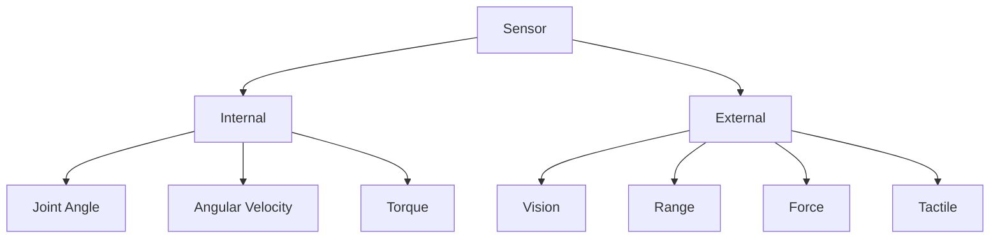
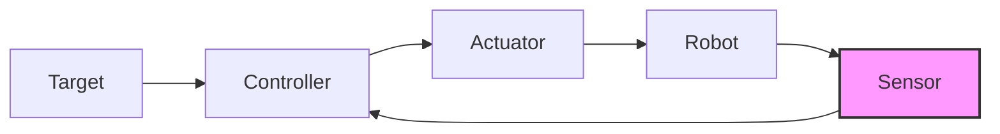

# 第1週：センサの基礎

> ⏱️ 読了時間：約20分 | 📝 確認問題：3問

## 学習目標

この週の講義を終えると、以下のことができるようになります：

- [ ] センサの定義と役割を説明できる
- [ ] 内界センサと外界センサを区別できる
- [ ] 物理量変換の基本概念を理解できる

---

## 1. なぜセンサを学ぶのか？

ロボットが「見て」「感じて」「動く」ためには、外界の情報を取得する必要があります。
センサはロボットにとっての「感覚器」です。

### 🎬 事例：様々なロボット

**ライントレースカー**
- 最もシンプルなセンサ応用例
- 光センサで線を検出

**マイクロマウス**
- 高速・精密制御
- 距離センサ + エンコーダ

**自動運転車**
- LiDAR, カメラ, GPS
- 複数センサの統合（センサフュージョン）

::: tip 💡 ポイント
センサなしでは、ロボットは「目隠しで動く」ようなものです。
:::

---

## 2. センサとは何か

::: info 定義
**センサ（Sensor）** とは、物理量（Physical property）を検出・計測し、それを記録・指示・反応する装置（device）のこと。
:::

### 人間の五感との対比

| 人間の感覚 | 対応するセンサ例 |
|-----------|-----------------|
| 視覚 👁️ | カメラ、光センサ |
| 聴覚 👂 | マイク、超音波センサ |
| 触覚 ✋ | 力センサ、圧力センサ |
| 嗅覚 👃 | ガスセンサ |
| 味覚 👅 | 化学センサ |

### 人間が持たない感覚

機械的センサであれば、人間には感じられない物理量も検知できます：

- 赤外光（Infrared）
- 紫外線（Ultraviolet）
- 放射線（Radiation）
- 磁気（Magnetism）
- 超音波（Ultrasonic）
- 近接覚（Proximity）

---

## 3. センサの分類

### 内界センサ（Internal Sensors）

ロボットや機械システムの**内部状態**を計測するセンサ

- 関節角（Joint angle）
- 角速度（Angular velocity）
- モータ電流

### 外界センサ（External Sensors）

ロボットの**周辺環境**の情報を計測するセンサ

- 視覚（Vision）
- 距離（Range）
- 力（Force）
- 触覚（Tactile）

::: details 🎯 確認クイズ
次のセンサは内界？外界？

1. エンコーダ → **内界**（モータの回転角を計測）
2. カメラ → **外界**（周囲の映像を取得）
3. 力センサ → **外界**（外部からの力を計測）
:::

---

## 4. 物理量の変換

センサの本質は**物理量の変換**です。

$$
\text{入力（物理量）} \xrightarrow{\text{センサ}} \text{出力（電気信号）}
$$

### 変換の例

| 入力物理量 | 変換後 | センサ例 |
|-----------|--------|---------|
| 力（Force） | 電圧 | ひずみゲージ |
| 距離（Range） | 電圧/パルス | 測距センサ |
| 温度（Temperature） | 抵抗値 | サーミスタ |
| 回転角（Angle） | パルス | エンコーダ |

---

## 5. フィードバック制御

センサはフィードバック制御システムの重要な構成要素です。

### 制御ループの流れ

1. **目標値**を設定（例：目標位置）
2. **コントローラ**が指令値を計算
3. **アクチュエータ**（モータ）が動作
4. **センサ**が現在状態を計測
5. 目標値との差を計算 → 2に戻る

::: warning 注意
フィードバック制御の詳細は第6-7週で学びます。
ここでは概念だけ理解しておきましょう。
:::

---

## 📝 確認問題

### Q1. センサの主な役割は？
- [ ] A. 電力を供給する
- [x] B. 物理量を電気信号に変換する
- [ ] C. 機械を動かす

### Q2. 「エンコーダ」は何を計測するセンサ？
- [ ] A. 力
- [ ] B. 温度
- [x] C. 回転角

### Q3. 内界センサの例として正しいものは？
- [x] A. 関節角センサ
- [ ] B. カメラ
- [ ] C. 距離センサ

---

## 📚 次週の予習

- **第2週**: 測定の誤差と精度
- 予習ポイント：正規分布（ガウス分布）の基礎

---

## 📖 参考資料

- 教科書：ロボットセンシング 第1章
- 講義スライド：P.1-33
