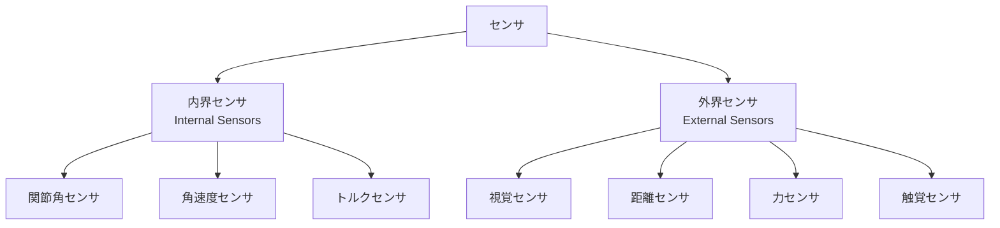
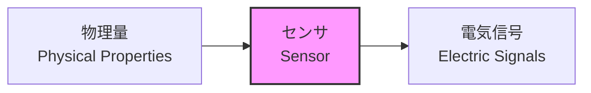
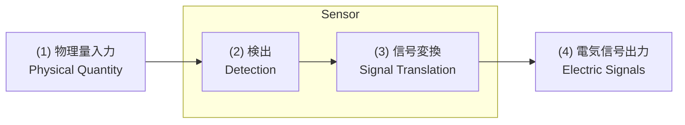
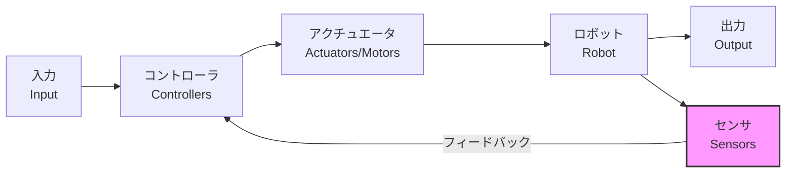

# 第1週：講義概要・センサの基礎

> ⏱️ 読了時間：約35分 | 📝 確認問題：7問 + 単位換算演習 6問

## 学習目標

この週の講義を終えると、以下のことができるようになります：

- [ ] センサの定義と役割を説明できる
- [ ] 内界センサと外界センサを区別できる
- [ ] センサによる物理量変換の原理を理解できる
- [ ] フィードバック制御におけるセンサの役割を説明できる

---

## 1. 講義概要

### 1.1 科目情報

| 項目 | 内容 |
|------|------|
| 科目名 | 計測工学 |
| 科目区分 | 選択 |
| 単位数 | 2単位 |
| 授業形態 | 講義 |
| 担当教員 | 曹 晟 |
| E-mail | cao@bene.fit.ac.jp |

### 1.2 授業概要

計測とは外界および内界の情報を取得・分析し、その状態を知ることです。ロボットシステムを正しく機能させるためには計測技術が不可欠であり、計測に用いるデバイスである**センサ**も多種多様です。

本科目では、ロボットシステムにおけるセンサの役割について、その目的と原理を学びます。

### 1.3 到達目標

| 能力 | 目標 |
|------|------|
| 専門知識 | 広く電気回路、電子材料について知見を深める |
| 課題解決力 | 機械式接触計測と非接触計測の長所・短所を理解し、相補完して利用できる |

### 1.4 成績評価

| 評価項目 | 割合 |
|---------|------|
| 理解度確認テスト・中間試験 | 60% |
| 課題・レポート | 40% |

::: warning 履修上の注意
- 講義時間内に提出するレポートがあります
- PC・スマホなど myFIT への提出ができるデバイスを用意してください
- 提出期限を厳守してください（遅延提出は認められません）
:::

---

## 2. 予備知識：単位系

### 2.1 基本単位

| 単位 | 読み方 | 意味 |
|------|--------|------|
| V | ボルト | 電圧（電位差） |
| A | アンペア | 電流の大きさ |
| N | ニュートン | 力の大きさ |
| s | セカンド | 秒（時間） |

### 2.2 接頭辞

| 記号 | 読み方 | 倍率 |
|------|--------|------|
| p | ピコ | $10^{-12}$ |
| n | ナノ | $10^{-9}$ |
| μ | マイクロ | $10^{-6}$ |
| m | ミリ | $10^{-3}$ |
| k | キロ | $10^{3}$ |
| M | メガ | $10^{6}$ |
| G | ギガ | $10^{9}$ |
| T | テラ | $10^{12}$ |

---

## 3. ロボットとセンサ

### 3.1 🤔 もし感覚を失ったら？

まず、こんな場面を想像してみてください：

> **目を閉じて、厚い手袋をはめて、生卵を割らずにお椀に入れられますか？**

答えは「とても難しい」です。なぜなら：
- **視覚**がないから卵の位置がわからない
- **触覚**がないから力加減ができない
- **フィードバック**（修正）ができない

::: warning 💡 重要な気づき
感覚がなければ、精密な動作は不可能！

**ロボットも同じ**です。センサがなければ「目隠しで作業する」のと同じ状態になります。
:::

### 3.2 なぜセンサを学ぶのか？

ロボットが「見て」「感じて」「動く」ためには、外界の情報を取得する必要があります。

**センサ ＝ ロボットに「感覚」を与える装置**

| 人間の感覚器官 | ロボットのセンサ | 計測対象 |
|:-------------:|:---------------:|:--------:|
| 👁️ 目 | カメラ、LiDAR | 形状、距離、色 |
| 👂 耳 | マイク、超音波 | 音、距離 |
| 🖐️ 皮膚 | 力/圧力センサ | 力、接触 |
| ⚖️ 内耳（前庭） | IMU、ジャイロ | 姿勢、加速度 |
| 🌡️ 皮膚 | 温度センサ | 温度 |

::: tip 💡 ポイント
この授業では、ロボットの「感覚器官」であるセンサの原理と応用を学びます。
:::

### 3.2 ロボット応用事例

以下は、センサを活用したロボットシステムの実例です：

#### ライントレースカー
最もシンプルなセンサ応用例。光センサで線を検出して追従します。

🎬 <a href="https://youtu.be/4aW3TpHLYvY" target="_blank">ライントレースカーの動画</a>

#### マイクロマウス
高速・精密制御が求められる迷路探索ロボット。距離センサ、エンコーダ、ジャイロセンサを組み合わせて使用します。

🎬 <a href="https://youtu.be/s8R-C5-6AWY" target="_blank">マイクロマウスの動画</a>

#### Amazon物流ロボット
倉庫内で対象物を認識し、つかみ、運ぶロボットです。カメラだけでなく、深度情報や力の情報も重要になります。

🎬 <a href="https://youtu.be/7lW1-RkfVcc" target="_blank">Amazon物流ロボットの動画</a>

#### お片付けロボット（Preferred Networks）
家庭環境での物体認識と操作を実現したロボット。整っていない環境でのセンシングの難しさがよくわかります。

🎬 <a href="https://youtu.be/204F_uo_huk" target="_blank">お片付けロボットの動画</a>

#### Kachaka / 自律移動ロボット
家庭や屋内環境で自律移動するロボット。LiDARやSLAMにより、周囲の地図を作りながら自己位置を推定します。

🎬 <a href="https://www.youtube.com/watch?v=pl9vgBEsX80" target="_blank">Kachakaの動画</a>

#### Boston Dynamics Atlas
IMU、力覚センサ、深度カメラを駆使した動的バランス制御。全身の協調運動を実現します。

🎬 <a href="https://youtu.be/fn3KWM1kuAw" target="_blank">Boston Dynamics Atlasの動画</a>

#### 卵を割らずに持つロボット
触覚センサと力センサによる繊細な力制御。センサがなければ卵は割れてしまいます。

🎬 <a href="https://youtu.be/gCBYwC6Bzj0" target="_blank">力制御ロボットの動画</a>

#### 自動運転センサ可視化（Waymo）
LiDAR点群とカメラ画像の**センサフュージョン**をリアルタイムで可視化。複数センサの統合がよくわかります。

🎬 <a href="https://youtu.be/tlThdr3O5Qo" target="_blank">Waymoセンサ可視化の動画</a>

#### ドローン自律飛行（Skydio）
GPS、気圧センサ、超音波、カメラを組み合わせた3次元空間での障害物回避。

🎬 <a href="https://youtu.be/MvRTALJp8DM" target="_blank">Skydio自律飛行の動画</a>

#### 高速ビンピッキング（FANUC）
高速カメラと画像処理による超高速ピッキング。人間を超える視覚処理速度を実現。

🎬 <a href="https://youtu.be/dKGONukkpBs" target="_blank">FANUC高速ピッキングの動画</a>

#### Openarm / 人間動作の教示
人間の動作や作業意図をロボットに移すタイプの自動化事例です。環境を測るだけでなく、人の動きや位置を測ることの重要性も示しています。

🎬 <a href="https://www.youtube.com/watch?v=L9zdlRQgVB4" target="_blank">Openarmの動画</a>

::: tip 📊 第1回PPTと対応したロボット事例
| # | ロボット | 主なセンサ | 学ぶポイント |
|:-:|:---------|:-----------|:------------|
| 1 | ライントレースカー | 光センサ | 最もシンプルなON/OFF判定 |
| 2 | マイクロマウス | 距離＋エンコーダ＋ジャイロ | 複数センサの協調 |
| 3 | Amazon物流 | カメラ＋深度＋力 | 産業応用 |
| 4 | お片付けロボット | 画像認識＋力 | 家庭環境の複雑さ |
| 5 | Kachaka | LiDAR＋SLAM | 自己位置推定 |
| 6 | Boston Dynamics | IMU＋力覚＋深度 | 動的バランス |
| 7 | 卵を持つロボット | 触覚＋力 | 力制御の重要性 |
| 8 | Waymo | LiDAR＋カメラ融合 | センサフュージョン |
| 9 | Skydio | GPS＋気圧＋超音波 | 3次元計測 |
| 10 | FANUC | 高速カメラ | 視覚処理の限界 |
| 11 | Openarm | 視覚＋位置計測 | 人間動作の教示 |
:::

---

## 4. センサとは何か

### 4.1 センサの定義

::: info 定義
**センサ（Sensor）** とは：

> A device which detects or measures a **physical property** and records, indicates, or otherwise **responds** to it.
> 
> — Oxford Advanced Learner's Dictionary

つまり、**Physical property（物理量）を検出または計測して、それを記録したり指し示したりする、もしくはそれに反応する device（装置・素子）** のこと。
:::

### 4.2 センサの分類

```mermaid
graph TD
    A[センサ] --> B[内界センサ<br>Internal Sensors]
    A --> C[外界センサ<br>External Sensors]
    
    B --> D[関節角センサ]
    B --> E[角速度センサ]
    B --> F[トルクセンサ]
    
    C --> G[視覚センサ]
    C --> H[距離センサ]
    C --> I[力センサ]
    C --> J[触覚センサ]
```

#### 内界センサ（Internal Sensors）

ロボットや機械システムの**内部の情報**を計測するセンサ

- 関節角（Joint angle）
- 関節角速度（Angular velocity）
- モータ電流・トルク

#### 外界センサ（External Sensors）

ロボットの**周辺環境の情報**を計測するセンサ

- 視覚（Vision）
- 距離（Range）
- 力（Force）
- 触覚（Tactile）

---

## 5. センサ＝感覚器

### 5.1 人間の五感との対比

ロボットにとってのセンサ ＝ 人間にとっての感覚器（五感）

| 人間の感覚 | 対応するセンサ例 |
|-----------|-----------------|
| 視覚 👁️ | カメラ、光センサ |
| 聴覚 👂 | マイク、超音波センサ |
| 触覚 ✋ | 力センサ、圧力センサ |
| 嗅覚 👃 | ガスセンサ |
| 味覚 👅 | 化学センサ |

### 5.2 🧠 脳の感覚マッピング（ホムンクルス）

人間の脳では、体の各部位の感覚・運動に割り当てられる皮質の面積が均等ではありません。

*出典: Penfield & Rasmussen (1950) "The Cerebral Cortex of Man" - 教育目的で引用*

**なぜ手と口が大きい？**
- **手**：細かい操作が必要 → 神経の密度が高い → 高分解能
- **唇・舌**：繊細な感覚 → 高感度
- **背中**：大まかな感覚でOK → 低密度

::: tip 🔧 工学的な意味
ロボット設計でも同じ考え方を適用します：

| 部位 | 要求精度 | センサ配置 |
|:----:|:-------:|:----------:|
| ロボットハンドの指先 | 高精度 | 高密度・高分解能センサ |
| アームの本体 | 中程度 | 位置センサのみ |
| 台座 | 低精度 | 衝突検知程度 |

**センサの「分解能」と「密度」を用途に応じて配置する**ことが重要です。
:::

### 5.2 人間が持たない感覚

機械的センサであれば、人間には感じられない物理量も検知できます：

- **赤外光**（Infrared）→ 赤外線カメラ
- **紫外線**（Ultraviolet）
- **放射線**（Radiation）
- **磁気**（Magnetism）
- **超音波**（Ultrasonic）
- **近接覚**（Proximity）

::: details 応用例：近接覚を持つロボットハンド
指先の近接覚センサで対象物の表面を追従するようにハンドの指を制御します。

🎬 [すべり・近接覚統合ロボットハンド](https://www.youtube.com/watch?v=_bHomIONCjM)
:::

---

::: details 応用例：赤外線カメラ（FLIR）
人間の目には見えない赤外線（熱）を検出し、温度分布を可視化します。

*出典: FLIR Systems, Inc. - 教育目的で引用*

肌の露出部分（顔・腕）が暖色、衣服や背景が寒色で表示されています。
:::

## 6. センサは物理量の変換装置

### 6.1 物理量変換の原理

センサの本質は**物理量の変換（Translation of physical properties）** です。

```mermaid
graph LR
    A[物理量<br>Physical Properties] --> B[センサ<br>Sensor]
    B --> C[電気信号<br>Electric Signals]
    
    style B fill:#f9f,stroke:#333,stroke-width:2px
```

### 6.2 入力となる物理量

- 力（Force）
- 距離（Range）
- 速度（Velocity）
- 温度（Temperature）
- 圧力（Pressure）

### 6.3 出力となる物理量

- 電圧（Voltage）
- 抵抗（Resistance）
- インダクタンス（Inductance）
- ひずみ（Strain）
- 磁場（Magnetic field）

### 6.4 変換の具体例

| 入力物理量 | 変換後 | センサ例 |
|-----------|--------|---------|
| 力（Force） | 電圧 | ひずみゲージ |
| 距離（Range） | 電圧/パルス | 測距センサ |
| 温度（Temperature） | 抵抗値 | サーミスタ |
| 回転角（Angle） | パルス | エンコーダ |

---

## 7. センサの動作メカニズム

### 7.1 一般的なセンサの働き

センサの動作は以下の4ステップで構成されます：

```mermaid
graph LR
    A["(1) 物理量入力<br>Physical Quantity"] --> B["(2) 検出<br>Detection"]
    B --> C["(3) 信号変換<br>Signal Translation"]
    C --> D["(4) 電気信号出力<br>Electric Signals"]
    
    subgraph Sensor
        B
        C
    end
```

1. **物理量が入力される** — 力、温度、距離など
2. **センサ素子がそれを検出** — Sensing elements
3. **何かしらの信号に変換する** — Transducer
4. **電気的信号が出力される** — 電圧、電流、抵抗変化など

---

## 8. メカトロニクスにおけるセンサ

### 8.1 フィードバック制御

センサはフィードバック制御システムの重要な構成要素です。

```mermaid
graph LR
    A[入力<br>Input] --> B[コントローラ<br>Controllers]
    B --> C[アクチュエータ<br>Actuators/Motors]
    C --> D[ロボット<br>Robot]
    D --> E[出力<br>Output]
    D --> F[センサ<br>Sensors]
    F -->|フィードバック| B
    
    style F fill:#f9f,stroke:#333,stroke-width:2px
```

### 8.2 制御ループの流れ

1. **目標値（入力）** を設定
2. **コントローラ** が指令値を計算
3. **アクチュエータ（モータ）** が動作
4. **ロボット** が動く
5. **センサ** が現在状態を計測
6. 目標値との差を計算 → 2に戻る（フィードバック）

::: warning 注意
フィードバック制御の詳細は第6-7週で学びます。
ここでは概念だけ理解しておきましょう。
:::

---

## 9. 人間 vs ロボット：制御システムの比較

人間の感覚制御とロボットのセンサ制御を対比すると、驚くほど似ていることがわかります：

| 比較項目 | 人間 | ロボット | 計測工学の課題 |
|:--------:|:----:|:--------:|:--------------:|
| **目標設定** | 脳の意図（「水を飲みたい」） | 設定値 Setpoint（座標、力の値） | — |
| **制御中枢** | 大脳皮質 | マイコン / CPU | 信号処理 |
| **信号伝達** | 神経系（生体電気） | 電線 / バス（電圧、デジタル信号） | A/D変換、ノイズ対策 |
| **実行機構** | 筋肉・骨格 | モータ・シリンダ | — |
| **感知（フィードバック）** | 感覚器官（👁️目、🖐️皮膚） | センサ（📷カメラ、⚖️力覚） | **精度・感度・応答性** |

::: tip 💡 計測工学の使命
センサが取得する信号は、ノイズが含まれていたり、非線形だったりします（人間でも強い光で眩しく感じるように）。

**計測工学** ＝ ロボットの「感覚器官」を**正確・高速・安定**に動作させる技術

この授業を通じて、センサの原理と信号処理の基礎を学びましょう。
:::

---

## 10. 授業後の自己復習：単位・接頭語ミニ演習

90分授業では、講義の最後に少し時間を残して、各自で以下の問題に取り組めるようにしておくのがおすすめです。

狙いは、今日学んだ「計測では単位が重要」という話を、そのまま次回以降の数値処理や工学的な計算につなげることです。ここでは、単位換算だけでなく、簡単な体積計算やモーメント計算も組み合わせて確認します。

### 問題1
2500 mV を V に直しなさい。

解答

2500 mV = 2500 × 10^-3 V = 2.5 V

### 問題2
2.5 kN を N に直しなさい。

解答

2.5 kN = 2.5 × 10^3 N = 2500 N

### 問題3
縦 20 cm、横 15 cm、高さ 10 cm の直方体の体積を求めなさい。その後、m^3 に換算しなさい。

解答

体積 = 20 × 15 × 10 = 3000 cm^3
1 cm^3 = 10^-6 m^3 なので、
3000 cm^3 = 3.0 × 10^-3 m^3

### 問題4
半径 5 cm、高さ 12 cm の円柱の体積を求めなさい。ただし、円周率は 3.14 とする。その後、m^3 に換算しなさい。

解答

体積 = 3.14 × 5^2 × 12 = 3.14 × 25 × 12 = 942 cm^3
1 cm^3 = 10^-6 m^3 なので、
942 cm^3 = 9.42 × 10^-4 m^3

### 問題5
長さ 40 cm のレンチの先に 15 N の力を垂直に加えた。このときのモーメントを求めなさい。その後、N·cm と N·m の両方で答えなさい。

解答

M = F × r = 15 × 40 = 600 N·cm
40 cm = 0.40 m より、
M = 15 × 0.40 = 6.0 N·m

### 問題6
長さ 250 mm の棒を m に換算しなさい。その棒の先に 8 N の力を加えたときのモーメントを N·m で求めなさい。

解答

250 mm = 250 × 10^-3 m = 0.25 m
M = F × r = 8 × 0.25 = 2.0 N·m

### 問題7
次のうち、モーメントの単位として正しいものを1つ選びなさい。
- (a) N
- (b) N·m
- (c) kg
- (d) m/s

解答

正解は (b) N·m

::: tip 授業での使い方
- 90分授業の最後に 10〜15分ほど各自で解かせる
- その場で答えを開いて自己採点させる
- 単位換算と簡単な工学計算を結びつけて理解させる
- 間違いが多い場合は、次回冒頭に 3分だけ復習する
:::

## 📚 次週の予習

- **第2週**: 測定の誤差と精度
- 予習ポイント：
  - 誤差とは何か（計測値 − 真値）
  - 系統誤差と偶然誤差の違い
  - 正規分布（ガウス分布）の基礎概念

