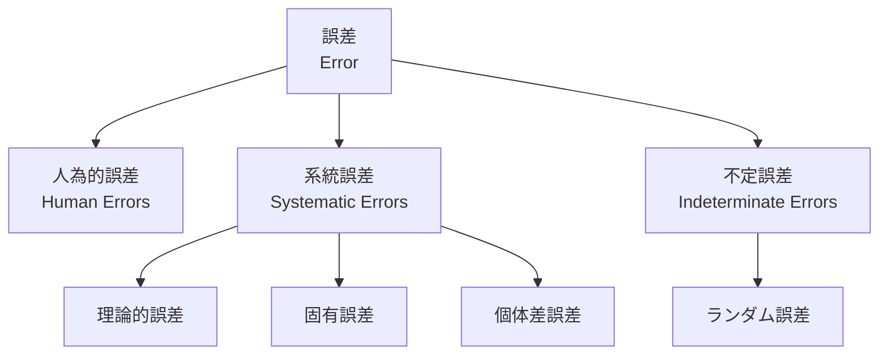

# 第2週：測定の誤差と精度

> ⏱️ 読了時間：約25分 | 📝 確認問題：5問

## 学習目標

この週の講義を終えると、以下のことができるようになります：

- [ ] 誤差の定義を説明できる
- [ ] 誤差の種類（人為的誤差、系統誤差、不定誤差）を区別できる
- [ ] 絶対誤差と相対誤差を計算できる
- [ ] 補正（Correction）と較正（Calibration）の違いを説明できる

---

## 1. この単元での履修内容

- 計測の誤差とその原因
- データの統計的処理（平均、分散、標準偏差）
- 誤差の補正と較正

---

## 2. データの統計的処理

### 2.1 母集団と標本

  <figure style="text-align: center; margin: 0; max-width: 420px;">

    <figcaption style="font-size: 0.85em; color: #666; margin-top: 8px;">味噌汁の例で理解する母集団と標本</figcaption>
  </figure>
  <figure style="text-align: center; margin: 0; max-width: 420px;">

    <figcaption style="font-size: 0.85em; color: #666; margin-top: 8px;">母集団から標本を抽出し、推定する流れ</figcaption>
  </figure>

| 用語 | 定義 | 例 |
|------|------|-----|
| **母集団** | 計測対象の全体 | 味噌汁全体 |
| **標本** | 母集団からランダムに抽出した一部分 | 味見した一口 |
| **推定** | 標本の特性から母集団の特性を予想する | 味見から全体の味を判断 |

### 2.2 標本の注意点

::: warning ⚠️ 重要
標本は母集団から「**無作為**」に抽出されていなければならない！
:::

**良い標本の条件**：
- 母集団から無作為（ランダム）に抽出されている
- 標本の特性が母集団全体の特性を適切に示している

**悪い例**：
- 全国の大学生の特性を調べたいのに、福岡県在住の学生だけを調査
- 味噌汁の味を確認したいのに、上澄みだけを味見（→ よくかき混ぜてから！）

---

## 3. 誤差（Error）とは

### 3.1 誤差の定義

::: info 定義
**誤差（Error）** ＝ 計測値 − 真値

つまり、「**計測されるべき値**」と「**実際に計測された値**」とのずれ
:::

$$
\text{誤差} = \text{計測値} - \text{真値}
$$

::: tip 💡 ポイント
誤差の生じない計測は**ほぼ不可能**です。
誤差が生じることを前提に考えましょう。
:::

### 3.2 誤差の分類

---

## 4. 誤差の種類

### 4.1 人為的誤差（Human Errors）

計測する**人間に原因がある**誤差。気をつければ小さくできる（ゼロにはできない）。

| 種類 | 説明 | 例 |
|------|------|-----|
| **読み間違い** | 計測器の値を誤って読む | レンジの勘違い、目盛りの数え間違い |
| **記録間違い** | 計測値を誤って記録する | 共同実験での伝達ミス |

::: warning 注意
完全になくすのはたぶん無理ですが、
- 丁寧に確認する
- できれば二人以上で確認する

ことで最小限に抑えられます。
:::

### 4.2 系統誤差（Systematic Errors）

発生原因がわかっている、**原理上避けられない誤差**。

| 種類 | 説明 | 例 |
|------|------|-----|
| **理論的誤差** | 理論計算によって補正可能 | 計測器の熱膨張 |
| **固有誤差** | 計測器固有の誤差 | ダイヤルの不連続（歯車のピッチ） |
| **個体差誤差** | 計測器・装置ごとの差 | 同じ型番でも個体によって異なる |

### 4.3 不定誤差（Indeterminate Errors）/ ランダム誤差

原因が特定できない、**不確定要素による誤差**。

- 何らかの小さな原因が多数重なり合って不規則に生じる
- 機械要素の摩擦
- 温度・大気圧の変化など

::: danger ⚠️ 注意
避けようのない誤差ではありますが、安易に「これが原因」と言ってしまうのは問題です。まず系統誤差や人為的誤差の可能性を検討しましょう。
:::

---

## 5. 確度と精度 (Accuracy vs Precision)

::: danger 重要
<strong>確度（Accuracy）</strong>と<strong>精度（Precision）</strong>は異なる概念です！混同しないよう注意しましょう。
:::

| 用語 | 英語 | 意味 |
|-----|------|------|
| **確度** | Accuracy | 計測値が**真の値にどれだけ近いか**（偏りがないか） |
| **精度** | Precision | 計測値の**ばらつきがどれだけ小さいか**（再現性があるか） |

### 図解：的（ターゲット）の例

  

    <svg viewBox="0 0 100 100" width="120" height="120">
      <circle cx="50" cy="50" r="45" fill="#f0f0f0" stroke="#333" stroke-width="2"/>
      <circle cx="50" cy="50" r="30" fill="#ddd" stroke="#333" stroke-width="1"/>
      <circle cx="50" cy="50" r="15" fill="#ff6b6b" stroke="#333" stroke-width="1"/>
      <circle cx="50" cy="50" r="4" fill="#cc0000"/>
      <circle cx="52" cy="48" r="3" fill="#2c3e50"/>
      <circle cx="49" cy="53" r="3" fill="#2c3e50"/>
      <circle cx="48" cy="47" r="3" fill="#2c3e50"/>
      <circle cx="53" cy="51" r="3" fill="#2c3e50"/>
    </svg>
    
確度：高 精度：高

    
理想的な状態

  

  

    <svg viewBox="0 0 100 100" width="120" height="120">
      <circle cx="50" cy="50" r="45" fill="#f0f0f0" stroke="#333" stroke-width="2"/>
      <circle cx="50" cy="50" r="30" fill="#ddd" stroke="#333" stroke-width="1"/>
      <circle cx="50" cy="50" r="15" fill="#ff6b6b" stroke="#333" stroke-width="1"/>
      <circle cx="50" cy="50" r="4" fill="#cc0000"/>
      <circle cx="25" cy="30" r="3" fill="#2c3e50"/>
      <circle cx="28" cy="27" r="3" fill="#2c3e50"/>
      <circle cx="26" cy="24" r="3" fill="#2c3e50"/>
      <circle cx="29" cy="31" r="3" fill="#2c3e50"/>
    </svg>
    
確度：低 精度：高

    
系統誤差が大きい

  

  

    <svg viewBox="0 0 100 100" width="120" height="120">
      <circle cx="50" cy="50" r="45" fill="#f0f0f0" stroke="#333" stroke-width="2"/>
      <circle cx="50" cy="50" r="30" fill="#ddd" stroke="#333" stroke-width="1"/>
      <circle cx="50" cy="50" r="15" fill="#ff6b6b" stroke="#333" stroke-width="1"/>
      <circle cx="50" cy="50" r="4" fill="#cc0000"/>
      <circle cx="50" cy="20" r="3" fill="#2c3e50"/>
      <circle cx="25" cy="65" r="3" fill="#2c3e50"/>
      <circle cx="75" cy="45" r="3" fill="#2c3e50"/>
      <circle cx="45" cy="80" r="3" fill="#2c3e50"/>
    </svg>
    
確度：高 精度：低

    
不定誤差が大きい

  

  

    <svg viewBox="0 0 100 100" width="120" height="120">
      <circle cx="50" cy="50" r="45" fill="#f0f0f0" stroke="#333" stroke-width="2"/>
      <circle cx="50" cy="50" r="30" fill="#ddd" stroke="#333" stroke-width="1"/>
      <circle cx="50" cy="50" r="15" fill="#ff6b6b" stroke="#333" stroke-width="1"/>
      <circle cx="50" cy="50" r="4" fill="#cc0000"/>
      <circle cx="75" cy="25" r="3" fill="#2c3e50"/>
      <circle cx="85" cy="40" r="3" fill="#2c3e50"/>
      <circle cx="65" cy="15" r="3" fill="#2c3e50"/>
      <circle cx="90" cy="20" r="3" fill="#2c3e50"/>
    </svg>
    
確度：低 精度：低

    
最も悪い状態

  

---
## 6. 正規分布（ガウス分布）

### 6.1 正規分布の特徴

標本に偏りが少ない場合、計測値は**正規分布**する傾向があります。

  <svg viewBox="0 0 400 200" width="100%" max-width="500" style="background: #fdfdfd; border-radius: 8px; padding: 10px;">
    <line x1="50" y1="160" x2="350" y2="160" stroke="#aaa" stroke-width="1.5" />
    <path d="M 50 160 C 100 160, 150 155, 170 120 C 185 60, 195 20, 200 20 C 205 20, 215 60, 230 120 C 250 155, 300 160, 350 160" fill="none" stroke="#3498db" stroke-width="3" />
    <line x1="200" y1="20" x2="200" y2="160" stroke="#e74c3c" stroke-width="2" stroke-dasharray="5,5" />
    <text x="200" y="175" text-anchor="middle" font-family="sans-serif" font-size="14" fill="#e74c3c">μ (平均)</text>
    <line x1="160" y1="90" x2="160" y2="160" stroke="#95a5a6" stroke-width="1" stroke-dasharray="3,3" />
    <text x="160" y="175" text-anchor="middle" font-family="sans-serif" font-size="12" fill="#7f8c8d">-1σ</text>
    <line x1="240" y1="90" x2="240" y2="160" stroke="#95a5a6" stroke-width="1" stroke-dasharray="3,3" />
    <text x="240" y="175" text-anchor="middle" font-family="sans-serif" font-size="12" fill="#7f8c8d">+1σ</text>
    <path d="M 160 100 Q 200 120 240 100" fill="none" stroke="#2ecc71" stroke-width="1.5" />
    <text x="200" y="115" text-anchor="middle" font-family="sans-serif" font-size="12" font-weight="bold" fill="#27ae60">約 68.3%</text>
  </svg>

**正規分布の特徴**：
- 平均値付近の出現頻度が高い
- ばらつきが平均値に対して左右対称

$$
f(x) = \frac{1}{\sqrt{2\pi\sigma^2}} \exp\left(-\frac{(x-\mu)^2}{2\sigma^2}\right)
$$

ここで：
- $\mu$：平均値
- $\sigma$：標準偏差
- $\sigma^2$：分散

### 6.2 正規分布の性質

| 範囲 | 含まれるデータの割合 |
|------|---------------------|
| $\mu \pm 1\sigma$ | 約 68.3% |
| $\mu \pm 2\sigma$ | 約 95.4% |
| $\mu \pm 3\sigma$ | 約 99.7% |

---

## 7. 誤差の補正

### 7.1 補正（Correction）

::: info 定義
**Correction**：原因のわかっている誤差を補正（修正）すること
:::

系統誤差によって、計測前からあらかじめ**ずれることがわかっている**場合、その分の値を動かします。

$$
\text{補正後の値} = \text{計測値} - \text{オフセット}
$$

**オフセット（offset）**：ずれ量

### 7.2 較正（Calibration）/ キャリブレーション

::: info 定義
**Calibration**：計測器の較正をすること。計測値と出力値の関係を調べる。
:::

**例：カメラのキャリブレーション**

カメラの歪みの影響を確認するため、寸法と形状のわかっているチェッカーボードを撮影し、画像中での映りを確認・補正します。

**例：力センサ（Flexiforce）のキャリブレーション**

既知の荷重を加えて、出力電圧との関係を調べます。

| 荷重 (N) | 出力電圧 (V) |
|---------|-------------|
| 0 | 0.0 |
| 1 | 0.5 |
| 2 | 1.0 |
| 3 | 1.5 |

### 7.3 補正と改ざんの違い

::: danger ⚠️ 重要な違い

| | 補正（Correction）😉 | 改ざん（Falsification）😱 |
|--|---------------------|-------------------------|
| 定義 | ずれの**原因がわかっていて**、その分を修正する | 原因は**わからないけど**、期待値からずれているのでなかったことにする |
| 正当性 | ✅ 正当な科学的手続き | ❌ 不正行為 |

**計測された値が事実です。都合よく解釈してはいけません。**
:::

---

## 8. 補正の重要性

### 8.1 誤差をできるだけ避けるために

1. **人為的誤差を減らす**
   - 丁寧かつ繰り返し確認
   - できれば二人以上で確認

2. **計測器を較正する**
   - 基準となるゼロ点がずれていないか確認
   - 定期的にキャリブレーションを行う

3. **偶然誤差のバラツキを把握する**
   - 複数回計測して分散を確認
   - 標準偏差を計算

---

## 9. 絶対誤差と相対誤差

### 9.1 絶対誤差

::: info 定義
**絶対誤差**：真値 $T$ に対する計測値 $M$ の誤差の絶対値

$$
\text{絶対誤差} = |M - T|
$$
:::

**例**：真値 1m に対する計測値 0.99m → 絶対誤差 = **0.01m**

### 9.2 相対誤差

::: info 定義
**相対誤差**：真値に対する絶対誤差の割合

$$
\text{相対誤差} = \frac{|M - T|}{T} \times 100\%
$$
:::

**例**：真値 1m に対する絶対誤差 0.01m → 相対誤差 = **1%**

### 9.3 計算例

| 真値 | 計測値 | 絶対誤差 | 相対誤差 |
|------|--------|---------|---------|
| 1 m | 0.99 m | 0.01 m | 1% |
| 100 m | 99 m | 1 m | 1% |
| 10 mm | 9.5 mm | 0.5 mm | 5% |

---

## 📝 確認問題

### Q1. 誤差の定義として正しいものは？

- [ ] A. 計測値そのもの
- [x] B. 計測値と真値の差
- [ ] C. 計測器の精度
- [ ] D. 計測回数

### Q2. 「計測器の熱膨張による誤差」は何に分類される？

- [ ] A. 人為的誤差
- [x] B. 系統誤差（理論的誤差）
- [ ] C. 不定誤差
- [ ] D. ランダム誤差

### Q3. キャリブレーション（Calibration）の目的は？

- [ ] A. 誤差をなくす
- [x] B. 計測器の計測値と出力値の関係を調べる
- [ ] C. 計測を自動化する
- [ ] D. データを保存する

### Q4. 真値10m、計測値9.8mのとき、相対誤差は？

- [ ] A. 0.2m
- [ ] B. 0.2%
- [x] C. 2%
- [ ] D. 20%

### Q5. 正規分布において、μ±2σの範囲に含まれるデータの割合は約？

- [ ] A. 68%
- [x] B. 95%
- [ ] C. 99%
- [ ] D. 100%

---

## 📚 次週の予習

- **第3週**: 計測データの統計的処理(1)：平均と分散、最小二乗法
- 予習ポイント：平均、分散、標準偏差の計算方法

