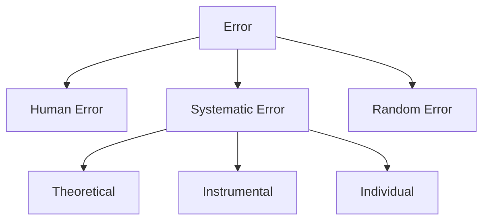

# 第2週：測定の誤差と精度

> ⏱️ 読了時間：約25分 | 📝 確認問題：4問

## 学習目標

- [ ] 誤差の種類（系統誤差・不定誤差）を分類できる
- [ ] 確度（accuracy）と精度（precision）の違いを説明できる
- [ ] 誤差の原因を特定できる

---

## 1. 計測における誤差とは

どんなに注意深く測定しても、**真の値**と**測定値**には必ず差が生じます。
この差を**誤差（Error）**と呼びます。

$$
\text{誤差} = \text{測定値} - \text{真の値}
$$

---

## 2. 誤差の分類



### 2.1 人為的誤差

測定者のミスによる誤差
- 目盛りの読み間違い
- 測定方法の誤り
- 記録ミス

### 2.2 系統誤差（Systematic Error）

測定のたびに**同じ方向**に生じる誤差

| 種類 | 説明 | 例 |
|-----|------|---|
| 理論的誤差 | 測定原理の限界 | 近似式の使用 |
| 固有誤差 | 測定器の特性 | ゼロ点のずれ |
| 個体差誤差 | 機器ごとの違い | 校正のばらつき |

### 2.3 不定誤差（Random Error）

測定のたびに**ランダム**に生じる誤差
- 環境変動（温度、振動）
- 電気的ノイズ
- 予測不可能な要因

---

## 3. 確度と精度

::: danger 重要
**確度（Accuracy）**と**精度（Precision）**は異なる概念です！
:::

| 用語 | 英語 | 意味 |
|-----|------|------|
| 確度 | Accuracy | 真の値にどれだけ近いか |
| 精度 | Precision | 測定値のばらつきの小ささ |

### 図示による理解

```
確度高・精度高    確度高・精度低    確度低・精度高    確度低・精度低
    ●               ● ●             ●●●              ● ●
   ●●●               ●              ●●●●               ●
    ●               ●  ●                              ●  ●
   [◎]              [◎]             [ ]◎             [ ]  ◎
```

---

## 4. 正規分布

測定を繰り返すと、不定誤差は**正規分布（ガウス分布）**に従います。

$$
f(x) = \frac{1}{\sqrt{2\pi}\sigma} e^{-\frac{(x-\mu)^2}{2\sigma^2}}
$$

- $\mu$：平均値
- $\sigma$：標準偏差

---

## 📝 確認問題

### Q1. 測定器のゼロ点がずれていることによる誤差は？
- [ ] A. 人為的誤差
- [x] B. 系統誤差
- [ ] C. 不定誤差

### Q2. 「精度が高い」とはどういう意味？
- [ ] A. 真の値に近い
- [x] B. ばらつきが小さい
- [ ] C. 測定が速い

---

## 📖 参考資料

- 教科書：ロボットセンシング 第2章
- 講義スライド：P.34-49
