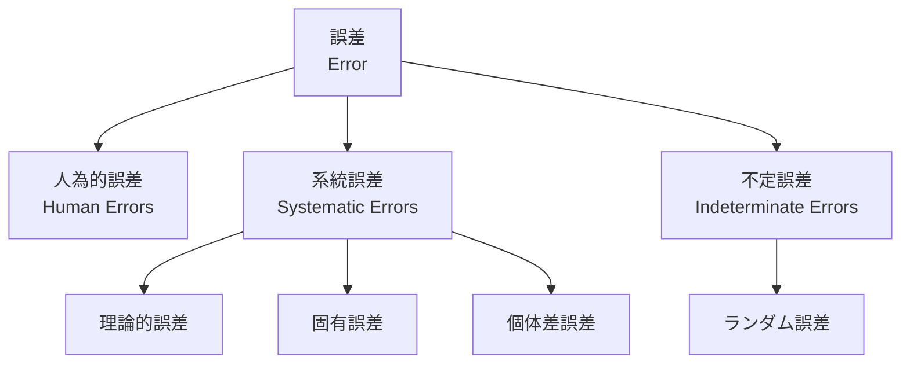

# 第2週：測定の誤差と精度

> ⏱️ 読了時間：約25分 | 📝 確認問題：5問

## 学習目標

この週の講義を終えると、以下のことができるようになります：

- [ ] 誤差の定義を説明できる
- [ ] 誤差の種類（人為的誤差、系統誤差、不定誤差）を区別できる
- [ ] 絶対誤差と相対誤差を計算できる
- [ ] 補正（Correction）と較正（Calibration）の違いを説明できる

---

## 1. この単元での履修内容

- 計測の誤差とその原因
- データの統計的処理（平均、分散、標準偏差）
- 誤差の補正と較正

---

## 2. データの統計的処理

### 2.1 母集団と標本

  <figure style="text-align: center; margin: 0; max-width: 420px;">

    <figcaption style="font-size: 0.85em; color: #666; margin-top: 8px;">味噌汁の例で理解する母集団と標本</figcaption>
  </figure>
  <figure style="text-align: center; margin: 0; max-width: 420px;">

    <figcaption style="font-size: 0.85em; color: #666; margin-top: 8px;">母集団から標本を抽出し、推定する流れ</figcaption>
  </figure>

| 用語 | 定義 | 例 |
|------|------|-----|
| **母集団** | 計測対象の全体 | 味噌汁全体 |
| **標本** | 母集団からランダムに抽出した一部分 | 味見した一口 |
| **推定** | 標本の特性から母集団の特性を予想する | 味見から全体の味を判断 |

### 2.2 標本の注意点

::: warning ⚠️ 重要
標本は母集団から「**無作為**」に抽出されていなければならない！
:::

**良い標本の条件**：
- 母集団から無作為（ランダム）に抽出されている
- 標本の特性が母集団全体の特性を適切に示している

**悪い例**：
- 全国の大学生の特性を調べたいのに、福岡県在住の学生だけを調査
- 味噌汁の味を確認したいのに、上澄みだけを味見（→ よくかき混ぜてから！）

<svg viewBox="0 0 420 240" width="100%" style="max-width: 420px; background: #fdfdfd; border-radius: 8px;">
  <ellipse cx="210" cy="120" rx="200" ry="100" fill="#e8f4fd" stroke="#3498db" stroke-width="2"/>
  <text x="210" y="35" text-anchor="middle" font-family="sans-serif" font-size="13" fill="#2980b9" font-weight="bold">全国の大学生</text>
  <ellipse cx="210" cy="130" rx="140" ry="70" fill="#fef9e7" stroke="#f39c12" stroke-width="2"/>
  <text x="210" y="75" text-anchor="middle" font-family="sans-serif" font-size="12" fill="#e67e22" font-weight="bold">福岡県在住の学生</text>
  <ellipse cx="210" cy="140" rx="80" ry="40" fill="#fdedec" stroke="#e74c3c" stroke-width="2"/>
  <text x="210" y="135" text-anchor="middle" font-family="sans-serif" font-size="11" fill="#c0392b" font-weight="bold">福岡工業大学</text>
  <!-- 工業大学なので男子が多いことを示す -->
  <text x="185" y="155" text-anchor="middle" font-family="sans-serif" font-size="9" fill="#7f8c8d">男男男男男女</text>
  <!-- 矢印を福岡工業大学の円に向ける -->
  <line x1="320" y1="140" x2="295" y2="140" stroke="#e74c3c" stroke-width="2" marker-end="url(#arrowhead)"/>
  <defs>
    <marker id="arrowhead" markerWidth="10" markerHeight="7" refX="9" refY="3.5" orient="auto">
      <polygon points="0 0, 10 3.5, 0 7" fill="#e74c3c"/>
    </marker>
  </defs>
  <text x="340" y="125" text-anchor="start" font-family="sans-serif" font-size="10" fill="#e74c3c">ここだけ</text>
  <text x="340" y="140" text-anchor="start" font-family="sans-serif" font-size="10" fill="#e74c3c">調べても</text>
  <text x="340" y="155" text-anchor="start" font-family="sans-serif" font-size="10" fill="#e74c3c">「全国」は</text>
  <text x="340" y="170" text-anchor="start" font-family="sans-serif" font-size="10" fill="#e74c3c">わからない！</text>
</svg>

---

## 3. 誤差（Error）とは

### 3.1 誤差の定義

::: info 定義
**誤差（Error）** ＝ 計測値 − 真値

つまり、「**計測されるべき値**」と「**実際に計測された値**」とのずれ
:::

$$
\text{誤差} = \text{計測値} - \text{真値}
$$

::: tip 💡 ポイント
誤差の生じない計測は**ほぼ不可能**です。
誤差が生じることを前提に考えましょう。
:::

### 3.2 誤差の分類

```mermaid
graph TD
    A["誤差<br/>Error"] --> B["人為的誤差<br/>Human Errors"]
    A --> C["系統誤差<br/>Systematic Errors"]
    A --> D["不定誤差<br/>Indeterminate Errors"]
    C --> E[理論的誤差]
    C --> F[固有誤差]
    C --> G[個体差誤差]
    D --> H[ランダム誤差]
```

---

## 4. 誤差の種類

### 4.1 人為的誤差（Human Errors）

計測する**人間に原因がある**誤差。気をつければ小さくできる（ゼロにはできない）。

| 種類 | 説明 | 例 |
|------|------|-----|
| **読み間違い** | 計測器の値を誤って読む | レンジの勘違い、目盛りの数え間違い |
| **記録間違い** | 計測値を誤って記録する | 共同実験での伝達ミス |

::: warning 注意
完全になくすのはたぶん無理ですが、
- 丁寧に確認する
- できれば二人以上で確認する

ことで最小限に抑えられます。
:::

### 4.1.1 人間の測定とセンサの測定

計測では、「**人間も間違えるし、センサも間違える**」という視点で誤差を考えることが大切です。

| 測定者 | 典型的な誤差の原因 | 具体例 |
|--------|------------------|--------|
| **人間** | 読み間違い、視差、集中力の低下、個人差 | 目盛りの読み違い、角度による見え方の違い |
| **センサ** | ノイズ、温度ドリフト、回路のずれ | 電気的雑音、ゼロ点ずれ、環境変動 |

::: tip 💡 ポイント
人間だから誤差が出るのではなく、**どんな計測システムでも誤差は出る**、という前提が計測工学では重要です。
:::

### 4.2 系統誤差（Systematic Errors）

発生原因がわかっている、**原理上避けられない誤差**。

| 種類 | 説明 | 例 |
|------|------|-----|
| **理論的誤差** | 理論計算によって補正可能 | 計測器の熱膨張 |
| **固有誤差** | 計測器固有の誤差 | ダイヤルの不連続（歯車のピッチ） |
| **個体差誤差** | 計測器・装置ごとの差 | 同じ型番でも個体によって異なる |

### 4.3 不定誤差（Indeterminate Errors）/ ランダム誤差

原因が特定できない、**不確定要素による誤差**。

- 何らかの小さな原因が多数重なり合って不規則に生じる
- 機械要素の摩擦
- 温度・大気圧の変化など

不定誤差には、次のような具体例があります。

- **電気ノイズ**：電源や周囲の電磁波による乱れ
- **量子化誤差**：アナログ値をデジタル化するときの丸めによるずれ
- **環境変動**：振動、気流、温度変化など
- **読み取りのばらつき**：人の判断のゆれ

::: tip 補足
偶然誤差は完全にはなくせませんが、**複数回計測して平均を取る**ことで影響を小さくできます。標本数が十分に多い場合、計測値は正規分布に近づくことが多いです。
:::

::: danger ⚠️ 注意
避けようのない誤差ではありますが、安易に「これが原因」と言ってしまうのは問題です。まず系統誤差や人為的誤差の可能性を検討しましょう。
:::

---

## 5. 確度と精度 (Accuracy vs Precision)

::: danger 重要
<strong>確度（Accuracy）</strong>と<strong>精度（Precision）</strong>は異なる概念です！混同しないよう注意しましょう。
:::

| 用語 | 英語 | 意味 |
|-----|------|------|
| **確度** | Accuracy | 計測値が**真の値にどれだけ近いか**（偏りがないか） |
| **精度** | Precision | 計測値の**ばらつきがどれだけ小さいか**（再現性があるか） |

### 図解：的（ターゲット）の例

  

    <svg viewBox="0 0 100 100" width="130" height="130">
      
      <circle cx="50" cy="50" r="45" fill="#f0f0f0" stroke="#333" stroke-width="2"/>
      <circle cx="50" cy="50" r="30" fill="#ddd" stroke="#333" stroke-width="1"/>
      <circle cx="50" cy="50" r="15" fill="#ff6b6b" stroke="#333" stroke-width="1"/>
      <circle cx="50" cy="50" r="4" fill="#cc0000"/>
      <circle cx="52" cy="48" r="3" fill="#27ae60" class="shot1a"/>
      <circle cx="49" cy="53" r="3" fill="#27ae60" class="shot2a"/>
      <circle cx="48" cy="47" r="3" fill="#27ae60" class="shot3a"/>
      <circle cx="53" cy="51" r="3" fill="#27ae60" class="shot4a"/>
    </svg>
    
確度：高 精度：高

    
理想的な状態 ✨

  

  

    <svg viewBox="0 0 100 100" width="130" height="130">
      
      <circle cx="50" cy="50" r="45" fill="#f0f0f0" stroke="#333" stroke-width="2"/>
      <circle cx="50" cy="50" r="30" fill="#ddd" stroke="#333" stroke-width="1"/>
      <circle cx="50" cy="50" r="15" fill="#ff6b6b" stroke="#333" stroke-width="1"/>
      <circle cx="50" cy="50" r="4" fill="#cc0000"/>
      <circle cx="25" cy="30" r="3" fill="#e67e22" class="shot1b"/>
      <circle cx="28" cy="27" r="3" fill="#e67e22" class="shot2b"/>
      <circle cx="26" cy="24" r="3" fill="#e67e22" class="shot3b"/>
      <circle cx="29" cy="31" r="3" fill="#e67e22" class="shot4b"/>
      <!-- 平均点を示す -->
      <circle cx="27" cy="28" r="5" fill="none" stroke="#e67e22" stroke-width="1" stroke-dasharray="2,2"/>
      <text x="27" y="40" text-anchor="middle" font-size="6" fill="#e67e22">平均</text>
    </svg>
    
確度：低 精度：高

    
系統誤差が大きい

  

  

    <svg viewBox="0 0 100 100" width="130" height="130">
      
      <circle cx="50" cy="50" r="45" fill="#f0f0f0" stroke="#333" stroke-width="2"/>
      <circle cx="50" cy="50" r="30" fill="#ddd" stroke="#333" stroke-width="1"/>
      <circle cx="50" cy="50" r="15" fill="#ff6b6b" stroke="#333" stroke-width="1"/>
      <circle cx="50" cy="50" r="4" fill="#cc0000"/>
      <circle cx="50" cy="20" r="3" fill="#3498db" class="shot1c"/>
      <circle cx="25" cy="65" r="3" fill="#3498db" class="shot2c"/>
      <circle cx="75" cy="45" r="3" fill="#3498db" class="shot3c"/>
      <circle cx="45" cy="80" r="3" fill="#3498db" class="shot4c"/>
      <!-- 平均点を示す（中心付近） -->
      <circle cx="49" cy="52" r="5" fill="none" stroke="#3498db" stroke-width="1" stroke-dasharray="2,2"/>
      <text x="49" y="62" text-anchor="middle" font-size="6" fill="#3498db">平均</text>
    </svg>
    
確度：高 精度：低

    
不定誤差が大きい

  

  

    <svg viewBox="0 0 100 100" width="130" height="130">
      
      <circle cx="50" cy="50" r="45" fill="#f0f0f0" stroke="#333" stroke-width="2"/>
      <circle cx="50" cy="50" r="30" fill="#ddd" stroke="#333" stroke-width="1"/>
      <circle cx="50" cy="50" r="15" fill="#ff6b6b" stroke="#333" stroke-width="1"/>
      <circle cx="50" cy="50" r="4" fill="#cc0000"/>
      <circle cx="75" cy="25" r="3" fill="#c0392b" class="shot1d"/>
      <circle cx="85" cy="40" r="3" fill="#c0392b" class="shot2d"/>
      <circle cx="65" cy="15" r="3" fill="#c0392b" class="shot3d"/>
      <circle cx="90" cy="20" r="3" fill="#c0392b" class="shot4d"/>
    </svg>
    
確度：低 精度：低

    
最も悪い状態 ⚠️

  

---
## 6. 正規分布（ガウス分布）

### 6.1 正規分布の特徴

標本に偏りが少ない場合、計測値は**正規分布**する傾向があります。

  <svg viewBox="0 0 400 200" width="100%" max-width="500" style="background: #fdfdfd; border-radius: 8px; padding: 10px;">
    <line x1="50" y1="160" x2="350" y2="160" stroke="#aaa" stroke-width="1.5" />
    <path d="M 50 160 C 100 160, 150 155, 170 120 C 185 60, 195 20, 200 20 C 205 20, 215 60, 230 120 C 250 155, 300 160, 350 160" fill="none" stroke="#3498db" stroke-width="3" />
    <line x1="200" y1="20" x2="200" y2="160" stroke="#e74c3c" stroke-width="2" stroke-dasharray="5,5" />
    <text x="200" y="175" text-anchor="middle" font-family="sans-serif" font-size="14" fill="#e74c3c">μ (平均)</text>
    <line x1="160" y1="90" x2="160" y2="160" stroke="#95a5a6" stroke-width="1" stroke-dasharray="3,3" />
    <text x="160" y="175" text-anchor="middle" font-family="sans-serif" font-size="12" fill="#7f8c8d">-1σ</text>
    <line x1="240" y1="90" x2="240" y2="160" stroke="#95a5a6" stroke-width="1" stroke-dasharray="3,3" />
    <text x="240" y="175" text-anchor="middle" font-family="sans-serif" font-size="12" fill="#7f8c8d">+1σ</text>
    <path d="M 160 100 Q 200 120 240 100" fill="none" stroke="#2ecc71" stroke-width="1.5" />
    <text x="200" y="115" text-anchor="middle" font-family="sans-serif" font-size="12" font-weight="bold" fill="#27ae60">約 68.3%</text>
  </svg>

**正規分布の特徴**：
- 平均値付近の出現頻度が高い
- ばらつきが平均値に対して左右対称

$$
f(x) = \frac{1}{\sqrt{2\pi\sigma^2}} \exp\left(-\frac{(x-\mu)^2}{2\sigma^2}\right)
$$

ここで：
- $\mu$：平均値
- $\sigma$：標準偏差
- $\sigma^2$：分散

### 6.2 正規分布の性質

| 範囲 | 含まれるデータの割合 |
|------|---------------------|
| $\mu \pm 1\sigma$ | 約 68.3% |
| $\mu \pm 2\sigma$ | 約 95.4% |
| $\mu \pm 3\sigma$ | 約 99.7% |

---

## 7. 誤差の補正

### 7.1 補正（Correction）

::: info 定義
**Correction**：原因のわかっている誤差を補正（修正）すること
:::

系統誤差によって、計測前からあらかじめ**ずれることがわかっている**場合、その分の値を動かします。

$$
\text{補正後の値} = \text{計測値} - \text{オフセット}
$$

**オフセット（offset）**：ずれ量

<svg viewBox="0 0 400 160" width="100%" style="max-width: 400px; background: #fdfdfd; border-radius: 8px;">
  <text x="100" y="15" text-anchor="middle" font-family="sans-serif" font-size="12" fill="#7f8c8d">補正前</text>
  <text x="300" y="15" text-anchor="middle" font-family="sans-serif" font-size="12" fill="#7f8c8d">補正後</text>
  <circle cx="100" cy="85" r="55" fill="#f5f5f5" stroke="#ccc" stroke-width="1.5"/>
  <circle cx="100" cy="85" r="35" fill="#eee" stroke="#ccc" stroke-width="1"/>
  <circle cx="100" cy="85" r="15" fill="#ff6b6b" stroke="#ccc" stroke-width="1"/>
  <circle cx="100" cy="85" r="3" fill="#cc0000"/>
  <circle cx="65" cy="55" r="4" fill="#2c3e50"/>
  <circle cx="60" cy="62" r="4" fill="#2c3e50"/>
  <circle cx="68" cy="50" r="4" fill="#2c3e50"/>
  <circle cx="58" cy="56" r="4" fill="#2c3e50"/>
  <path d="M 155 85 L 240 85" fill="none" stroke="#27ae60" stroke-width="2.5" marker-end="url(#arrowG2)"/>
  <text x="198" y="78" text-anchor="middle" font-family="sans-serif" font-size="11" fill="#27ae60" font-weight="bold">offset 補正</text>
  <defs>
    <marker id="arrowG2" markerWidth="10" markerHeight="10" refX="9" refY="3" orient="auto">
      <path d="M0,0 L0,6 L9,3 z" fill="#27ae60"/>
    </marker>
  </defs>
  <circle cx="300" cy="85" r="55" fill="#f5f5f5" stroke="#ccc" stroke-width="1.5"/>
  <circle cx="300" cy="85" r="35" fill="#eee" stroke="#ccc" stroke-width="1"/>
  <circle cx="300" cy="85" r="15" fill="#ff6b6b" stroke="#ccc" stroke-width="1"/>
  <circle cx="300" cy="85" r="3" fill="#cc0000"/>
  <circle cx="296" cy="82" r="4" fill="#27ae60"/>
  <circle cx="302" cy="88" r="4" fill="#27ae60"/>
  <circle cx="298" cy="78" r="4" fill="#27ae60"/>
  <circle cx="304" cy="84" r="4" fill="#27ae60"/>
  <text x="100" y="155" text-anchor="middle" font-family="sans-serif" font-size="11" fill="#e74c3c">系統誤差で偏っている</text>
  <text x="300" y="155" text-anchor="middle" font-family="sans-serif" font-size="11" fill="#27ae60">補正で中心に戻す</text>
</svg>

### 7.2 較正（Calibration）/ キャリブレーション

::: info 定義
**Calibration**：計測器の較正をすること。計測値と出力値の関係を調べる。
:::

**例：カメラのキャリブレーション**

カメラの歪みの影響を確認するため、寸法と形状のわかっているチェッカーボードを撮影し、画像中での映りを確認・補正します。

### 7.2.1 ゼロ点調整とスパン調整

センサの入出力関係を

$$
y = ax + b
$$

とみなし、次の2種類の調整を区別しています。

| 調整 | 何を直すか | 数式での意味 | 例 |
|------|------------|--------------|----|
| **ゼロ点調整** | 出力の上下方向のずれ | $b$ を調整する | 入力0のとき出力も0に合わせる |
| **スパン調整** | 傾きのずれ | $a$ を調整する | フルスケールで正しい値に合わせる |

::: tip ポイント
ゼロ点調整は「オフセット補正」、スパン調整は「ゲイン補正」と考えると理解しやすいです。
:::

### 7.2.2 温度センサの2点校正

温度センサでは、

- **氷水：0℃**
- **沸騰水：100℃**

の2点を基準にして、センサ出力との対応関係を決めることができます。

2点 $(x_1, y_1)$, $(x_2, y_2)$ が分かれば、直線の傾きと切片は

$$
a = \frac{y_2-y_1}{x_2-x_1}, \qquad b = y_1-ax_1
$$

で求められます。

::: info 実務的な考え方
校正点が多いほど精度は上がる可能性がありますが、時間や手間も増えます。用途に応じて、2点校正・多点校正を使い分けます。
:::

**例：力センサ（Flexiforce）のキャリブレーション**

*出典: Tekscan, Inc. - 教育目的で引用*

既知の荷重を加えて、出力電圧との関係を調べます。

| 荷重 (N) | 出力電圧 (V) |
|---------|-------------|
| 0 | 0.0 |
| 1 | 0.5 |
| 2 | 1.0 |
| 3 | 1.5 |

### 7.3 補正と改ざんの違い

::: danger ⚠️ 重要な違い

| | 補正（Correction）😉 | 改ざん（Falsification）😱 |
|--|---------------------|-------------------------|
| 定義 | ずれの**原因がわかっていて**、その分を修正する | 原因は**わからないけど**、期待値からずれているのでなかったことにする |
| 正当性 | ✅ 正当な科学的手続き | ❌ 不正行為 |

**計測された値が事実です。都合よく解釈してはいけません。**
:::

---

## 8. 補正の重要性

### 8.1 誤差をできるだけ避けるために

1. **人為的誤差を減らす**
   - 丁寧かつ繰り返し確認
   - できれば二人以上で確認

2. **計測器を較正する**
   - 基準となるゼロ点がずれていないか確認
   - 定期的にキャリブレーションを行う

3. **偶然誤差のバラツキを把握する**
   - 複数回計測して分散を確認
   - 標準偏差を計算

---

## 9. 絶対誤差と相対誤差

### 9.1 絶対誤差

::: info 定義
**絶対誤差**：真値 $T$ に対する計測値 $M$ の誤差の絶対値

$$
\text{絶対誤差} = |M - T|
$$
:::

**例**：真値 1m に対する計測値 0.99m → 絶対誤差 = **0.01m**

### 9.2 相対誤差

::: info 定義
**相対誤差**：真値に対する絶対誤差の割合

$$
\text{相対誤差} = \frac{|M - T|}{T} \times 100\%
$$
:::

**例**：真値 1m に対する絶対誤差 0.01m → 相対誤差 = **1%**

### 9.3 計算例

| 真値 | 計測値 | 絶対誤差 | 相対誤差 |
|------|--------|---------|---------|
| 1 m | 0.99 m | 0.01 m | 1% |
| 100 m | 99 m | 1 m | 1% |
| 10 mm | 9.5 mm | 0.5 mm | 5% |

### 9.4 有効数字

誤差の表し方に関連して、**有効数字**も重要な概念です。

::: info 定義
**有効数字**とは、測定値のうち**信頼できる桁数**のことです。
:::

- 最後の1桁は、通常「推定を含む桁」です
- 測定器の分解能より細かい桁を、むやみに書いてはいけません

| 表記 | 有効数字 | 意味 |
|------|---------|------|
| 3.14 | 3桁 | 3.135〜3.145 程度の不確かさを含む表現 |
| 12.0 | 3桁 | 12 ちょうどではなく、小数第1位まで意味がある |
| 0.0050 | 2桁 | 5 と 0 が有効数字 |

::: warning 注意
計測値を書くときは、「桁を多く書けば正確になる」のではなく、**測定精度に見合った桁数で表す**ことが大切です。
:::

---

## 10. 計測データの統計的処理

この回では、誤差の考え方とあわせて、**平均・分散・標準偏差**による計測データの見方も導入します。

### 10.1 平均値

::: info 定義
$n$ 個の計測値 $x_1, x_2, \dots, x_n$ の平均値 $\bar{x}$ は

$$
\bar{x} = \frac{1}{n}\sum_{i=1}^{n}x_i
$$
:::

平均値は、複数回の計測結果の「中心」を表します。

### 10.2 分散

::: info 定義
分散 $s^2$ は、各データが平均値からどれだけ離れているかを表す量です。

$$
s^2 = \frac{1}{n}\sum_{i=1}^{n}(x_i-\bar{x})^2
$$
:::

- 分散が小さい → ばらつきが小さい
- 分散が大きい → ばらつきが大きい

### 10.3 標準偏差

::: info 定義
標準偏差 $s$ は分散の平方根です。

$$
s = \sqrt{s^2}
$$
:::

::: tip ポイント
標準偏差は元のデータと**同じ単位**を持つため、計測値と直接比較しやすい量です。
:::

### 10.4 確度と精度の評価

計測データを評価するときは、
- **平均値が真値に近いか** → 確度（accuracy）
- **分散や標準偏差が小さいか** → 精度（precision）

という観点で整理できます。

| 観点 | 何を見るか | 判断のしかた |
|------|------------|--------------|
| 確度 | 平均値と真値の近さ | 真値に近いほど確度が高い |
| 精度 | データのばらつき | 分散・標準偏差が小さいほど精度が高い |

---

## 11. 演習で確認してみよう

### 11.1 A/B の計測データ比較

2組の計測データ A・B を比較するときは、どちらがより**正確**または**精密**かを次の手順で判断できます。

1. それぞれの**平均値**を求める
2. 真値に近いほうを「確度が高い」と判断する
3. それぞれの**分散**または**標準偏差**を求める
4. ばらつきの小さいほうを「精度が高い」と判断する

### 11.2 ストップウォッチ演習

実際の計測では、次のような方法で誤差とばらつきを考えることができます。

- 任意のストップウォッチ（スマホ可）を用いて**5秒間**を10回計測
- 平均、分散、標準偏差を計算
- 同様に**10秒間**でも計測
- 5秒計測と10秒計測の**正確さ・精密さ**を比較

この演習では、実測データから誤差とばらつきを考えることが大切です。

### 11.3 反復測定の練習

次のような反復計測データを用いて、平均値やばらつきを考えてみましょう。

**例1：5回の測定結果**

$$
4.66,\ 4.65,\ 4.67,\ 4.66,\ 4.64
$$

**例2：8回の測定結果**

$$
4.66,\ 4.65,\ 4.67,\ 4.66,\ 4.64,\ 4.65,\ 4.64,\ 4.67
$$

ここでは、
- 反復測定の平均値を求める
- データのばらつきを確認する
- 計測回数が増えると評価がどう変わるかを考える

という点が重要です。

::: warning 補足
このページでは、ばらつきの考え方と統計処理への導入を重視しています。より詳しい統計処理は第3週以降で扱います。
:::

---

## 12. 授業後の自己復習：誤差と精度の演習問題

90分授業では、講義の最後に少し時間を残して、各自で以下の問題に取り組めるようにしておくのがおすすめです。

狙いは、今日学んだ「誤差」「確度と精度」「補正と較正」「統計的な見方」を、定義の暗記だけで終わらせず、実際に判断・計算できるようにすることです。

### 問題1
次の文の空欄を埋めなさい。

誤差とは、**（　　　）** と **（　　　）** の差である。

解答

誤差とは、**計測値** と **真値** の差です。

式で書くと、

誤差 = 計測値 − 真値

となります。

### 問題2
次の誤差を、人為的誤差・系統誤差・不定誤差のどれに分類するか答えなさい。

(1) 目盛りを1目盛り読み間違えた  
(2) 計測器の熱膨張によって常に少し大きめに出る  
(3) 電源ノイズの影響で値が毎回少しずつばらつく

解答

(1) **人為的誤差**
- 人が読み間違えたためです。

(2) **系統誤差**
- 発生原因がわかっており、理論的に補正できる誤差です。

(3) **不定誤差（ランダム誤差）**
- 原因が多数重なって不規則にばらつく誤差です。

### 問題3
ある長さの真値が 50.0 mm であるとする。計測値が 49.6 mm だったとき、

(1) 誤差  
(2) 絶対誤差  
(3) 相対誤差 [%]

を求めなさい。

解答

(1) 誤差

誤差 = 計測値 − 真値
= 49.6 − 50.0
= -0.4 mm

(2) 絶対誤差

絶対誤差 = |-0.4|
= 0.4 mm

(3) 相対誤差

相対誤差 = 0.4 / 50.0 × 100
= 0.8 %

答え：
- 誤差 = -0.4 mm
- 絶対誤差 = 0.4 mm
- 相対誤差 = 0.8 %

### 問題4
次の2組の測定データ A, B がある。真値は 10.0 とする。

- A: 10.0, 10.1, 9.9, 10.0, 10.0
- B: 9.4, 9.4, 9.5, 9.4, 9.5

A と B のうち、

(1) 確度が高いのはどちらか  
(2) 精度が高いのはどちらか

を答えなさい。

解答

まず平均値を考えます。

A の平均値はほぼ 10.0 です。  
B の平均値は 9.44 程度です。

したがって、真値 10.0 に近いのは A なので、

(1) 確度が高いのは **A**

次にばらつきを考えます。

- A は 9.9〜10.1 の範囲で少しばらついている
- B は 9.4〜9.5 に集中していて、ばらつきが小さい

したがって、

(2) 精度が高いのは **B**

結論：
- 確度が高い：A
- 精度が高い：B

### 問題5
次の説明のうち、正しいものを選びなさい。

(a) 精度が高いとは、真値に必ず近いことである  
(b) 確度が高いとは、ばらつきが小さいことである  
(c) 精度が高くても、系統誤差が大きければ真値からずれることがある  
(d) 不定誤差はすべて補正で完全に消せる

解答

正しいのは **(c)** です。

理由：
- 精度が高い = ばらつきが小さいこと
- しかし平均値が真値からずれていれば、確度は低いままです
- これは系統誤差がある場合に起こります

他の選択肢：
- (a) は誤り。真値への近さは確度です
- (b) は誤り。ばらつきの小ささは精度です
- (d) は誤り。不定誤差は完全には消せません

### 問題6
あるセンサの理想的な入出力関係は

$$
y = 2x
$$

であるべきだが、実際には

$$
y = 2x + 0.5
$$

となっていた。

このセンサにはどのようなずれがあるか。また、主に必要なのはゼロ点調整か、スパン調整か答えなさい。

解答

理想式は

y = 2x

実際は

y = 2x + 0.5

なので、傾き 2 は同じですが、切片に +0.5 のずれがあります。

つまり、出力全体が上方向に 0.5 ずれている状態です。

したがって、必要なのは **ゼロ点調整** です。

答え：
- ゼロ点のずれ（オフセット）がある
- 必要なのはゼロ点調整

### 問題7
温度センサを 2点校正する。0℃ のとき出力が 0.20 V、100℃ のとき出力が 4.20 V だった。

出力 $y$ [V] と温度 $x$ [℃] の関係を

$$
y = ax + b
$$

とするとき、$a$ と $b$ を求めなさい。

解答

2点は
- (x₁, y₁) = (0, 0.20)
- (x₂, y₂) = (100, 4.20)

傾きは

$$
a = \frac{4.20 - 0.20}{100 - 0} = \frac{4.00}{100} = 0.04
$$

切片は

$$
b = 0.20
$$

したがって、

$$
y = 0.04x + 0.20
$$

答え：
- $a = 0.04$
- $b = 0.20$

### 問題8
次の値の有効数字の桁数を答えなさい。

(1) 3.14  
(2) 12.0  
(3) 0.0050

解答

(1) 3.14
→ **3桁**

(2) 12.0
→ **3桁**
- 小数第1位の 0 も意味を持っています

(3) 0.0050
→ **2桁**
- 有効数字は 5 と最後の 0 です
- 前の 0 は桁位置を示すだけです

### 問題9
5回の測定結果が次の通りだった。

$$
4.66,\ 4.65,\ 4.67,\ 4.66,\ 4.64
$$

(1) 平均値を求めなさい。  
(2) このデータは大きくばらついているか、小さくばらついているかを答えなさい。

解答

(1) 平均値

和を求めると、

4.66 + 4.65 + 4.67 + 4.66 + 4.64 = 23.28

したがって、平均値は

$$
\bar{x} = 23.28 / 5 = 4.656
$$

(2) ばらつき

最大値は 4.67、最小値は 4.64 なので、差は 0.03 です。

このことから、データのばらつきは **比較的小さい** と判断できます。

答え：
- 平均値 = 4.656
- ばらつきは比較的小さい

### 問題10
8回の測定結果が次の通りだった。

$$
4.66,\ 4.65,\ 4.67,\ 4.66,\ 4.64,\ 4.65,\ 4.64,\ 4.67
$$

このデータを見て、5回測定の場合と比べて、計測回数が増えることの利点を説明しなさい。

解答

計測回数が増えると、偶然誤差の影響を平均化しやすくなります。

1回ごとの測定にはランダムなばらつきがありますが、回数を増やすことで平均値はより安定しやすくなります。

その結果、
- 平均値の信頼性が高くなる
- ばらつきの傾向をより正確に把握できる
- 不定誤差の影響を評価しやすくなる

といった利点があります。

::: tip 授業での使い方
- 授業の最後に 15〜20 分程度で 3〜4 問を選んで解かせる
- 残りは授業後または宿題として使う
- 解答を開いて自己採点させる
- 試験前の復習問題として再利用しやすい構成にしておく
:::

---

## 📚 次週の予習

- **第3週**: 計測データの統計的処理(1)：平均と分散、最小二乗法
- 予習ポイント：平均、分散、標準偏差の計算方法

