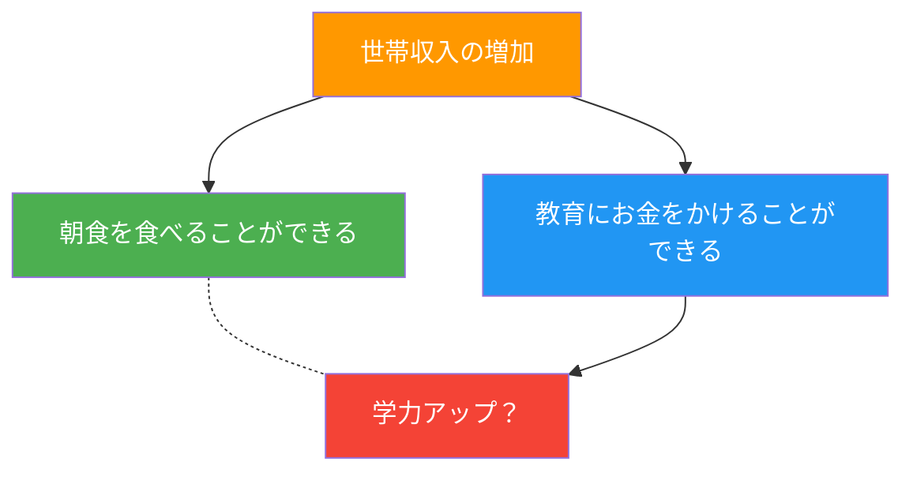

# 第4週：計測データの統計的処理（2）

> ⏱️ 読了時間：約35分 | 📝 確認問題：5問

## 学習目標

この週の講義を終えると、以下のことができるようになります：

- [ ] 最小二乗法の行列表現（正規方程式）を理解できる
- [ ] Excel ソルバーを用いて近似曲線を求めることができる
- [ ] 相関と因果の違いを説明できる
- [ ] 相関係数を計算し、相関の強さを評価できる

---

## 1. 最小二乗法の行列表現

第3週では最小二乗法の基本原理を学びました。ここでは、データ数が多い場合にも効率よく計算できる**行列表現**を学びます。

### 1.1 残差のベクトル表現

$n$ 個の計測データ $(x_1, y_1), (x_2, y_2), \dots, (x_n, y_n)$ に対して、近似式 $y = a\ln x + b$ の残差は：

$$r_1 = a\ln x_1 + b - y_1$$
$$r_2 = a\ln x_2 + b - y_2$$
$$\vdots$$
$$r_n = a\ln x_n + b - y_n$$

### 1.2 行列定義

これを行列・ベクトルで表現します：

| 記号 | 定義 | サイズ |
|------|------|--------|
| $\boldsymbol{r}$ | 残差ベクトル $[r_1, \dots, r_n]^T$ | $n \times 1$ |
| $\boldsymbol{a}$ | 係数ベクトル $[a, b]^T$ | $2 \times 1$ |
| $\boldsymbol{y}$ | 観測ベクトル $[y_1, \dots, y_n]^T$ | $n \times 1$ |
| $\boldsymbol{\Omega}$ | 計画行列 | $n \times 2$ |

計画行列：

$$\boldsymbol{\Omega} = \begin{bmatrix} \ln x_1 & 1 \\ \ln x_2 & 1 \\ \vdots & \vdots \\ \ln x_n & 1 \end{bmatrix}$$

### 1.3 残差の行列表現

$$\boldsymbol{r} = \boldsymbol{\Omega a} - \boldsymbol{y}$$

### 1.4 目的関数

$$J = \boldsymbol{r}^T \boldsymbol{r} = (\boldsymbol{\Omega a} - \boldsymbol{y})^T(\boldsymbol{\Omega a} - \boldsymbol{y})$$

### 1.5 正規方程式

$J$ を最小化する条件（$\boldsymbol{a}$ で偏微分して 0 とおく）：

$$\frac{\partial J}{\partial \boldsymbol{a}} = 2\boldsymbol{\Omega}^T(\boldsymbol{\Omega a} - \boldsymbol{y}) = 0$$

::: info 正規方程式（Normal Equation）
$$\boldsymbol{\Omega}^T \boldsymbol{\Omega} \cdot \boldsymbol{a} = \boldsymbol{\Omega}^T \boldsymbol{y}$$

この方程式を解くことで、最適な係数 $\boldsymbol{a} = [a, b]^T$ が一意に求まります。
:::

::: tip 💡 ポイント
行列表現のメリット：
- データ数 $n$ が大きくても、同じ形式の式で解ける
- コンピュータでの実装が容易
- 任意の近似関数に拡張可能
:::

---

## 2. Excel を用いた最小二乗法

手計算が困難な場合、Excel の**ソルバー**機能を使って最小二乗法を実行できます。

### 2.1 手順の概要

| ステップ | 操作 |
|---------|------|
| 1 | 計測データ（X値、Y値）を列に入力 |
| 2 | 係数 $a, b$ の初期値を適当に設定 |
| 3 | 近似式の計算列を作成（例：`=a*LN(X)+b`） |
| 4 | 残差の列を作成（近似値 − 実測値） |
| 5 | 残差の二乗列を作成 |
| 6 | 残差の二乗和（$J$）を計算 |
| 7 | ソルバーで $J$ を最小化する $a, b$ を求める |

### 2.2 ソルバーの設定

::: warning ⚠️ ソルバーの有効化
ソルバーはデフォルトでは有効になっていません。

**有効化手順：** ファイル → オプション → アドイン → 管理: Excel アドイン → 「ソルバー アドイン」にチェック
:::

**ソルバー パラメータの設定：**

| 項目 | 設定値 |
|------|--------|
| 目的のセル | 残差の二乗和のセル |
| 目標値 | **最小値** |
| 変数セル | 係数 $a, b$ のセル |
| 制約 | 「制約のない変数を非負数にする」の**チェックを外す** |

### 2.3 結果の検証

::: tip 💡 注意事項
- ソルバーが解を見つけられない場合は、**初期値を変えて**再実行
- 計算結果が**常に正しいと信じ込まない**こと
- 得られた近似曲線をプロットして、データとの一致を目視確認する
:::

---

## 3. 最小二乗法の注意点

最小二乗法を使う際に考慮すべき3つのポイント：

### 3.1 関数の選択

どのような関数で近似するべきか、よく考えましょう。

- **理論的背景**があるなら、その関数を使う
- データの形状だけで判断すると、**過学習**（オーバーフィッティング）の危険

### 3.2 結果の検証

- 計算結果を**そのまま信じない**
- 近似曲線をプロットして、**目視で確認**する
- 物理的に妥当な値か検討する

### 3.3 外れ値の扱い

::: warning ⚠️ 外れ値（Outlier）
- ただの**ノイズ**なのか？
- それとも重要な**シグナル**なのか？

外れ値を安易に除外すると、重要な情報を見落とす可能性があります。
:::

---

## 4. 相関と因果

### 4.1 相関（Correlation）とは

::: info 定義
**相関**：計測データの中の複数の変数について、ある指標の増減に応じて別の指標が変化する**傾向**があること
:::

### 4.2 相関と因果は違う！

| | 相関 | 因果 |
|---|---|---|
| 意味 | そういう**傾向**にある | 原因と結果が**はっきり**している |
| 表現 | 「AとBには相関がある」 | 「AがBの原因である」 |
| 数学的 | 統計量として計算可能 | $y = f(x)$ として表現 |

::: danger ⚠️ 重要
<strong>相関が見られるからといって、因果関係があるとは言い切れない！</strong>
:::

### 4.3 例：朝食と学力

「**朝食を食べると学力がアップする**」— これは因果関係？

- 朝食を食べる → 学力が上がる（因果？）
- 朝食を食べない → 学力が下がる？

::: tip 💡 考えてみよう
朝食さえ食べれば、本当に学力がアップするでしょうか？
:::

### 4.4 疑似相関（Spurious Correlation）

::: info 定義
**疑似相関**：同じ原因（**交絡因子**）によって変化する2つの要素の間に、あたかも相関があるように見える現象
:::

**真の原因**は「世帯収入」であり、「朝食」と「学力」の関係は**疑似相関**です。

::: warning ⚠️ 教訓
事象は単純ではない。**さまざまな要因を考慮する**こと！
:::

---

## 5. 相関の種類と強さ

### 5.1 正の相関と負の相関

<svg viewBox="0 0 500 200" xmlns="http://www.w3.org/2000/svg" style="max-width: 500px; margin: 20px auto; display: block;">
  <rect x="10" y="10" width="220" height="180" fill="#fafafa" stroke="#ddd" rx="3"/>
  <text x="120" y="30" text-anchor="middle" font-size="13" fill="#333" font-weight="bold">正の相関</text>
  <line x1="40" y1="170" x2="210" y2="170" stroke="#333" stroke-width="1"/>
  <line x1="40" y1="170" x2="40" y2="40" stroke="#333" stroke-width="1"/>
  <text x="125" y="188" text-anchor="middle" font-size="11" fill="#666">A</text>
  <text x="25" y="105" text-anchor="middle" font-size="11" fill="#666" transform="rotate(-90,25,105)">B</text>
  <circle cx="55" cy="155" r="3" fill="#1565C0"/>
  <circle cx="70" cy="145" r="3" fill="#1565C0"/>
  <circle cx="80" cy="135" r="3" fill="#1565C0"/>
  <circle cx="95" cy="130" r="3" fill="#1565C0"/>
  <circle cx="105" cy="115" r="3" fill="#1565C0"/>
  <circle cx="120" cy="105" r="3" fill="#1565C0"/>
  <circle cx="135" cy="95" r="3" fill="#1565C0"/>
  <circle cx="150" cy="80" r="3" fill="#1565C0"/>
  <circle cx="165" cy="70" r="3" fill="#1565C0"/>
  <circle cx="185" cy="55" r="3" fill="#1565C0"/>
  <circle cx="195" cy="50" r="3" fill="#1565C0"/>
  <line x1="50" y1="160" x2="200" y2="45" stroke="#FF5722" stroke-width="2" stroke-dasharray="5,3"/>
  <rect x="270" y="10" width="220" height="180" fill="#fafafa" stroke="#ddd" rx="3"/>
  <text x="380" y="30" text-anchor="middle" font-size="13" fill="#333" font-weight="bold">負の相関</text>
  <line x1="300" y1="170" x2="470" y2="170" stroke="#333" stroke-width="1"/>
  <line x1="300" y1="170" x2="300" y2="40" stroke="#333" stroke-width="1"/>
  <text x="385" y="188" text-anchor="middle" font-size="11" fill="#666">A</text>
  <text x="285" y="105" text-anchor="middle" font-size="11" fill="#666" transform="rotate(-90,285,105)">B</text>
  <circle cx="315" cy="55" r="3" fill="#1565C0"/>
  <circle cx="330" cy="65" r="3" fill="#1565C0"/>
  <circle cx="340" cy="75" r="3" fill="#1565C0"/>
  <circle cx="355" cy="85" r="3" fill="#1565C0"/>
  <circle cx="370" cy="100" r="3" fill="#1565C0"/>
  <circle cx="385" cy="110" r="3" fill="#1565C0"/>
  <circle cx="395" cy="120" r="3" fill="#1565C0"/>
  <circle cx="410" cy="130" r="3" fill="#1565C0"/>
  <circle cx="425" cy="140" r="3" fill="#1565C0"/>
  <circle cx="440" cy="150" r="3" fill="#1565C0"/>
  <circle cx="455" cy="158" r="3" fill="#1565C0"/>
  <line x1="310" y1="50" x2="460" y2="162" stroke="#FF5722" stroke-width="2" stroke-dasharray="5,3"/>
</svg>

| 種類 | 意味 | 相関係数 |
|------|------|---------|
| **正の相関** | 一方が増えると、他方も増える | $r > 0$ |
| **負の相関** | 一方が増えると、他方は減る | $r < 0$ |
| **無相関** | 変動に関連性がない | $r \approx 0$ |

### 5.2 相関の強さ

<svg viewBox="0 0 500 200" xmlns="http://www.w3.org/2000/svg" style="max-width: 500px; margin: 20px auto; display: block;">
  <rect x="10" y="10" width="220" height="180" fill="#fafafa" stroke="#ddd" rx="3"/>
  <text x="120" y="30" text-anchor="middle" font-size="13" fill="#333" font-weight="bold">相関が弱い</text>
  <line x1="40" y1="170" x2="210" y2="170" stroke="#333" stroke-width="1"/>
  <line x1="40" y1="170" x2="40" y2="40" stroke="#333" stroke-width="1"/>
  <circle cx="55" cy="80" r="3" fill="#1565C0"/>
  <circle cx="70" cy="145" r="3" fill="#1565C0"/>
  <circle cx="85" cy="60" r="3" fill="#1565C0"/>
  <circle cx="95" cy="120" r="3" fill="#1565C0"/>
  <circle cx="110" cy="90" r="3" fill="#1565C0"/>
  <circle cx="120" cy="150" r="3" fill="#1565C0"/>
  <circle cx="140" cy="70" r="3" fill="#1565C0"/>
  <circle cx="155" cy="130" r="3" fill="#1565C0"/>
  <circle cx="170" cy="100" r="3" fill="#1565C0"/>
  <circle cx="185" cy="55" r="3" fill="#1565C0"/>
  <circle cx="200" cy="140" r="3" fill="#1565C0"/>
  <rect x="270" y="10" width="220" height="180" fill="#fafafa" stroke="#ddd" rx="3"/>
  <text x="380" y="30" text-anchor="middle" font-size="13" fill="#333" font-weight="bold">相関が強い</text>
  <line x1="300" y1="170" x2="470" y2="170" stroke="#333" stroke-width="1"/>
  <line x1="300" y1="170" x2="300" y2="40" stroke="#333" stroke-width="1"/>
  <circle cx="315" cy="155" r="3" fill="#1565C0"/>
  <circle cx="330" cy="142" r="3" fill="#1565C0"/>
  <circle cx="342" cy="133" r="3" fill="#1565C0"/>
  <circle cx="355" cy="120" r="3" fill="#1565C0"/>
  <circle cx="368" cy="108" r="3" fill="#1565C0"/>
  <circle cx="380" cy="98" r="3" fill="#1565C0"/>
  <circle cx="395" cy="85" r="3" fill="#1565C0"/>
  <circle cx="410" cy="78" r="3" fill="#1565C0"/>
  <circle cx="425" cy="68" r="3" fill="#1565C0"/>
  <circle cx="440" cy="58" r="3" fill="#1565C0"/>
  <circle cx="455" cy="50" r="3" fill="#1565C0"/>
  <line x1="310" y1="158" x2="460" y2="47" stroke="#FF5722" stroke-width="2" stroke-dasharray="5,3"/>
</svg>

---

## 6. 相関係数

### 6.1 相関係数の公式

計測データ $(x_1, y_1), (x_2, y_2), \dots, (x_N, y_N)$ に対して：

::: info 定義
**相関係数** $r$：

$$r = \frac{\displaystyle\sum_{i=1}^{N} (x_i - \bar{x})(y_i - \bar{y})}{\sqrt{\displaystyle\sum_{i=1}^{N} (x_i - \bar{x})^2 \cdot \sum_{i=1}^{N} (y_i - \bar{y})^2}}$$
:::

### 6.2 相関係数の解釈

| 相関係数 $r$ の範囲 | 解釈 |
|:---:|---|
| $0.7 \leq |r| \leq 1.0$ | **強い**相関 |
| $0.4 \leq |r| < 0.7$ | **中程度**の相関 |
| $0.2 \leq |r| < 0.4$ | **弱い**相関 |
| $|r| < 0.2$ | ほぼ**無相関** |

::: tip 💡 ポイント
- $r = 1$：完全な正の相関（直線上に並ぶ）
- $r = -1$：完全な負の相関
- $r = 0$：無相関（ただし非線形な関係はありうる！）
:::

---

## 7. 相関の落とし穴：Datasaurus Dozen

::: danger ⚠️ 統計量だけでは不十分！
以下の13個のデータセットは、すべて<strong>同じ統計量</strong>を持っています：

- 平均 $\bar{x} = 54.26$, $\bar{y} = 47.83$
- 標準偏差 $\sigma_x = 16.76$, $\sigma_y = 26.93$
- 相関係数 $r = -0.06$
:::

統計量は同じでも、データの分布は**まったく異なります**。

::: warning 教訓
**必ずデータを可視化して確認する**こと！数値だけで判断してはいけません。
:::

---

## 8. 共分散

### 8.1 共分散の定義

::: info 定義
**共分散**（Covariance）$\sigma_{XY}$：2つの変数がどの程度ともに変動するかを表す指標

$$\sigma_{XY} = \frac{1}{N} \sum_{i=1}^{N} x_i y_i - \bar{x}\bar{y}$$
:::

| 共分散の値 | 意味 |
|-----------|------|
| $\sigma_{XY} > 0$ | 正の相関（同じ方向に変動） |
| $\sigma_{XY} < 0$ | 負の相関（逆方向に変動） |
| $\sigma_{XY} = 0$ | 無相関 |

::: tip 💡 相関係数との関係
相関係数は、共分散を各変数の標準偏差で正規化したものです：

$$r = \frac{\sigma_{XY}}{\sigma_X \cdot \sigma_Y}$$

これにより、$-1 \leq r \leq 1$ の範囲に収まります。
:::

---

## 📝 確認問題

### Q1. 正規方程式 $\boldsymbol{\Omega}^T\boldsymbol{\Omega} \cdot \boldsymbol{a} = \boldsymbol{\Omega}^T\boldsymbol{y}$ について正しいのは？

- [ ] A. データ数が少ないときのみ使える
- [x] B. 最小二乗法の最適解を行列形式で求める式である
- [ ] C. 相関係数を求めるための式である
- [ ] D. 近似関数は線形関数に限定される

### Q2. 相関と因果の違いについて正しいのは？

- [ ] A. 相関があれば必ず因果関係がある
- [ ] B. 因果があっても相関はない場合がある
- [x] C. 相関があっても因果関係があるとは限らない
- [ ] D. 相関と因果は同じ意味である

### Q3. 相関係数 $r = -0.85$ のデータについて正しい解釈は？

- [ ] A. 弱い正の相関
- [ ] B. 相関なし
- [x] C. 強い負の相関
- [ ] D. 完全な負の相関

### Q4. Datasaurus Dozen が示す教訓は？

- [ ] A. 統計量が異なれば、データの分布も異なる
- [x] B. 統計量が同じでも、データの分布はまったく異なることがある
- [ ] C. 相関係数が高ければ、データは必ず直線的
- [ ] D. 散布図は不要であり、統計量だけで十分

### Q5. 共分散と相関係数の関係として正しいのは？

- [ ] A. 共分散と相関係数は同じものである
- [ ] B. 相関係数は共分散の二乗である
- [x] C. 相関係数は共分散を標準偏差の積で正規化したものである
- [ ] D. 共分散は相関係数から計算できない

---

## 📚 次週の予習

- **第5週**: 計測データの統計的処理(3)：データの補間
- 予習ポイント：多項式補間、スプライン補間の基本概念
