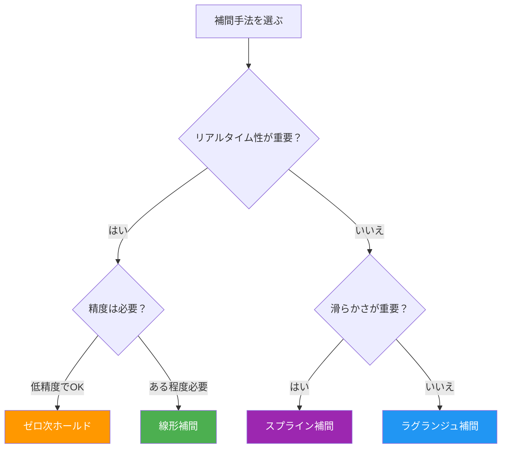

# 第5週：計測データの統計的処理（3）

> ⏱️ 読了時間：約30分 | 📝 確認問題：5問

## 学習目標

この週の講義を終えると、以下のことができるようになります：

- [ ] 内挿（Interpolation）と外挿（Extrapolation）の違いを説明できる
- [ ] ゼロ次ホールドと線形補間の特徴を理解できる
- [ ] 高次補間（ラグランジュ補間・スプライン補間）の考え方を理解できる
- [ ] 補間手法の選択基準を説明できる

---

## 1. なぜデータの補間が必要なのか

### 1.1 計測データの特性

計測では、センサからの信号を**離散的な時刻**でサンプリングします。つまり、得られるデータは「点」の集合であり、点と点の間の値は**直接わからない**のです。

::: info 補間の目的
**補間**（Interpolation）：既知のデータ点の間の値を推定すること

データの無い部分を「何らかの方法で」連続量に見せかける技術です。
:::

### 1.2 補間が必要な場面

| 場面 | 説明 |
|------|------|
| **D/A変換** | デジタルデータをアナログ信号に戻す |
| **データの可視化** | 離散点を滑らかな曲線で結ぶ |
| **制御** | サンプリング間の状態を推定する |
| **画像処理** | 画像の拡大・縮小 |

---

## 2. 内挿と外挿

### 2.1 内挿（Interpolation）

::: info 定義
**内挿**：既知のデータ点の**範囲内**で、間の値を推定すること
:::

<svg viewBox="0 0 450 200" xmlns="http://www.w3.org/2000/svg" style="max-width: 450px; margin: 20px auto; display: block;">
  <line x1="50" y1="170" x2="400" y2="170" stroke="#333" stroke-width="1.5"/>
  <line x1="50" y1="170" x2="50" y2="20" stroke="#333" stroke-width="1.5"/>
  <text x="225" y="195" text-anchor="middle" font-size="12" fill="#333">時間 t</text>
  <text x="25" y="95" text-anchor="middle" font-size="12" fill="#333" transform="rotate(-90,25,95)">値</text>
  <circle cx="80" cy="120" r="5" fill="#1565C0"/>
  <circle cx="140" cy="80" r="5" fill="#1565C0"/>
  <circle cx="200" cy="100" r="5" fill="#1565C0"/>
  <circle cx="260" cy="60" r="5" fill="#1565C0"/>
  <circle cx="320" cy="90" r="5" fill="#1565C0"/>
  <line x1="80" y1="120" x2="140" y2="80" stroke="#4CAF50" stroke-width="2"/>
  <line x1="140" y1="80" x2="200" y2="100" stroke="#4CAF50" stroke-width="2"/>
  <line x1="200" y1="100" x2="260" y2="60" stroke="#4CAF50" stroke-width="2"/>
  <line x1="260" y1="60" x2="320" y2="90" stroke="#4CAF50" stroke-width="2"/>
  <text x="200" y="150" text-anchor="middle" font-size="12" fill="#4CAF50" font-weight="bold">内挿（Interpolation）</text>
  <rect x="70" y="48" width="260" height="130" fill="none" stroke="#4CAF50" stroke-width="1.5" stroke-dasharray="5,3" rx="5"/>
</svg>

### 2.2 外挿（Extrapolation）

::: info 定義
**外挿**：既知のデータ点の**範囲外**で、値を予測すること
:::

<svg viewBox="0 0 450 200" xmlns="http://www.w3.org/2000/svg" style="max-width: 450px; margin: 20px auto; display: block;">
  <line x1="50" y1="170" x2="400" y2="170" stroke="#333" stroke-width="1.5"/>
  <line x1="50" y1="170" x2="50" y2="20" stroke="#333" stroke-width="1.5"/>
  <text x="225" y="195" text-anchor="middle" font-size="12" fill="#333">時間 t</text>
  <text x="25" y="95" text-anchor="middle" font-size="12" fill="#333" transform="rotate(-90,25,95)">値</text>
  <circle cx="80" cy="120" r="5" fill="#1565C0"/>
  <circle cx="140" cy="80" r="5" fill="#1565C0"/>
  <circle cx="200" cy="100" r="5" fill="#1565C0"/>
  <circle cx="260" cy="60" r="5" fill="#1565C0"/>
  <line x1="80" y1="120" x2="260" y2="60" stroke="#1565C0" stroke-width="2"/>
  <line x1="260" y1="60" x2="370" y2="30" stroke="#FF5722" stroke-width="2" stroke-dasharray="6,3"/>
  <circle cx="320" cy="44" r="4" fill="#FF5722" fill-opacity="0.5" stroke="#FF5722"/>
  <circle cx="370" cy="30" r="4" fill="#FF5722" fill-opacity="0.5" stroke="#FF5722"/>
  <text x="340" y="70" text-anchor="middle" font-size="12" fill="#FF5722" font-weight="bold">外挿（Extrapolation）</text>
</svg>

::: warning ⚠️ 外挿の注意点
外挿は内挿よりも**不確実性が高い**です。データの範囲外の予測は、実際の値と大きくずれる可能性があります。
:::

---

## 3. 補間手法

### 3.1 ゼロ次ホールド（Zero-Order Hold）

最もシンプルな補間方法：前のサンプリング値を次のサンプリングまで**そのまま保持**する。

<svg viewBox="0 0 450 220" xmlns="http://www.w3.org/2000/svg" style="max-width: 450px; margin: 20px auto; display: block;">
  <line x1="50" y1="190" x2="400" y2="190" stroke="#333" stroke-width="1.5"/>
  <line x1="50" y1="190" x2="50" y2="20" stroke="#333" stroke-width="1.5"/>
  <text x="225" y="215" text-anchor="middle" font-size="12" fill="#333">時間 t</text>
  <path d="M60,180 Q100,175 140,150 Q180,100 220,80 Q260,70 300,90 Q340,130 380,160" fill="none" stroke="#ccc" stroke-width="1.5" stroke-dasharray="4,3"/>
  <circle cx="80" cy="160" r="4" fill="#1565C0"/>
  <circle cx="140" cy="140" r="4" fill="#1565C0"/>
  <circle cx="200" cy="85" r="4" fill="#1565C0"/>
  <circle cx="260" cy="70" r="4" fill="#1565C0"/>
  <circle cx="320" cy="100" r="4" fill="#1565C0"/>
  <circle cx="380" cy="155" r="4" fill="#1565C0"/>
  <line x1="80" y1="160" x2="140" y2="160" stroke="#FF5722" stroke-width="2.5"/>
  <line x1="140" y1="160" x2="140" y2="140" stroke="#FF5722" stroke-width="2.5"/>
  <line x1="140" y1="140" x2="200" y2="140" stroke="#FF5722" stroke-width="2.5"/>
  <line x1="200" y1="140" x2="200" y2="85" stroke="#FF5722" stroke-width="2.5"/>
  <line x1="200" y1="85" x2="260" y2="85" stroke="#FF5722" stroke-width="2.5"/>
  <line x1="260" y1="85" x2="260" y2="70" stroke="#FF5722" stroke-width="2.5"/>
  <line x1="260" y1="70" x2="320" y2="70" stroke="#FF5722" stroke-width="2.5"/>
  <line x1="320" y1="70" x2="320" y2="100" stroke="#FF5722" stroke-width="2.5"/>
  <line x1="320" y1="100" x2="380" y2="100" stroke="#FF5722" stroke-width="2.5"/>
  <text x="380" y="45" font-size="11" fill="#ccc">元の信号</text>
  <text x="380" y="115" font-size="11" fill="#FF5722" font-weight="bold">ゼロ次ホールド</text>
</svg>

| 特徴 | 内容 |
|------|------|
| **方法** | 直前のサンプル値を保持 |
| **利点** | 実装が極めて簡単 |
| **欠点** | 階段状になり、元の信号との誤差が大きい |
| **用途** | D/A変換の基本、デジタル制御 |

### 3.2 線形補間（Linear Interpolation / 一次補間）

隣接するデータ点を**直線**で結ぶ方法。

2点 $(x_0, y_0)$ と $(x_1, y_1)$ の間の点 $x$ における値：

$$y = y_0 + \frac{y_1 - y_0}{x_1 - x_0}(x - x_0)$$

<svg viewBox="0 0 450 220" xmlns="http://www.w3.org/2000/svg" style="max-width: 450px; margin: 20px auto; display: block;">
  <line x1="50" y1="190" x2="400" y2="190" stroke="#333" stroke-width="1.5"/>
  <line x1="50" y1="190" x2="50" y2="20" stroke="#333" stroke-width="1.5"/>
  <text x="225" y="215" text-anchor="middle" font-size="12" fill="#333">時間 t</text>
  <path d="M60,180 Q100,175 140,150 Q180,100 220,80 Q260,70 300,90 Q340,130 380,160" fill="none" stroke="#ccc" stroke-width="1.5" stroke-dasharray="4,3"/>
  <circle cx="80" cy="160" r="4" fill="#1565C0"/>
  <circle cx="140" cy="140" r="4" fill="#1565C0"/>
  <circle cx="200" cy="85" r="4" fill="#1565C0"/>
  <circle cx="260" cy="70" r="4" fill="#1565C0"/>
  <circle cx="320" cy="100" r="4" fill="#1565C0"/>
  <circle cx="380" cy="155" r="4" fill="#1565C0"/>
  <line x1="80" y1="160" x2="140" y2="140" stroke="#4CAF50" stroke-width="2.5"/>
  <line x1="140" y1="140" x2="200" y2="85" stroke="#4CAF50" stroke-width="2.5"/>
  <line x1="200" y1="85" x2="260" y2="70" stroke="#4CAF50" stroke-width="2.5"/>
  <line x1="260" y1="70" x2="320" y2="100" stroke="#4CAF50" stroke-width="2.5"/>
  <line x1="320" y1="100" x2="380" y2="155" stroke="#4CAF50" stroke-width="2.5"/>
  <text x="380" y="45" font-size="11" fill="#ccc">元の信号</text>
  <text x="380" y="178" font-size="11" fill="#4CAF50" font-weight="bold">線形補間</text>
</svg>

| 特徴 | 内容 |
|------|------|
| **方法** | 隣接点を直線で結ぶ |
| **利点** | 計算が簡単、ゼロ次ホールドより精度が高い |
| **欠点** | 折れ線になる（滑らかでない） |
| **用途** | 多くの工学分野で広く使用 |

### 3.3 ラグランジュ補間（Lagrange Interpolation）

$n+1$ 個のデータ点を**すべて通る $n$ 次多項式**を求める方法。

::: info 定義
$n+1$ 個の点 $(x_0, y_0), (x_1, y_1), \dots, (x_n, y_n)$ を通る $n$ 次多項式：

$$P(x) = \sum_{i=0}^{n} y_i \prod_{\substack{j=0 \\ j \neq i}}^{n} \frac{x - x_j}{x_i - x_j}$$
:::

**2点の場合（1次）：**

$$P(x) = y_0 \frac{x - x_1}{x_0 - x_1} + y_1 \frac{x - x_0}{x_1 - x_0}$$

（これは線形補間と同じ結果）

**3点の場合（2次）：**

$$P(x) = y_0 \frac{(x-x_1)(x-x_2)}{(x_0-x_1)(x_0-x_2)} + y_1 \frac{(x-x_0)(x-x_2)}{(x_1-x_0)(x_1-x_2)} + y_2 \frac{(x-x_0)(x-x_1)}{(x_2-x_0)(x_2-x_1)}$$

::: warning ⚠️ ラグランジュ補間の注意点
- 点数が多くなると、多項式の次数が上がり、端で大きく振動する（**ルンゲ現象**）
- 新しいデータ点が追加されると、すべて再計算が必要
:::

### 3.4 スプライン補間（Spline Interpolation）

隣接するデータ点の間を**低次の多項式**で個別に補間し、接続点で滑らかにつなぐ方法。

::: info 定義
**3次スプライン補間**：各区間を3次多項式で補間し、境界で**関数値・1階微分・2階微分が連続**になるようにする
:::

<svg viewBox="0 0 450 220" xmlns="http://www.w3.org/2000/svg" style="max-width: 450px; margin: 20px auto; display: block;">
  <line x1="50" y1="190" x2="400" y2="190" stroke="#333" stroke-width="1.5"/>
  <line x1="50" y1="190" x2="50" y2="20" stroke="#333" stroke-width="1.5"/>
  <text x="225" y="215" text-anchor="middle" font-size="12" fill="#333">時間 t</text>
  <path d="M60,180 Q100,175 140,150 Q180,100 220,80 Q260,70 300,90 Q340,130 380,160" fill="none" stroke="#ccc" stroke-width="1.5" stroke-dasharray="4,3"/>
  <circle cx="80" cy="160" r="4" fill="#1565C0"/>
  <circle cx="140" cy="140" r="4" fill="#1565C0"/>
  <circle cx="200" cy="85" r="4" fill="#1565C0"/>
  <circle cx="260" cy="70" r="4" fill="#1565C0"/>
  <circle cx="320" cy="100" r="4" fill="#1565C0"/>
  <circle cx="380" cy="155" r="4" fill="#1565C0"/>
  <path d="M80,160 Q110,148 140,140 Q170,118 200,85 Q230,72 260,70 Q290,78 320,100 Q350,130 380,155" fill="none" stroke="#9C27B0" stroke-width="2.5"/>
  <text x="380" y="45" font-size="11" fill="#ccc">元の信号</text>
  <text x="390" y="140" font-size="11" fill="#9C27B0" font-weight="bold">スプライン</text>
</svg>

| 特徴 | 内容 |
|------|------|
| **方法** | 各区間を低次多項式で接続 |
| **利点** | 滑らかで安定、ルンゲ現象が起きない |
| **欠点** | ラグランジュ補間より計算量が多い |
| **用途** | CG、CAD、数値計算など広く使用 |

---

## 4. 補間手法の比較

### 4.1 比較表

| 手法 | 精度 | 滑らかさ | 計算量 | 安定性 |
|------|:----:|:--------:|:------:|:------:|
| ゼロ次ホールド | △ | × | ◎ | ◎ |
| 線形補間 | ○ | △ | ◎ | ◎ |
| ラグランジュ補間 | ◎ | ◎ | △ | △ |
| スプライン補間 | ◎ | ◎ | ○ | ◎ |

### 4.2 選択の指針

---

## 5. 補間と計測への応用

### 5.1 D/A変換における補間

第6週で詳しく学びますが、デジタルからアナログへの変換（D/A変換）には補間が不可欠です。

| D/A変換の手法 | 使用する補間 |
|-------------|------------|
| ゼロ次ホールド回路 | ゼロ次ホールド |
| 一次ホールド回路 | 線形補間 |
| オーバーサンプリング | 高次補間 + フィルタ |

### 5.2 画像処理における補間

画像の拡大・縮小にも補間が使われます。

| 手法 | 対応する補間 | 特徴 |
|------|------------|------|
| 最近傍法 | ゼロ次ホールド | 高速だがギザギザ |
| バイリニア法 | 線形補間 | バランスが良い |
| バイキュービック法 | 3次補間 | 滑らかだが計算量大 |

::: tip 💡 身近な例
スマートフォンで写真をズームすると、実際には補間処理が行われています。ズーム倍率が高くなるほど、補間の精度が画質に影響します。
:::

---

## 📝 確認問題

### Q1. 内挿（Interpolation）の説明として正しいのは？

- [x] A. 既知のデータ点の範囲内で値を推定すること
- [ ] B. 既知のデータ点の範囲外で値を予測すること
- [ ] C. データ点をすべて削除すること
- [ ] D. データを圧縮すること

### Q2. ゼロ次ホールドの特徴として正しいのは？

- [ ] A. データ点を直線で結ぶ
- [x] B. 前のサンプル値を次のサンプルまで保持する
- [ ] C. 滑らかな曲線を生成する
- [ ] D. 高次多項式を使用する

### Q3. ラグランジュ補間の問題点は？

- [ ] A. 計算が簡単すぎて精度が低い
- [ ] B. 2次元データに適用できない
- [x] C. 点数が多いと端で大きく振動する（ルンゲ現象）
- [ ] D. 直線でしか補間できない

### Q4. スプライン補間の利点は？

- [ ] A. 最も計算量が少ない
- [ ] B. 1次多項式のみ使用する
- [x] C. 滑らかで安定した補間が得られる
- [ ] D. データ点を通らなくてもよい

### Q5. 外挿が内挿より不確実性が高い理由は？

- [ ] A. 計算が複雑だから
- [ ] B. データ点を使わないから
- [x] C. 既知のデータ範囲外で予測するため、実際の値と大きくずれる可能性がある
- [ ] D. 常に直線近似しかできないから

---

## 📚 次週の予習

- **第6週**: センサ信号処理（アナログとデジタル）
- 予習ポイント：サンプリング定理（ナイキスト周波数）、フィルタの概念
