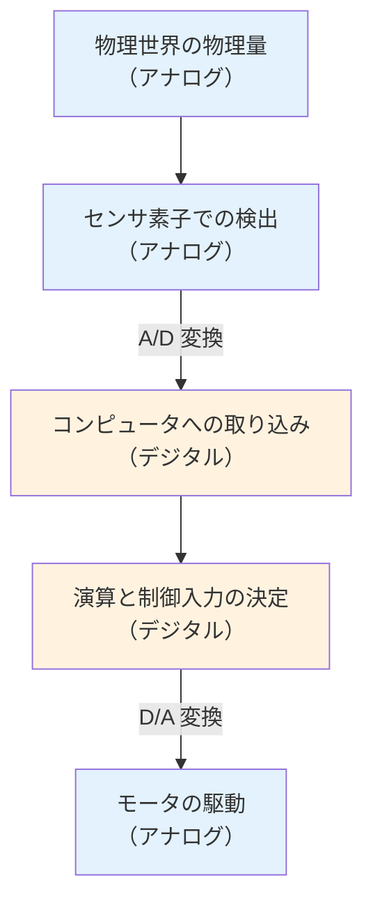
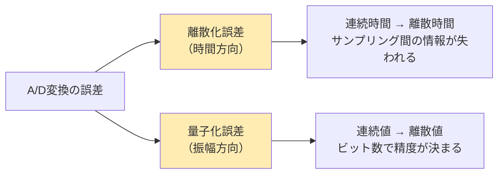
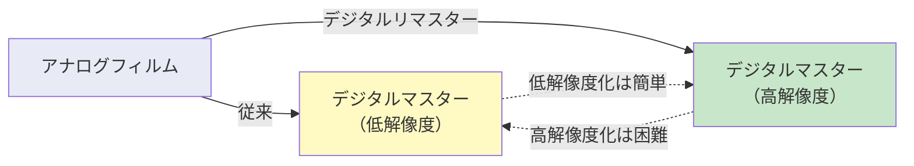

# 第6週：センサ信号処理（アナログとデジタル）

> ⏱️ 読了時間：約40分 | 📝 確認問題：5問

## 学習目標

この週の講義を終えると、以下のことができるようになります：

- [ ] アナログ信号とデジタル信号の違いを説明できる
- [ ] A/D変換・D/A変換の流れと役割を理解できる
- [ ] サンプリング時間・サンプリングレートの意味を説明できる
- [ ] 離散化誤差と量子化誤差の違いを理解できる
- [ ] 分解能の概念と計算ができる
- [ ] サンプリング定理（ナイキスト周波数）を説明できる
- [ ] ノイズ除去の基本的な手法を理解できる

---

## 1. アナログ信号とデジタル信号

### 1.1 アナログ信号（Analog Signal）

::: info 定義
**アナログ信号**：時間的に連続した物理量。通常の物理世界はアナログです。
:::

<svg viewBox="0 0 500 180" xmlns="http://www.w3.org/2000/svg" style="max-width: 500px; margin: 20px auto; display: block;">
  <line x1="50" y1="150" x2="460" y2="150" stroke="#333" stroke-width="1.5"/>
  <line x1="50" y1="150" x2="50" y2="20" stroke="#333" stroke-width="1.5"/>
  <text x="255" y="175" text-anchor="middle" font-size="12" fill="#333">時間 t</text>
  <text x="25" y="85" text-anchor="middle" font-size="12" fill="#333" transform="rotate(-90,25,85)">電圧</text>
  <path d="M50,90 Q80,40 110,60 Q140,80 170,50 Q200,20 230,70 Q260,120 290,80 Q320,40 350,65 Q380,90 410,55 Q440,30 460,60" fill="none" stroke="#1565C0" stroke-width="2.5"/>
  <text x="400" y="30" font-size="11" fill="#1565C0" font-weight="bold">連続量</text>
</svg>

### 1.2 デジタル信号（Digital Signal）

::: info 定義
**デジタル信号**：離散的な量。とびとびの時間で計測された結果です。
:::

<svg viewBox="0 0 500 180" xmlns="http://www.w3.org/2000/svg" style="max-width: 500px; margin: 20px auto; display: block;">
  <line x1="50" y1="150" x2="460" y2="150" stroke="#333" stroke-width="1.5"/>
  <line x1="50" y1="150" x2="50" y2="20" stroke="#333" stroke-width="1.5"/>
  <text x="255" y="175" text-anchor="middle" font-size="12" fill="#333">時間 t</text>
  <text x="25" y="85" text-anchor="middle" font-size="12" fill="#333" transform="rotate(-90,25,85)">電圧</text>
  <line x1="80" y1="150" x2="80" y2="90" stroke="#FF5722" stroke-width="6"/>
  <line x1="120" y1="150" x2="120" y2="60" stroke="#FF5722" stroke-width="6"/>
  <line x1="160" y1="150" x2="160" y2="50" stroke="#FF5722" stroke-width="6"/>
  <line x1="200" y1="150" x2="200" y2="70" stroke="#FF5722" stroke-width="6"/>
  <line x1="240" y1="150" x2="240" y2="120" stroke="#FF5722" stroke-width="6"/>
  <line x1="280" y1="150" x2="280" y2="80" stroke="#FF5722" stroke-width="6"/>
  <line x1="320" y1="150" x2="320" y2="40" stroke="#FF5722" stroke-width="6"/>
  <line x1="360" y1="150" x2="360" y2="65" stroke="#FF5722" stroke-width="6"/>
  <line x1="400" y1="150" x2="400" y2="55" stroke="#FF5722" stroke-width="6"/>
  <line x1="440" y1="150" x2="440" y2="75" stroke="#FF5722" stroke-width="6"/>
  <text x="400" y="30" font-size="11" fill="#FF5722" font-weight="bold">離散量</text>
</svg>

### 1.3 なぜデジタルに変換するのか

コンピュータはデジタルデータしか扱えません。物理世界（アナログ）のセンサ信号をコンピュータで処理するためには、**A/D変換**（アナログ→デジタル）が不可欠です。

---

## 2. A/D変換とD/A変換

### 2.1 信号処理の全体フロー

センサからモータまでの信号の流れを示します：

### 2.2 A/D変換（Analog to Digital Conversion）

アナログ信号の大きさを**とびとびの時間で計測**します。

<svg viewBox="0 0 500 220" xmlns="http://www.w3.org/2000/svg" style="max-width: 500px; margin: 20px auto; display: block;">
  <line x1="50" y1="190" x2="460" y2="190" stroke="#333" stroke-width="1.5"/>
  <line x1="50" y1="190" x2="50" y2="20" stroke="#333" stroke-width="1.5"/>
  <text x="255" y="215" text-anchor="middle" font-size="12" fill="#333">時間 t</text>
  <text x="25" y="105" text-anchor="middle" font-size="12" fill="#333" transform="rotate(-90,25,105)">電圧</text>
  <path d="M60,140 Q100,60 140,80 Q180,100 220,50 Q260,30 300,70 Q340,120 380,90 Q420,50 450,75" fill="none" stroke="#ccc" stroke-width="1.5" stroke-dasharray="4,3"/>
  <line x1="100" y1="190" x2="100" y2="68" stroke="#1565C0" stroke-width="1.5" stroke-dasharray="3,3"/>
  <line x1="170" y1="190" x2="170" y2="92" stroke="#1565C0" stroke-width="1.5" stroke-dasharray="3,3"/>
  <line x1="240" y1="190" x2="240" y2="42" stroke="#1565C0" stroke-width="1.5" stroke-dasharray="3,3"/>
  <line x1="310" y1="190" x2="310" y2="78" stroke="#1565C0" stroke-width="1.5" stroke-dasharray="3,3"/>
  <line x1="380" y1="190" x2="380" y2="90" stroke="#1565C0" stroke-width="1.5" stroke-dasharray="3,3"/>
  <circle cx="100" cy="68" r="5" fill="#1565C0"/>
  <circle cx="170" cy="92" r="5" fill="#1565C0"/>
  <circle cx="240" cy="42" r="5" fill="#1565C0"/>
  <circle cx="310" cy="78" r="5" fill="#1565C0"/>
  <circle cx="380" cy="90" r="5" fill="#1565C0"/>
  <line x1="100" y1="198" x2="170" y2="198" stroke="#E65100" stroke-width="2"/>
  <line x1="100" y1="195" x2="100" y2="201" stroke="#E65100" stroke-width="2"/>
  <line x1="170" y1="195" x2="170" y2="201" stroke="#E65100" stroke-width="2"/>
  <text x="135" y="210" text-anchor="middle" font-size="10" fill="#E65100" font-weight="bold">T [s]</text>
  <text x="390" y="40" font-size="11" fill="#ccc">元のアナログ信号</text>
  <text x="420" y="100" font-size="11" fill="#1565C0" font-weight="bold">サンプリング点</text>
</svg>

| 用語 | 意味 |
|------|------|
| **サンプリング時間 $T$ [s]** | 計測の間隔（時間） |
| **サンプリングレート $f_s = 1/T$ [Hz]** | 1秒あたりの計測回数（サンプリング時間の逆数） |

### 2.3 サンプリングレートの関連用語

| 用語 | 意味 | 分野 |
|------|------|------|
| **FPS（Frame Per Second）** | 1秒あたりの撮影フレーム数 | ビデオカメラ、アニメーション |
| **リフレッシュレート [Hz]** | 1秒あたりの画面更新頻度 | ディスプレイ |

---

## 3. A/D変換における誤差

### 3.1 離散化誤差（Discretization Error）

::: warning ⚠️ 切り捨て誤差（Truncation Error）
連続量を有限個のデータに区切ることによって生じる誤差。サンプリング点以外での値は**すべて失われます**。
:::

<svg viewBox="0 0 500 220" xmlns="http://www.w3.org/2000/svg" style="max-width: 500px; margin: 20px auto; display: block;">
  <line x1="50" y1="190" x2="460" y2="190" stroke="#333" stroke-width="1.5"/>
  <line x1="50" y1="190" x2="50" y2="20" stroke="#333" stroke-width="1.5"/>
  <text x="255" y="215" text-anchor="middle" font-size="12" fill="#333">時間 t</text>
  <text x="25" y="105" text-anchor="middle" font-size="12" fill="#333" transform="rotate(-90,25,105)">電圧</text>
  <path d="M60,150 Q100,60 140,80 Q180,130 220,50 Q260,30 300,70 Q340,140 380,100 Q420,50 450,85" fill="none" stroke="#ccc" stroke-width="1.5"/>
  <circle cx="100" cy="68" r="5" fill="#1565C0"/>
  <circle cx="170" cy="110" r="5" fill="#1565C0"/>
  <circle cx="240" cy="40" r="5" fill="#1565C0"/>
  <circle cx="310" cy="78" r="5" fill="#1565C0"/>
  <circle cx="380" cy="100" r="5" fill="#1565C0"/>
  <rect x="100" y="60" width="70" height="60" fill="#FFCDD2" fill-opacity="0.3" stroke="#F44336" stroke-width="1" stroke-dasharray="3,2"/>
  <rect x="240" y="32" width="70" height="55" fill="#FFCDD2" fill-opacity="0.3" stroke="#F44336" stroke-width="1" stroke-dasharray="3,2"/>
  <text x="135" y="55" text-anchor="middle" font-size="9" fill="#F44336">失われる情報</text>
  <text x="275" y="28" text-anchor="middle" font-size="9" fill="#F44336">失われる情報</text>
</svg>

### 3.2 量子化誤差（Quantization Error）

10進数を2進数に変換することによって生じる誤差。アナログ値を有限のビット数で表現するため、完全な精度は得られません。

---

## 4. 分解能（Resolution）

### 4.1 分解能とは

::: info 定義
**分解能（Resolution）**：量子化における分割数の多さ。画面の解像度も同じ意味です。
:::

### 4.2 計算例

**例題**：0〜5 [V] の電圧を **10ビット** で計測する場合

| 項目 | 計算 |
|------|------|
| ビット数 | 10 bit |
| 分割数 | $2^{10} = 1024$ |
| 割り当て | 0〜1023 の数値 |
| 1ステップの電圧 | $5 / 1024 = 0.00488\dots$ [V] |

<svg viewBox="0 0 500 200" xmlns="http://www.w3.org/2000/svg" style="max-width: 500px; margin: 20px auto; display: block;">
  <rect x="50" y="20" width="400" height="160" fill="#F5F5F5" rx="5"/>
  <text x="250" y="45" text-anchor="middle" font-size="14" fill="#333" font-weight="bold">10ビット量子化のマッピング</text>
  <line x1="80" y1="55" x2="420" y2="55" stroke="#ccc" stroke-width="1"/>
  <text x="130" y="75" text-anchor="middle" font-size="12" fill="#333" font-weight="bold">電圧 [V]</text>
  <text x="320" y="75" text-anchor="middle" font-size="12" fill="#333" font-weight="bold">デジタル値</text>
  <text x="130" y="95" text-anchor="middle" font-size="12" fill="#1565C0">5.0000</text>
  <text x="320" y="95" text-anchor="middle" font-size="12" fill="#1565C0">1023</text>
  <text x="130" y="115" text-anchor="middle" font-size="12" fill="#666">4.9951</text>
  <text x="320" y="115" text-anchor="middle" font-size="12" fill="#666">1022</text>
  <text x="250" y="135" text-anchor="middle" font-size="12" fill="#999">...</text>
  <text x="130" y="152" text-anchor="middle" font-size="12" fill="#666">0.0049</text>
  <text x="320" y="152" text-anchor="middle" font-size="12" fill="#666">1</text>
  <text x="130" y="170" text-anchor="middle" font-size="12" fill="#1565C0">0.0000</text>
  <text x="320" y="170" text-anchor="middle" font-size="12" fill="#1565C0">0</text>
  <line x1="220" y1="60" x2="220" y2="178" stroke="#ccc" stroke-width="1" stroke-dasharray="3,2"/>
</svg>

::: tip 💡 ポイント
分解能が高い（ビット数が多い）ほど、**刻みを小さく**できます。

- 8ビット → $2^8 = 256$ 分割 → $5/256 \approx 0.0195$ [V]
- 10ビット → $2^{10} = 1024$ 分割 → $5/1024 \approx 0.0049$ [V]
- 12ビット → $2^{12} = 4096$ 分割 → $5/4096 \approx 0.0012$ [V]
- 16ビット → $2^{16} = 65536$ 分割 → $5/65536 \approx 0.000076$ [V]
:::

### 4.3 サンプリングレートも分解能の一つ

サンプリング時間の幅 → 時間方向の刻みの大きさ

<svg viewBox="0 0 500 280" xmlns="http://www.w3.org/2000/svg" style="max-width: 500px; margin: 20px auto; display: block;">
  <text x="250" y="20" text-anchor="middle" font-size="13" fill="#333" font-weight="bold">サンプリングレートの比較</text>
  <text x="30" y="70" text-anchor="middle" font-size="11" fill="#666" transform="rotate(-90,30,70)">高レート</text>
  <line x1="50" y1="110" x2="230" y2="110" stroke="#333" stroke-width="1"/>
  <line x1="50" y1="110" x2="50" y2="30" stroke="#333" stroke-width="1"/>
  <path d="M50,80 Q70,40 90,55 Q110,70 130,45 Q150,30 170,60 Q190,85 210,65 Q230,40 230,55" fill="none" stroke="#ccc" stroke-width="1" stroke-dasharray="3,2"/>
  <circle cx="60" cy="75" r="3" fill="#4CAF50"/>
  <circle cx="80" cy="47" r="3" fill="#4CAF50"/>
  <circle cx="100" cy="58" r="3" fill="#4CAF50"/>
  <circle cx="120" cy="65" r="3" fill="#4CAF50"/>
  <circle cx="140" cy="42" r="3" fill="#4CAF50"/>
  <circle cx="160" cy="35" r="3" fill="#4CAF50"/>
  <circle cx="180" cy="65" r="3" fill="#4CAF50"/>
  <circle cx="200" cy="78" r="3" fill="#4CAF50"/>
  <circle cx="220" cy="50" r="3" fill="#4CAF50"/>
  <polyline points="60,75 80,47 100,58 120,65 140,42 160,35 180,65 200,78 220,50" fill="none" stroke="#4CAF50" stroke-width="1.5"/>
  <text x="140" y="105" text-anchor="middle" font-size="10" fill="#4CAF50" font-weight="bold">高サンプリングレート → 再現良好</text>
  <text x="30" y="200" text-anchor="middle" font-size="11" fill="#666" transform="rotate(-90,30,200)">低レート</text>
  <line x1="50" y1="240" x2="230" y2="240" stroke="#333" stroke-width="1"/>
  <line x1="50" y1="240" x2="50" y2="160" stroke="#333" stroke-width="1"/>
  <path d="M50,210 Q70,170 90,185 Q110,200 130,175 Q150,160 170,190 Q190,215 210,195 Q230,170 230,185" fill="none" stroke="#ccc" stroke-width="1" stroke-dasharray="3,2"/>
  <circle cx="70" cy="178" r="3" fill="#F44336"/>
  <circle cx="130" cy="175" r="3" fill="#F44336"/>
  <circle cx="190" cy="212" r="3" fill="#F44336"/>
  <polyline points="70,178 130,175 190,212" fill="none" stroke="#F44336" stroke-width="1.5"/>
  <text x="140" y="235" text-anchor="middle" font-size="10" fill="#F44336" font-weight="bold">低サンプリングレート → 再現不良</text>
  <text x="370" y="60" font-size="11" fill="#333" font-weight="bold">再現したい波形：</text>
  <line x1="280" y1="110" x2="460" y2="110" stroke="#333" stroke-width="1"/>
  <line x1="280" y1="110" x2="280" y2="30" stroke="#333" stroke-width="1"/>
  <path d="M280,70 Q310,30 340,70 Q370,110 400,70 Q430,30 460,70" fill="none" stroke="#1565C0" stroke-width="2"/>
  <text x="370" y="105" text-anchor="middle" font-size="10" fill="#1565C0">正弦波（サインカーブ）</text>
</svg>

---

## 5. サンプリング定理

### 5.1 定理の内容

::: danger サンプリング定理（Nyquist-Shannon）
原信号の**最高周波数の2倍以上**のサンプリング周波数でサンプリングすれば、原信号を<strong>完全に再現</strong>できる。

$$f_s \geq 2 f_{\max}$$

- $f_s$：サンプリング周波数 [Hz]
- $f_{\max}$：原信号の最高周波数 [Hz]
:::

### 5.2 ナイキスト周波数

::: info 定義
**ナイキスト周波数**：サンプリング周波数の **$1/2$** の周波数

$$f_N = \frac{f_s}{2}$$

サンプリングで正しく再現できる最高周波数の上限です。
:::

### 5.3 エリアシング（Aliasing）

ナイキスト周波数を越える周波数の信号成分を含む場合に、再現信号に**偽の低周波成分（ノイズ）** が現れる現象です。

<svg viewBox="0 0 500 220" xmlns="http://www.w3.org/2000/svg" style="max-width: 500px; margin: 20px auto; display: block;">
  
  <text x="250" y="18" text-anchor="middle" font-size="13" fill="#333" font-weight="bold">エリアシングの発生（アニメーション）</text>
  <line x1="50" y1="170" x2="460" y2="170" stroke="#333" stroke-width="1.5"/>
  <line x1="50" y1="170" x2="50" y2="30" stroke="#333" stroke-width="1.5"/>
  <text x="255" y="192" text-anchor="middle" font-size="11" fill="#333">時間 t</text>
  
  <!-- 高周波原信号（アニメーション） -->
  <g class="highfreq">
    <path d="M20,100 Q30,50 40,100 Q50,150 60,100 Q70,50 80,100 Q90,150 100,100 Q110,50 120,100 Q130,150 140,100 Q150,50 160,100 Q170,150 180,100 Q190,50 200,100 Q210,150 220,100 Q230,50 240,100 Q250,150 260,100 Q270,50 280,100 Q290,150 300,100 Q310,50 320,100 Q330,150 340,100 Q350,50 360,100 Q370,150 380,100 Q390,50 400,100 Q410,150 420,100 Q430,50 440,100 Q450,150 460,100 Q470,50 480,100 Q490,150 500,100" fill="none" stroke="#BDBDBD" stroke-width="1.5"/>
  </g>
  
  <!-- サンプリング点（点滅） -->
  <circle cx="80" cy="100" r="5" fill="#F44336" class="sample-pt"/>
  <circle cx="140" cy="100" r="5" fill="#F44336" class="sample-pt" style="animation-delay: 0.1s"/>
  <circle cx="200" cy="100" r="5" fill="#F44336" class="sample-pt" style="animation-delay: 0.2s"/>
  <circle cx="260" cy="100" r="5" fill="#F44336" class="sample-pt" style="animation-delay: 0.3s"/>
  <circle cx="320" cy="100" r="5" fill="#F44336" class="sample-pt" style="animation-delay: 0.4s"/>
  <circle cx="380" cy="100" r="5" fill="#F44336" class="sample-pt" style="animation-delay: 0.5s"/>
  <circle cx="440" cy="100" r="5" fill="#F44336" class="sample-pt" style="animation-delay: 0.6s"/>
  
  <!-- 偏信号（エリアシング） -->
  <path d="M80,100 Q130,85 180,100 Q230,115 280,100 Q330,85 380,100 Q410,108 440,100" fill="none" stroke="#F44336" stroke-width="2.5" class="alias-line"/>
  
  <!-- 凡例 -->
  <rect x="320" y="30" width="130" height="55" fill="#FAFAFA" stroke="#E0E0E0" rx="3"/>
  <line x1="330" y1="45" x2="350" y2="45" stroke="#BDBDBD" stroke-width="2"/>
  <text x="355" y="48" font-size="9" fill="#757575">原信号（高周波）</text>
  <circle cx="340" cy="62" r="4" fill="#F44336"/>
  <text x="355" y="65" font-size="9" fill="#757575">サンプリング点</text>
  <line x1="330" y1="78" x2="350" y2="78" stroke="#F44336" stroke-width="2"/>
  <text x="355" y="81" font-size="9" fill="#F44336" font-weight="bold">偏信号</text>
  
  <!-- 説明 -->
  <text x="250" y="210" text-anchor="middle" font-size="10" fill="#757575">サンプリング点がすべて同じ値 → 低周波の偏信号が現れる</text>
</svg>

::: warning ⚠️ 実用上の注意
理論上は2倍で十分ですが、実際には原信号の **5〜10倍程度** のサンプリング周波数で計測することが推奨されます。
:::

---

## 6. D/A変換（Digital to Analog Conversion）

デジタルデータを再びアナログ信号に変換するためには、データの無い部分を**補間**する必要があります。

::: tip 📌 参照
補間手法の詳細は [第5週：データの補間](/weeks/week-05) を参照してください。
:::

| D/A変換の手法 | 使用する補間 | 特徴 |
|-------------|------------|------|
| ゼロ次ホールド回路 | ゼロ次ホールド | 最もシンプル、階段状 |
| 一次ホールド回路 | 線形補間 | 折れ線で近似 |
| オーバーサンプリング | 高次補間 + フィルタ | 高品質 |

---

## 7. 余談：デジタルリマスターとAI技術

### 7.1 デジタルリマスター

アナログの録画フィルムなどから、配信用のマスターデータを**最新デジタル技術**で作り直すこと。

::: info AI超解像技術
他の画像データに基づく予測で高解像度風にする技術（Super-Resolution）が近年発展しています。
:::

### 7.2 AI超解像（SR3: Super-Resolution via Diffusion）

低解像度の画像から高解像度画像を生成する拡散モデルの例：

*出典: Google AI Blog - High Fidelity Image Generation Using Diffusion Models*

### 7.3 AIによる白黒画像の自動着色

深層学習を用いた白黒写真のカラー化技術：

*出典: Colorizing black & white images with U-Net and conditional GAN*

*出典: Black and white image colorization with OpenCV and Deep Learning*

---

## 8. A/D変換の3ステップ

A/D変換のプロセスを詳しく見ていきましょう：

### 8.1 ステップ1：サンプリング

アナログ信号の大きさを**とびとびの時間**で計測します。

<svg viewBox="0 0 500 200" xmlns="http://www.w3.org/2000/svg" style="max-width: 500px; margin: 20px auto; display: block;">
  <text x="250" y="18" text-anchor="middle" font-size="12" fill="#333" font-weight="bold">Step 1: サンプリング</text>
  <line x1="50" y1="175" x2="460" y2="175" stroke="#333" stroke-width="1.5"/>
  <line x1="50" y1="175" x2="50" y2="25" stroke="#333" stroke-width="1.5"/>
  <text x="255" y="195" text-anchor="middle" font-size="11" fill="#333">時間 t</text>
  <text x="35" y="100" text-anchor="middle" font-size="11" fill="#333" transform="rotate(-90,35,100)">電圧</text>
  <path d="M60,130 Q100,50 150,80 Q200,110 250,55 Q300,35 350,85 Q400,130 440,95" fill="none" stroke="#FF9800" stroke-width="2"/>
  <circle cx="100" cy="62" r="5" fill="#1565C0" stroke="#1565C0" stroke-width="1"/>
  <circle cx="160" cy="85" r="5" fill="#1565C0" stroke="#1565C0" stroke-width="1"/>
  <circle cx="220" cy="90" r="5" fill="#1565C0" stroke="#1565C0" stroke-width="1"/>
  <circle cx="280" cy="45" r="5" fill="#1565C0" stroke="#1565C0" stroke-width="1"/>
  <circle cx="340" cy="78" r="5" fill="#1565C0" stroke="#1565C0" stroke-width="1"/>
  <circle cx="400" cy="125" r="5" fill="#1565C0" stroke="#1565C0" stroke-width="1"/>
  <line x1="100" y1="175" x2="100" y2="62" stroke="#1565C0" stroke-width="1" stroke-dasharray="3,2"/>
  <line x1="160" y1="175" x2="160" y2="85" stroke="#1565C0" stroke-width="1" stroke-dasharray="3,2"/>
  <line x1="220" y1="175" x2="220" y2="90" stroke="#1565C0" stroke-width="1" stroke-dasharray="3,2"/>
  <line x1="280" y1="175" x2="280" y2="45" stroke="#1565C0" stroke-width="1" stroke-dasharray="3,2"/>
  <line x1="340" y1="175" x2="340" y2="78" stroke="#1565C0" stroke-width="1" stroke-dasharray="3,2"/>
  <line x1="400" y1="175" x2="400" y2="125" stroke="#1565C0" stroke-width="1" stroke-dasharray="3,2"/>
</svg>

### 8.2 ステップ2：ホールド

サンプル値を一定の時間、**一定値を保つ**（ゼロ次ホールド）。

<svg viewBox="0 0 500 200" xmlns="http://www.w3.org/2000/svg" style="max-width: 500px; margin: 20px auto; display: block;">
  <text x="250" y="18" text-anchor="middle" font-size="12" fill="#333" font-weight="bold">Step 2: ホールド</text>
  <line x1="50" y1="175" x2="460" y2="175" stroke="#333" stroke-width="1.5"/>
  <line x1="50" y1="175" x2="50" y2="25" stroke="#333" stroke-width="1.5"/>
  <text x="255" y="195" text-anchor="middle" font-size="11" fill="#333">時間 t</text>
  <text x="35" y="100" text-anchor="middle" font-size="11" fill="#333" transform="rotate(-90,35,100)">電圧</text>
  <path d="M60,130 Q100,50 150,80 Q200,110 250,55 Q300,35 350,85 Q400,130 440,95" fill="none" stroke="#ccc" stroke-width="1.5" stroke-dasharray="4,3"/>
  <rect x="100" y="62" width="60" height="113" fill="#FF9800" fill-opacity="0.2" stroke="#FF9800" stroke-width="1.5"/>
  <rect x="160" y="85" width="60" height="90" fill="#FF9800" fill-opacity="0.2" stroke="#FF9800" stroke-width="1.5"/>
  <rect x="220" y="90" width="60" height="85" fill="#FF9800" fill-opacity="0.2" stroke="#FF9800" stroke-width="1.5"/>
  <rect x="280" y="45" width="60" height="130" fill="#FF9800" fill-opacity="0.2" stroke="#FF9800" stroke-width="1.5"/>
  <rect x="340" y="78" width="60" height="97" fill="#FF9800" fill-opacity="0.2" stroke="#FF9800" stroke-width="1.5"/>
  <rect x="400" y="125" width="40" height="50" fill="#FF9800" fill-opacity="0.2" stroke="#FF9800" stroke-width="1.5"/>
</svg>

### 8.3 ステップ3：量子化

10進数の値を**2進数に変換**します。

<svg viewBox="0 0 500 200" xmlns="http://www.w3.org/2000/svg" style="max-width: 500px; margin: 20px auto; display: block;">
  <text x="250" y="18" text-anchor="middle" font-size="12" fill="#333" font-weight="bold">Step 3: 量子化</text>
  <line x1="50" y1="175" x2="460" y2="175" stroke="#333" stroke-width="1.5"/>
  <line x1="50" y1="175" x2="50" y2="25" stroke="#333" stroke-width="1.5"/>
  <text x="255" y="195" text-anchor="middle" font-size="11" fill="#333">時間 t</text>
  <text x="35" y="100" text-anchor="middle" font-size="11" fill="#333" transform="rotate(-90,35,100)">電圧</text>
  <path d="M60,130 Q100,50 150,80 Q200,110 250,55 Q300,35 350,85 Q400,130 440,95" fill="none" stroke="#ccc" stroke-width="1.5" stroke-dasharray="4,3"/>
  <circle cx="100" cy="65" r="5" fill="#4CAF50"/>
  <circle cx="160" cy="85" r="5" fill="#4CAF50"/>
  <circle cx="220" cy="90" r="5" fill="#4CAF50"/>
  <circle cx="280" cy="45" r="5" fill="#4CAF50"/>
  <circle cx="340" cy="80" r="5" fill="#4CAF50"/>
  <circle cx="400" cy="125" r="5" fill="#4CAF50"/>
  <text x="100" y="55" text-anchor="middle" font-size="9" fill="#4CAF50" font-weight="bold">872</text>
  <text x="160" y="78" text-anchor="middle" font-size="9" fill="#4CAF50" font-weight="bold">693</text>
  <text x="220" y="83" text-anchor="middle" font-size="9" fill="#4CAF50" font-weight="bold">654</text>
  <text x="280" y="38" text-anchor="middle" font-size="9" fill="#4CAF50" font-weight="bold">951</text>
  <text x="340" y="73" text-anchor="middle" font-size="9" fill="#4CAF50" font-weight="bold">730</text>
  <text x="400" y="118" text-anchor="middle" font-size="9" fill="#4CAF50" font-weight="bold">378</text>
</svg>

---

## 9. ノイズと信号処理

### 9.1 用語の確認

| 用語 | 定義 |
|------|------|
| **サンプリング（Sampling）** | アナログ信号に対して、離散的にデータを取得すること |
| **ノイズ（Noise）** | 雑音。必要な信号以外の不必要な乱れのこと。音以外の画像や電気信号でも雑"音"という |
| **フィルタ（Filter）** | 得られた信号からノイズを除去したり、信号を滑らかにしたりするための処理。電気回路またはソフトウェアで行う |

### 9.2 画像におけるノイズ

ノイズは音声だけでなく、画像にも存在します。以下は画像処理の標準テスト画像（Lena）を使った例です：

::: details 画像ノイズの例（クリックで展開）

| 原画像 | ノイズ印加 | ノイズ除去後 |
|:------:|:--------:|:----------:|
|  |  |  |
| 元のクリアな画像 | GIMPでノイズを追加 | ノイズ除去処理後 |

*出典: 「Lena」標準テスト画像 - 画像処理の教育・研究目的で広く使用されている画像*

:::

### 9.3 時系列データ

::: info 定義
**時系列データ**：センシングデータなどで、時間経過とともに変化するもの
:::

**例：表面筋電位（sEMG）の時間変化**

*上: 原波形（高周波の振動）、下: 整流平滑化後（筋活動の包絡線）*

### 9.4 センサ信号の周波数特性

- センサ信号は**複数の周波数の波形の重ね合わせ**
- 周波数成分の分析には**パワースペクトル**や**高速フーリエ変換（FFT）** を用いる

---

## 10. ノイズ除去の手法

### 10.1 基本的な考え方

::: tip 💡 ノイズ除去の前提
- 時系列データは**複数の周波数の波形の重ね合わせ**
- ノイズもある**周波数成分**であると考えられる
- ノイズの周波数や強度は**ランダム**であることが多い
:::

### 10.2 主な手法

| 手法 | 概要 | 特徴 |
|------|------|------|
| **自己相関** | 信号の時間的な規則性を検出 | 周期的な信号の抽出に有効 |
| **フィルタリング** | 特定の周波数帯域を通過/遮断 | ローパス/ハイパス/バンドパス |
| **整流平滑化** | 信号を整流後、平均化 | EMG信号など振動データに有効 |
| **移動平均** | 一定区間の平均値を算出 | シンプルで実装が容易 |

### 10.3 自己相関関数

離散時間（サンプリング時間ごとにデータが並んでいる）での自己相関関数：

$$R_k = \frac{1}{N} \sum_{i=0}^{N-1-k} x_i \cdot x_{i+k} \quad (k = 0, 1, 2, \dots, N-1)$$

**$R_k$ の性質：**

| 性質 | 説明 |
|------|------|
| $k = 0$ で最大 | $R_k$ は $k = 0$ のとき最大値を示す |
| $R_0$ の意味 | $x_i$ の絶対値の2乗平均（パワー） |
| 偶関数 | $R_k$ は $k = 0$ の軸に対して対称 |

::: info 自己相関の意味
自己相関関数は、信号が**自分自身とどれだけ似ているか**を時間シフト $k$ の関数として表したものです。周期的な信号には大きな相関が現れ、ランダムなノイズは相関が小さくなります。
:::

### 10.4 整流平滑化

信号処理の2段階：

1. **整流化（Rectification）**：信号の絶対値を取る
2. **平滑化（Smoothing）**：振動を抑制して、変化を滑らかにする

例えば、表面筋電位（sEMG）の処理では：
- データの絶対値を取る（整流化）の後、バタワースフィルタ（ローパスフィルタの一種）を使う
- または二乗平均平方根（RMS）を使う

$$RMS(t) = \sqrt{\frac{1}{n} \sum_{i=0}^{n-1} x^2(t-i)}$$

### 10.5 移動平均（Moving Average）

**単純相加平均**：前後の適当な幅での平均値を取る方法。

$$ma_i = \frac{x_{i-2} + x_{i-1} + x_i + x_{i+1} + x_{i+2}}{N}$$

| 特徴 | 説明 |
|------|------|
| **効果** | 短期的な変動を無視して、長期的な傾向を分析できる |
| **欠点1** | 時間遅れが生じる |
| **欠点2** | センサの持つ周期的な特徴は失われる |

::: details 演習：3点移動平均

**問題**：次のデータを3点単純平均法により平滑化する。算出値は2桁とする。両端の前後は0.0で補外する。

| X | 0.0 | 2.0 | 4.0 | 6.0 | 8.0 | 10.0 | 12.0 |
|---|-----|-----|-----|-----|-----|------|------|
| Y | 1.0 | 4.0 | 2.0 | 10.0 | 3.0 | 4.0 | 2.0 |

**解答**（$X=0.0$ の左側と $X=12.0$ の右側をそれぞれ 0 とする）：

- $X_1 = (0.0 + 1.0 + 4.0) / 3 = 1.67$
- $X_2 = (1.0 + 4.0 + 2.0) / 3 = 2.33$
- $X_3 = (4.0 + 2.0 + 10.0) / 3 = 5.33$
- $X_4 = (2.0 + 10.0 + 3.0) / 3 = 5.00$
- $X_5 = (10.0 + 3.0 + 4.0) / 3 = 5.67$
- $X_6 = (3.0 + 4.0 + 2.0) / 3 = 3.00$
- $X_7 = (4.0 + 2.0 + 0.0) / 3 = 2.00$

**注意**：リアルタイムの計測データに対して移動平均を計算する場合、未来のデータ（$t = i+1$）が必要となるため、計測データの算出に**遅れ**が生じます。また、スパイクノイズの絶対値が平均化により小さく丸められてしまいます。
:::

---

## 📝 確認問題

### Q1. アナログ信号の説明として正しいのは？

- [x] A. 時間的に連続した物理量
- [ ] B. とびとびの値を持つ信号
- [ ] C. 2進数で表現される信号
- [ ] D. コンピュータで直接扱える信号

### Q2. サンプリングレートの定義は？

- [ ] A. サンプリング時間そのもの
- [x] B. サンプリング時間の逆数（$1/T$）
- [ ] C. 信号の最大周波数
- [ ] D. 量子化のビット数

### Q3. 0〜5V を12ビットで量子化する場合、1ステップあたりの電圧はおよそ？

- [ ] A. 約 0.02 V
- [ ] B. 約 0.005 V
- [x] C. 約 0.0012 V
- [ ] D. 約 0.1 V

解答の計算過程

$$\frac{5}{2^{12}} = \frac{5}{4096} \approx 0.00122 \text{ [V]}$$

### Q4. サンプリング定理によると、100Hz の信号を正しく再現するために必要な最低サンプリング周波数は？

- [ ] A. 50 Hz
- [ ] B. 100 Hz
- [x] C. 200 Hz
- [ ] D. 1000 Hz

### Q5. エリアシングが発生する条件は？

- [ ] A. サンプリング周波数が十分に高い場合
- [x] B. 信号にナイキスト周波数を越える周波数成分が含まれる場合
- [ ] C. 量子化のビット数が多い場合
- [ ] D. D/A変換を行った場合

---

## 📚 次週の予習

- **第7週**: センサ信号の特性（直線性、ヒステリシス、再現性等）
- 予習ポイント：センサの直線性とは何か、ヒステリシスの意味
