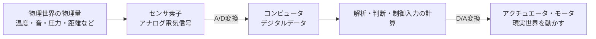
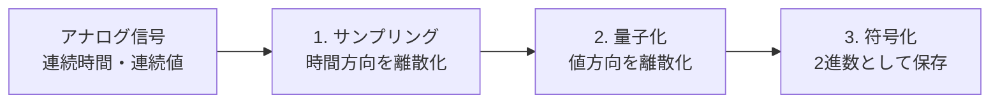

# 第6週：センサ信号処理（アナログとデジタル）

> ⏱️ 読了時間：約35分 | 📝 自己復習：計算・判断問題 12問 | 今日の中心：A/D変換・分解能・サンプリング定理

## 学習目標

この週の講義を終えると、以下のことができるようになります：

- [ ] 現実世界の連続的な信号と、コンピュータで扱う離散的なデータの違いを説明できる
- [ ] A/D変換とD/A変換が、計測・制御のどこで使われるか説明できる
- [ ] サンプリング時間 $T$ とサンプリング周波数 $f_s$ の関係を計算できる
- [ ] 離散化誤差と量子化誤差を、時間方向・値方向の情報損失として説明できる
- [ ] ビット数から分解能を計算できる
- [ ] サンプリング定理、ナイキスト周波数、エリアシングを使って測定条件を判断できる
- [ ] 実用上、なぜ理論上の2倍だけでなく 5〜10倍程度の余裕を見込むことが多いか説明できる

---

## 0. これまでの復習：測定値はどのようにデータになるのか


第3〜5週では、すでに得られた測定データをどう扱うかを学びました。

| 週 | 主な内容 | データに対する見方 |
|---:|---|---|
| 第3週 | 平均・分散・標準偏差・最小二乗法 | 測定値のばらつきから、信頼できる値を考える |
| 第4週 | 回帰分析・相関 | 2つの量の関係を、グラフや数値で読む |
| 第5週 | 補間・外挿・差分 | 測定点の間や外側を推定する |

しかし、そもそもコンピュータの中にあるデータは、最初から存在していたわけではありません。

現実の温度・音・圧力・距離・電圧などは、多くの場合、時間的に連続して変化します。一方、コンピュータが保存し、計算し、制御に使うのは、離散的な数値列です。

この第6週では、次の問いを扱います。

::: tip 今日の問い
現実世界の連続的な信号は、どのようにしてコンピュータで扱える数値データになるのか。
:::

---

## 1. アナログ信号とデジタル信号


### 1.1 アナログ信号

**アナログ信号**とは、時間や値が連続的に変化する信号です。

例：

- 室温の変化
- マイクに入る音声
- 圧力センサの出力電圧
- 距離センサが出す電圧
- 力センサや加速度センサの出力

現実世界の多くの物理量は、本来は連続的に変化しています。

### 1.2 デジタル信号

**デジタル信号**とは、時間方向にも値方向にも、とびとびの値として表された信号です。

例えば、電圧波形をコンピュータに取り込むと、次のような数値列になります。

```text
時刻 [s]    0.00   0.01   0.02   0.03   0.04   ...
電圧 [V]    1.24   1.31   1.40   1.35   1.28   ...
```

ここで重要なのは、コンピュータは「連続そのもの」を保存しているのではなく、一定間隔で取り出した数値を保存している、という点です。

### 1.3 アナログとデジタルの比較

| 項目 | アナログ信号 | デジタル信号 |
|---|---|---|
| 時間 | 連続 | 離散 |
| 値 | 連続 | 離散 |
| 自然現象との関係 | 現実の物理量に近い | コンピュータで保存・計算しやすい |
| 例 | 電圧波形、音、温度変化 | 数値列、画像データ、制御指令 |

::: info ポイント
デジタル化とは、連続的な現象を、コンピュータで扱える数値列に変換することです。
:::

---

## 2. 計測・制御における信号の流れ


センサを使った計測・制御では、入力側で **A/D変換**、出力側で **D/A変換** が使われます。


```mermaid
graph LR
    A[物理世界の物理量<br>温度・音・圧力・距離など] --> B[センサ素子<br>アナログ電気信号]
    B -->|A/D変換| C[コンピュータ<br>デジタルデータ]
    C --> D[解析・判断・制御入力の計算]
    D -->|D/A変換| E[アクチュエータ・モータ<br>現実世界を動かす]
```

- **A/D変換**：Analog to Digital Conversion。アナログ信号をデジタルデータに変換する。
- **D/A変換**：Digital to Analog Conversion。デジタルデータをアナログ信号に戻す。

ロボットや計測システムでは、次の流れが基本になります。

1. 現実の物理量をセンサで電気信号に変える
2. その電気信号をA/D変換して数値データにする
3. コンピュータで解析・判断する
4. 必要ならD/A変換してモータなどを動かす

---

## 3. A/D変換の3段階


A/D変換では、主に次の3つの処理が行われます。


```mermaid
graph LR
    A[アナログ信号<br>連続時間・連続値] --> B[1. サンプリング<br>時間方向を離散化]
    B --> C[2. 量子化<br>値方向を離散化]
    C --> D[3. 符号化<br>2進数として保存]
```

| 段階 | 何をするか | 失われやすい情報 |
|---|---|---|
| サンプリング | 一定時間ごとに信号を測る | 測定点と測定点の間の時間情報 |
| 量子化 | 測定値を有限個の段階に丸める | 細かい値の違い |
| 符号化 | 数値を2進数として保存する | 表現できない値は丸められる |

::: warning 重要
A/D変換は便利ですが、変換の途中で情報が失われます。主な損失は、時間方向の損失と値方向の損失です。
:::

---

## 4. サンプリング：時間方向をとびとびに測る


### 4.1 サンプリングとは

**サンプリング**とは、アナログ信号に対して、離散的にデータを取得することです。

一定間隔で測定するとき、その間隔を **サンプリング時間** といいます。

| 用語 | 記号 | 意味 |
|---|---|---|
| サンプリング時間 | $T$ [s] | 測定と測定の時間間隔 |
| サンプリング周波数 | $f_s$ [Hz] | 1秒あたりの測定回数 |

両者の関係は次の式です。

$$
f_s = \frac{1}{T}, \qquad T = \frac{1}{f_s}
$$

### 4.2 計算例

例1：$T = 0.01\,\mathrm{s}$ ごとに測定する場合

$$
f_s = \frac{1}{0.01} = 100\,\mathrm{Hz}
$$

つまり、1秒間に100回測定していることになります。

例2：$f_s = 50\,\mathrm{Hz}$ で測定する場合

$$
T = \frac{1}{50} = 0.02\,\mathrm{s}
$$

つまり、0.02秒ごとに1回測定していることになります。

### 4.3 身近なサンプリング周波数

サンプリング周波数は、センサだけでなく、映像・音・画面表示にも関係します。

| 分野 | 例 | 意味 |
|---|---|---|
| 動画 | 30 fps, 60 fps | 1秒あたりのフレーム数 |
| ディスプレイ | 60 Hz, 144 Hz | 1秒あたりの画面更新回数 |
| 音声CD | 44.1 kHz | 1秒あたり44100回の音声サンプリング |
| 表面筋電位（EMG） | 1000 Hz以上など | 速い変化を捉えるため高いサンプリングが必要 |
| IMU・加速度センサ | 100 Hz, 200 Hzなど | 動きの速さに応じて設定する |

変化が遅い現象なら低いサンプリング周波数でも十分なことがあります。一方、速く変化する現象では、高いサンプリング周波数が必要になります。

---

## 5. 離散化誤差：点と点の間の情報が失われる


サンプリングによって、連続的な波形は点の列になります。

サンプリング周波数が十分に高ければ、元の波形に近い形を再現できます。しかしサンプリングが粗いと、測定点の間で何が起きたかが見えなくなります。

::: warning 離散化誤差
連続的な時間変化を、とびとびの時刻でしか測らないために生じる誤差を、ここでは離散化誤差として考えます。
:::

例えば、10 msごとに測定している場合、5 msの時点の値は直接測定していません。第5週で学んだ補間は、この「測っていない間」を推定する考え方です。

ただし、補間で推定できるとしても、実際に測っていない情報が完全に戻るわけではありません。

---

## 6. 量子化と分解能：値方向をとびとびにする


### 6.1 量子化とは

**量子化**とは、連続的な値を、有限個の段階のどれかに割り当てることです。

例えば、0〜5 V の電圧を 10 bit でA/D変換する場合、出力されるデジタル値は通常、0〜1023 の整数になります。

```text
0 V  ------------------------------  5 V
 0     1     2     ...     1022   1023
```

本当の値が 2.436 V であっても、コンピュータの中では最も近い段階の整数値として保存されます。この丸めによって、**量子化誤差** が発生します。

### 6.2 bit数と段数

$n$ bit で表せる段数は、次のようになります。

$$
2^n
$$

段の値を表すことができます。

| bit数 | 段数 | 0〜5 Vを測るときの1段の幅 |
|---:|---:|---:|
| 8 bit | 256 | $5/256 \approx 0.0195\,\mathrm{V}$ |
| 10 bit | 1024 | $5/1024 \approx 0.00488\,\mathrm{V}$ |
| 12 bit | 4096 | $5/4096 \approx 0.00122\,\mathrm{V}$ |
| 16 bit | 65536 | $5/65536 \approx 0.000076\,\mathrm{V}$ |

bit数が1増えると、段数は2倍になります。

### 6.3 分解能の計算


測定範囲が $V_{\min}$ から $V_{\max}$ まで、bit数が $n$ のとき、1段あたりの幅は次のように計算します。

$$
\Delta = \frac{V_{\max} - V_{\min}}{2^n}
$$

例：0〜5 Vを10 bitで測定する場合

$$
\Delta = \frac{5 - 0}{2^{10}} = \frac{5}{1024} \approx 0.00488\,\mathrm{V}
$$

つまり、約 4.9 mV より細かい違いは区別しにくい、ということです。

### 6.4 量子化誤差

量子化では、本当の値を近い段階の値に丸めるため、値方向の誤差が生じます。

一般に、最も近い段階に丸めると考える場合、最大の量子化誤差はおよそ次の大きさになります。

$$
\frac{\Delta}{2}
$$

bit数が多いほど1段の幅 $\Delta$ は小さくなり、量子化誤差も小さくなります。

ただし、bit数を増やせば必ず測定全体が正確になるわけではありません。センサ自身のノイズ、校正誤差、温度変化、回路の性能なども測定結果に影響します。

::: tip ポイント
bit数はA/D変換器の性能に関わる重要な指標ですが、測定全体の性能は「センサ・回路・環境・処理方法」も含めて判断します。
:::

---

## 7. 身近なデジタル化の例：画像


画像も、信号のデジタル化として理解できます。

### 7.1 画像のサンプリング

1次元の時間信号では、時間方向に一定間隔で測定します。

画像では、縦方向・横方向に一定間隔で光の情報を取得します。この1点1点が **画素（ピクセル）** です。

例：1920 × 1080 の画像

$$
1920 \times 1080 = 2,073,600
$$

つまり、約207万個の画素で構成されています。

### 7.2 画像の量子化

白黒画像では、明るさを 0〜255 の整数で表すことがあります。

- 0：黒
- 128：中間の灰色
- 255：白

これは、明るさを8 bit、つまり256段階で表しているということです。

カラー画像では、RGBそれぞれを8 bitで表す場合がよくあります。

| 成分 | 値の範囲 |
|---|---|
| R（赤） | 0〜255 |
| G（緑） | 0〜255 |
| B（青） | 0〜255 |

この場合、$8 + 8 + 8 = 24$ bit のカラー表現になります。

::: info センサ信号との対応
時間信号では「時間方向の点」と「値の段階」が問題になります。画像では「空間方向の画素」と「明るさ・色の段階」が問題になります。
:::

---

## 8. サンプリング定理とナイキスト周波数


### 8.1 サンプリング定理

サンプリング定理は、元の信号を再現するための最低条件を示す定理です。

::: danger サンプリング定理
原信号の最高周波数を $f_{\max}$ とすると、理論上、次の条件を満たすサンプリング周波数が必要です。

$$
f_s \geq 2 f_{\max}
$$
:::

つまり、信号の中で最も速く変化する成分の2倍以上の周波数で測定する必要があります。

### 8.2 ナイキスト周波数

サンプリング周波数の半分を **ナイキスト周波数** といいます。

$$
f_N = \frac{f_s}{2}
$$

ナイキスト周波数は、そのサンプリング条件で正しく扱える周波数の目安になります。

例：$f_s = 100\,\mathrm{Hz}$ の場合

$$
f_N = \frac{100}{2} = 50\,\mathrm{Hz}
$$

この場合、50 Hzを超える成分を含む信号は、正しく再現できない可能性があります。

### 8.3 エリアシング


**エリアシング**とは、サンプリング周波数が不足しているために、高周波の信号が低周波の信号のように見えてしまう現象です。

身近な例として、動画で車輪が逆回転して見えることがあります。これは、実際の車輪の回転と、カメラのフレーム取得のタイミングが合わず、違う動きとして見えてしまうためです。

エリアシングは、センサ信号でも起こります。

- 高速振動を低いサンプリング周波数で測る
- LEDの高速点滅を低いフレームレートで撮る
- 高周波ノイズを含む信号を十分に速く測らない

このような場合、実際には存在しない低周波の波形が見えてしまうことがあります。

### 8.4 実用上は2倍だけでは足りないことが多い

理論上の最低条件は $f_s \geq 2f_{\max}$ です。

しかし、実際の計測では、次の理由から 5〜10倍程度のサンプリング周波数を使うことが多いです。

- 実際の最高周波数がはっきり分からないことがある
- 2倍ぎりぎりでは、波形を滑らかに観察しにくい
- 回路やセンサには理想的でない特性がある
- ノイズや急な変化を見落とす可能性がある

::: tip 実用上の目安
理論：$f_s \geq 2f_{\max}$  
実用：最高周波数の5〜10倍程度の余裕を持たせることが多い
:::

---

## 9. 第6週のまとめ：A/D変換で失われる2方向の情報


A/D変換では、主に2方向の情報が失われます。

| 方向 | 処理 | 何が失われるか | 何を考えるべきか |
|---|---|---|---|
| 時間方向 | サンプリング | 測定点の間の変化 | どれくらい速く測るか、エリアシングを防げるか |
| 値方向 | 量子化 | 段階より細かい値の違い | 何bitで測るか、分解能は十分か |

デジタルデータは保存・計算・解析に便利です。しかし、データを作る過程で情報が失われることを理解しておく必要があります。

次回以降は、A/D変換された後の信号について、さらに考えます。実際のセンサ信号には、ノイズ、温度変化、電源の影響、機械的な振動、環境光など、さまざまな要因が重なります。

---

## 授業後の自己復習：計算・判断問題

前の週と同じように、1つの問題に対して1つの解答を用意しています。まず自分で解いてから、クリックして解答を確認してください。

### 問題1：アナログ信号とデジタル信号を区別する

温度センサの出力電圧が時間とともに連続的に変化している。この信号をコンピュータに取り込む前と、取り込んだ後では、それぞれアナログ信号・デジタル信号のどちらと考えればよいか。

<details>
<summary>解答</summary>

コンピュータに取り込む前のセンサ出力電圧は、時間的にも値的にも連続的に変化するので、アナログ信号である。

コンピュータに取り込んだ後は、一定時間ごとに測定され、有限の数値として保存されるので、デジタル信号である。

ポイントは、デジタル信号では「時間方向」と「値方向」がどちらも離散的になることである。

</details>

### 問題2：A/D変換とD/A変換の役割

ロボットが距離センサで障害物までの距離を測り、その結果に基づいてモータを動かす。この流れの中で、A/D変換とD/A変換はそれぞれどこで使われるか。

<details>
<summary>解答</summary>

A/D変換は、距離センサから出るアナログ電気信号をコンピュータで扱えるデジタルデータに変換するときに使われる。

D/A変換は、コンピュータで計算した制御指令を、モータを動かすためのアナログ信号に戻すときに使われる。

つまり、入力側では A/D変換、出力側では D/A変換が使われる。

</details>

### 問題3：A/D変換の3段階

A/D変換の流れを、サンプリング・量子化・符号化の3語を使って順番に説明しなさい。

<details>
<summary>解答</summary>

A/D変換は、次の順番で考えることができる。

1. **サンプリング**：アナログ信号を一定時間ごとに測定する。
2. **量子化**：測定した値を、有限個の段階のどれかに丸める。
3. **符号化**：丸めた数値を2進数などのデジタルデータとして保存する。

サンプリングでは時間方向が離散化され、量子化では値方向が離散化される。

</details>

### 問題4：サンプリング周波数を求める

あるセンサを $T = 0.005\,\mathrm{s}$ ごとに測定した。このときのサンプリング周波数 $f_s$ を求めなさい。

<details>
<summary>解答</summary>

サンプリング周波数は、サンプリング時間の逆数である。

$$
f_s = \frac{1}{T} = \frac{1}{0.005} = 200\,\mathrm{Hz}
$$

したがって、1秒間に200回測定している。

</details>

### 問題5：サンプリング時間を求める

サンプリング周波数が $f_s = 250\,\mathrm{Hz}$ のとき、サンプリング時間 $T$ を求めなさい。

<details>
<summary>解答</summary>

サンプリング時間は、サンプリング周波数の逆数である。

$$
T = \frac{1}{f_s} = \frac{1}{250} = 0.004\,\mathrm{s}
$$

つまり、4 msごとに1回測定している。

</details>

### 問題6：身近な例のサンプリング周波数を読む

60 fps の動画は、1秒間に何回画像を取得していると考えられるか。また、30 fps と比べると、速い動きを見るときにどちらが有利か。

<details>
<summary>解答</summary>

60 fps は、1秒間に60枚の画像を取得していることを意味する。

30 fps は1秒間に30枚なので、60 fps の方が時間方向の点が多い。したがって、速い動きを見るときには、一般に60 fps の方が動きを細かく追いやすい。

これは、サンプリング周波数が高いほど、時間方向の変化を細かく記録できることに対応している。

</details>

### 問題7：離散化誤差を説明する

10 msごとにセンサ信号を測定している。このとき、5 msの時点で急な変化が起きた場合、その変化を必ず正確に記録できるとは限らない。なぜか。

<details>
<summary>解答</summary>

10 msごとにしか測定していない場合、測定点は 0 ms、10 ms、20 ms、... のように並ぶ。

5 msの時点は測定点ではないため、その瞬間の値は直接記録されない。したがって、測定点と測定点の間で起きた変化は見落とされる可能性がある。

このように、時間方向をとびとびに測ることで生じる情報の損失が、離散化誤差に関係する。

</details>

### 問題8：分解能を計算する（0〜3.3 V、12 bit）

0〜3.3 V の電圧を 12 bit で測定する。1段あたりの電圧幅を求めなさい。

<details>
<summary>解答</summary>

12 bit なので段数は、

$$
2^{12} = 4096
$$

したがって、1段あたりの幅は、

$$
\Delta = \frac{3.3}{4096} \approx 0.000805\,\mathrm{V}
$$

約 $0.805\,\mathrm{mV}$ である。

</details>

### 問題9：分解能を計算する（0〜10 V、8 bit）

0〜10 V の電圧を 8 bit で測定する。1段あたりの電圧幅を求めなさい。

<details>
<summary>解答</summary>

8 bit なので段数は、

$$
2^8 = 256
$$

したがって、1段あたりの幅は、

$$
\Delta = \frac{10}{256} \approx 0.0391\,\mathrm{V}
$$

約 $39.1\,\mathrm{mV}$ である。

</details>

### 問題10：量子化誤差の最大値を求める

0〜5 V の電圧を 10 bit で測定する。最も近い段階に丸めると考えるとき、最大の量子化誤差はおよそいくらか。

<details>
<summary>解答</summary>

まず1段あたりの幅を求める。

$$
\Delta = \frac{5}{2^{10}} = \frac{5}{1024} \approx 0.00488\,\mathrm{V}
$$

最も近い段階に丸める場合、最大の量子化誤差はおよそ $\Delta/2$ である。

$$
\frac{\Delta}{2} \approx \frac{0.00488}{2} = 0.00244\,\mathrm{V}
$$

したがって、最大の量子化誤差は約 $2.44\,\mathrm{mV}$ である。

</details>

### 問題11：サンプリング定理で最低条件を判断する

最高周波数が 20 Hz の信号を測定したい。理論上、最低限必要なサンプリング周波数はいくらか。

<details>
<summary>解答</summary>

サンプリング定理より、原信号の最高周波数の2倍以上で測定する必要がある。

$$
f_s \geq 2f_{\max}
$$

したがって、

$$
f_s \geq 2 	imes 20 = 40\,\mathrm{Hz}
$$

最低限必要なサンプリング周波数は 40 Hz である。

</details>

### 問題12：ナイキスト周波数とエリアシングを判断する

サンプリング周波数 $f_s = 100\,\mathrm{Hz}$ で測定している。このときのナイキスト周波数を求めなさい。また、80 Hz の成分を含む信号は安全に測定できるか。

<details>
<summary>解答</summary>

ナイキスト周波数は、サンプリング周波数の半分である。

$$
f_N = \frac{f_s}{2} = \frac{100}{2} = 50\,\mathrm{Hz}
$$

80 Hz は 50 Hz を超えている。したがって、この条件では正しく再現できない可能性があり、エリアシングが発生する恐れがある。

安全に測定するには、少なくとも $f_s \geq 160\,\mathrm{Hz}$ が必要であり、実用上はさらに余裕を持たせることが望ましい。

</details>

---

## 📚 次週への橋渡し

第6週では、アナログ信号をデジタルデータに変えるときの条件を学びました。

次に考えるべきことは、デジタル化された信号そのものの性質です。

- 実際のセンサ信号には、どのようなノイズが混ざるのか
- 信号を滑らかにするには、どのような処理が必要か
- センサの直線性、ヒステリシス、繰り返し性、ドリフト、応答性をどう読むか

第7週では、これらのセンサ信号の特性を扱います。
