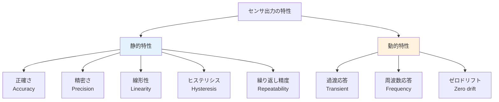

# 第7週：センサ信号の特性

> ⏱️ 読了時間：約25分 | 📝 確認問題：5問

## 学習目標

この週の講義を終えると、以下のことができるようになります：

- [ ] 正確さ（Accuracy）と精密さ（Precision）の違いを説明できる
- [ ] 線形性（Linearity）の意味と重要性を理解できる
- [ ] ヒステリシス（Hysteresis）の意味を説明できる
- [ ] 繰り返し精度とゼロドリフトの概念を理解できる
- [ ] 過渡応答と周波数応答の基本を説明できる

---

## 1. 正確さと精密さ

### 1.1 正確さ（Accuracy）

::: info 定義
**正確さ**：真値に対して誤差が小さいこと。平均するとだいたい真値に近い。
:::

### 1.2 精密さ（Precision）

::: info 定義
**精密さ**：ばらつきが小さいこと。繰り返し精度が良い。
:::

### 1.3 正確さと精密さの違い

<svg viewBox="0 0 520 220" xmlns="http://www.w3.org/2000/svg" style="max-width: 520px; margin: 20px auto; display: block;">
  <text x="130" y="20" text-anchor="middle" font-size="13" fill="#333" font-weight="bold">正確だが精密でない</text>
  <text x="390" y="20" text-anchor="middle" font-size="13" fill="#333" font-weight="bold">精密だが正確でない</text>
  <circle cx="130" cy="120" r="80" fill="none" stroke="#ccc" stroke-width="1"/>
  <circle cx="130" cy="120" r="55" fill="none" stroke="#ccc" stroke-width="1"/>
  <circle cx="130" cy="120" r="30" fill="none" stroke="#ccc" stroke-width="1"/>
  <circle cx="130" cy="120" r="3" fill="#F44336"/>
  <circle cx="115" cy="95" r="4" fill="#1565C0"/>
  <circle cx="150" cy="105" r="4" fill="#1565C0"/>
  <circle cx="120" cy="145" r="4" fill="#1565C0"/>
  <circle cx="145" cy="140" r="4" fill="#1565C0"/>
  <circle cx="108" cy="115" r="4" fill="#1565C0"/>
  <circle cx="140" cy="92" r="4" fill="#1565C0"/>
  <circle cx="155" cy="130" r="4" fill="#1565C0"/>
  <circle cx="110" cy="130" r="4" fill="#1565C0"/>
  <text x="130" y="210" text-anchor="middle" font-size="11" fill="#666">だいたい真ん中だが、ばらつく</text>
  <circle cx="390" cy="120" r="80" fill="none" stroke="#ccc" stroke-width="1"/>
  <circle cx="390" cy="120" r="55" fill="none" stroke="#ccc" stroke-width="1"/>
  <circle cx="390" cy="120" r="30" fill="none" stroke="#ccc" stroke-width="1"/>
  <circle cx="390" cy="120" r="3" fill="#F44336"/>
  <circle cx="420" cy="80" r="4" fill="#FF9800"/>
  <circle cx="425" cy="85" r="4" fill="#FF9800"/>
  <circle cx="418" cy="78" r="4" fill="#FF9800"/>
  <circle cx="422" cy="82" r="4" fill="#FF9800"/>
  <circle cx="416" cy="84" r="4" fill="#FF9800"/>
  <circle cx="424" cy="76" r="4" fill="#FF9800"/>
  <circle cx="419" cy="81" r="4" fill="#FF9800"/>
  <circle cx="421" cy="79" r="4" fill="#FF9800"/>
  <text x="390" y="210" text-anchor="middle" font-size="11" fill="#666">外れているが、集まっている</text>
</svg>

| 特性 | 正確さ（Accuracy） | 精密さ（Precision） |
|------|:------------------:|:------------------:|
| **評価基準** | 真値との差 | ばらつきの小ささ |
| **統計量** | 平均値の偏り（バイアス） | 標準偏差 |
| **改善方法** | 較正（キャリブレーション） | 機器の精度向上 |

::: tip 📌 振り返り
正確さと精密さの概念は [第2週：誤差と精度](/weeks/week-02) でも学びました。
:::

---

## 2. 線形性（Linearity）

### 2.1 線形性とは

::: info 定義
**線形性**：入力に対して出力の応答が**比例的**であること
:::

**例：線形ばねの伸びと復元力**

<svg viewBox="0 0 500 200" xmlns="http://www.w3.org/2000/svg" style="max-width: 500px; margin: 20px auto; display: block;">
  <rect x="20" y="50" width="15" height="100" fill="#999"/>
  <line x1="35" y1="60" x2="50" y2="70" stroke="#666" stroke-width="1.5"/>
  <line x1="50" y1="70" x2="35" y2="80" stroke="#666" stroke-width="1.5"/>
  <line x1="35" y1="80" x2="50" y2="90" stroke="#666" stroke-width="1.5"/>
  <line x1="50" y1="90" x2="35" y2="100" stroke="#666" stroke-width="1.5"/>
  <line x1="35" y1="100" x2="50" y2="110" stroke="#666" stroke-width="1.5"/>
  <line x1="50" y1="110" x2="35" y2="120" stroke="#666" stroke-width="1.5"/>
  <line x1="35" y1="120" x2="50" y2="130" stroke="#666" stroke-width="1.5"/>
  <line x1="50" y1="130" x2="35" y2="140" stroke="#666" stroke-width="1.5"/>
  <rect x="50" y="85" width="30" height="30" fill="#FF9800" rx="3"/>
  <line x1="80" y1="100" x2="130" y2="100" stroke="#1565C0" stroke-width="2"/>
  <polygon points="126,96 134,100 126,104" fill="#1565C0"/>
  <line x1="50" y1="100" x2="10" y2="100" stroke="#F44336" stroke-width="2" stroke-dasharray="5,3"/>
  <polygon points="14,96 6,100 14,104" fill="#F44336"/>
  <text x="115" y="90" font-size="13" fill="#1565C0" font-weight="bold">F</text>
  <text x="18" y="90" font-size="11" fill="#F44336">F_R</text>
  <text x="65" y="75" font-size="10" fill="#666">x</text>
  <line x1="250" y1="170" x2="430" y2="170" stroke="#333" stroke-width="1.5"/>
  <line x1="250" y1="170" x2="250" y2="40" stroke="#333" stroke-width="1.5"/>
  <text x="340" y="190" text-anchor="middle" font-size="11" fill="#333">変位 x</text>
  <text x="235" y="100" text-anchor="middle" font-size="11" fill="#333" transform="rotate(-90,235,100)">復元力 |F_R|</text>
  <line x1="250" y1="170" x2="420" y2="50" stroke="#FF9800" stroke-width="2.5"/>
  <text x="260" y="175" font-size="10" fill="#333">O</text>
  <text x="380" y="65" font-size="11" fill="#FF9800" font-weight="bold">線形</text>
</svg>

線形性があると、**内挿・外挿**に有利です。

### 2.2 線形範囲の重要性

実際のセンサでは、入力全範囲で完全に線形であることは稀です。**できるだけ線形な関係とみなせる範囲**での使用が好ましいです。

<svg viewBox="0 0 450 220" xmlns="http://www.w3.org/2000/svg" style="max-width: 450px; margin: 20px auto; display: block;">
  <line x1="60" y1="190" x2="400" y2="190" stroke="#333" stroke-width="1.5"/>
  <line x1="60" y1="190" x2="60" y2="30" stroke="#333" stroke-width="1.5"/>
  <text x="230" y="210" text-anchor="middle" font-size="11" fill="#333">入力（input）</text>
  <text x="40" y="110" text-anchor="middle" font-size="11" fill="#333" transform="rotate(-90,40,110)">出力（output）</text>
  <path d="M60,190 Q120,140 180,100 Q240,65 280,50 Q320,42 350,40 Q380,39 400,39" fill="none" stroke="#FF9800" stroke-width="2.5"/>
  <line x1="60" y1="190" x2="250" y2="70" stroke="#4CAF50" stroke-width="1.5" stroke-dasharray="5,3"/>
  <rect x="60" y="70" width="190" height="125" fill="#C8E6C9" fill-opacity="0.15" stroke="#4CAF50" stroke-width="1.5" stroke-dasharray="5,3" rx="3"/>
  <text x="155" y="88" text-anchor="middle" font-size="11" fill="#4CAF50" font-weight="bold">線形範囲（Linear）</text>
  <text x="155" y="102" text-anchor="middle" font-size="10" fill="#4CAF50">計測の信頼性が高い</text>
  <text x="350" y="60" font-size="10" fill="#FF9800">飽和領域</text>
  <text x="68" y="195" font-size="10" fill="#333">O</text>
</svg>

::: warning ⚠️ 注意
線形範囲を超えた領域では、出力が入力に比例しなくなり（飽和など）、計測の信頼性が低下します。
:::

---

## 3. ヒステリシス（Hysteresis）

### 3.1 ヒステリシスとは

::: info 定義
**ヒステリシス**：増加側と減少側で**出力応答が異なる**現象
:::

<svg viewBox="0 0 450 250" xmlns="http://www.w3.org/2000/svg" style="max-width: 450px; margin: 20px auto; display: block;">
  
  <line x1="60" y1="220" x2="400" y2="220" stroke="#333" stroke-width="1.5"/>
  <line x1="60" y1="220" x2="60" y2="30" stroke="#333" stroke-width="1.5"/>
  <text x="230" y="245" text-anchor="middle" font-size="11" fill="#333">入力（input）</text>
  <text x="40" y="125" text-anchor="middle" font-size="11" fill="#333" transform="rotate(-90,40,125)">出力（output）</text>
  <path d="M80,200 Q120,180 160,150 Q200,110 240,80 Q280,55 320,45 Q360,40 380,38" fill="none" stroke="#9C27B0" stroke-width="2.5" class="path-up"/>
  <path d="M380,38 Q360,50 320,65 Q280,85 240,110 Q200,140 160,165 Q120,185 80,200" fill="none" stroke="#1565C0" stroke-width="2.5" class="path-down"/>
  <circle cx="80" cy="200" r="4" fill="#9C27B0"/>
  <circle cx="120" cy="178" r="4" fill="#9C27B0"/>
  <circle cx="160" cy="150" r="4" fill="#9C27B0"/>
  <circle cx="200" cy="115" r="4" fill="#9C27B0"/>
  <circle cx="240" cy="82" r="4" fill="#9C27B0"/>
  <circle cx="280" cy="58" r="4" fill="#9C27B0"/>
  <circle cx="320" cy="46" r="4" fill="#9C27B0"/>
  <circle cx="360" cy="40" r="4" fill="#9C27B0"/>
  <circle cx="360" cy="48" r="4" fill="#1565C0"/>
  <circle cx="320" cy="62" r="4" fill="#1565C0"/>
  <circle cx="280" cy="82" r="4" fill="#1565C0"/>
  <circle cx="240" cy="108" r="4" fill="#1565C0"/>
  <circle cx="200" cy="138" r="4" fill="#1565C0"/>
  <circle cx="160" cy="162" r="4" fill="#1565C0"/>
  <circle cx="120" cy="183" r="4" fill="#1565C0"/>
  <circle cx="80" cy="200" r="6" fill="#9C27B0" opacity="0.9" class="hyst-dot"/>
  <text x="300" y="35" font-size="11" fill="#9C27B0" font-weight="bold">増加 &#x2197;</text>
  <text x="130" y="210" font-size="11" fill="#1565C0" font-weight="bold">減少 &#x2198;</text>
  <text x="68" y="225" font-size="10" fill="#333">O</text>
</svg>

近似すればだいたい直線性がありますが、入力の**増減方向で出力特性が異なります**。

### 3.2 具体例：手指の筋腱複合体の弾性特性

手指の筋腱複合体（Muscle-Tendon Complex）のヒステリシスの例：

- 指先を伸展（反らす）方向に押し込むと、指屈筋腱が伸長して**復元力**が発揮される（ばねを引き延ばすような作用）
- 外力を取り除くと蓄積された弾性エネルギーにより、手指は筋力以上に**高速に運動**する

<svg viewBox="0 0 450 220" xmlns="http://www.w3.org/2000/svg" style="max-width: 450px; margin: 20px auto; display: block;">
  <line x1="60" y1="200" x2="400" y2="200" stroke="#333" stroke-width="1.5"/>
  <line x1="60" y1="200" x2="60" y2="30" stroke="#333" stroke-width="1.5"/>
  <text x="230" y="220" text-anchor="middle" font-size="11" fill="#333">関節角度 [deg]</text>
  <text x="40" y="115" text-anchor="middle" font-size="11" fill="#333" transform="rotate(-90,40,115)">外力 [N]</text>
  <path d="M80,185 Q120,170 160,140 Q200,100 250,65 Q300,42 350,30" fill="none" stroke="#4CAF50" stroke-width="2.5"/>
  <path d="M350,30 Q300,55 250,85 Q200,120 160,155 Q120,175 80,185" fill="none" stroke="#9C27B0" stroke-width="2.5"/>
  <text x="300" y="25" font-size="11" fill="#4CAF50" font-weight="bold">反らす（loading）&#x2197;</text>
  <text x="280" y="110" font-size="11" fill="#9C27B0" font-weight="bold">&#x2199; 戻す（unloading）</text>
</svg>

---

## 4. 繰り返し精度とゼロドリフト

### 4.1 繰り返し精度（Repeatability）

::: info 定義
**繰り返し精度**：同じ大きさの入力に対して、**同じだけの出力**をすること
:::

ロボットの制御においては、例えば毎回同じ位置に移動できること。

### 4.2 ゼロドリフト（Zero Drift）

::: info 定義
**ゼロドリフト**：ゼロ点のゆらぎ。無入力状態であっても、時間経過とともに**原点の値がずれてしまう**こと。
:::

<svg viewBox="0 0 450 180" xmlns="http://www.w3.org/2000/svg" style="max-width: 450px; margin: 20px auto; display: block;">
  <line x1="60" y1="150" x2="400" y2="150" stroke="#333" stroke-width="1.5"/>
  <line x1="60" y1="150" x2="60" y2="20" stroke="#333" stroke-width="1.5"/>
  <text x="230" y="172" text-anchor="middle" font-size="11" fill="#333">時間 t</text>
  <text x="40" y="85" text-anchor="middle" font-size="11" fill="#333" transform="rotate(-90,40,85)">出力（output）</text>
  <line x1="60" y1="120" x2="400" y2="120" stroke="#ccc" stroke-width="1" stroke-dasharray="4,3"/>
  <text x="410" y="123" font-size="10" fill="#ccc">理想（ゼロ）</text>
  <path d="M70,118 Q100,115 130,112 Q160,118 190,108 Q220,105 250,100 Q280,102 310,95 Q340,90 370,85 Q390,80 400,78" fill="none" stroke="#FF9800" stroke-width="2.5"/>
  <line x1="80" y1="118" x2="80" y2="120" stroke="#F44336" stroke-width="2"/>
  <line x1="250" y1="100" x2="250" y2="120" stroke="#F44336" stroke-width="2"/>
  <line x1="390" y1="80" x2="390" y2="120" stroke="#F44336" stroke-width="2"/>
  <text x="250" y="135" text-anchor="middle" font-size="10" fill="#F44336">ドリフト量が増加</text>
</svg>

::: warning ⚠️ ゼロドリフトの対策
- 定期的な**ゼロ点補正**（キャリブレーション）が必要
- 温度変化が大きい環境では特に注意
:::

---

## 5. 過渡応答（Transient Response）

### 5.1 ステップ応答

::: info 定義
どんな素子・デバイスも入力に対して**瞬間的に応答できることはありません**。
:::

<svg viewBox="0 0 500 200" xmlns="http://www.w3.org/2000/svg" style="max-width: 500px; margin: 20px auto; display: block;">
  <text x="130" y="18" text-anchor="middle" font-size="12" fill="#333" font-weight="bold">理想</text>
  <text x="370" y="18" text-anchor="middle" font-size="12" fill="#333" font-weight="bold">現実</text>
  <line x1="40" y1="170" x2="220" y2="170" stroke="#333" stroke-width="1"/>
  <line x1="40" y1="170" x2="40" y2="30" stroke="#333" stroke-width="1"/>
  <line x1="40" y1="140" x2="100" y2="140" stroke="#1565C0" stroke-width="2"/>
  <line x1="100" y1="140" x2="100" y2="60" stroke="#1565C0" stroke-width="2"/>
  <line x1="100" y1="60" x2="210" y2="60" stroke="#1565C0" stroke-width="2"/>
  <line x1="40" y1="140" x2="100" y2="140" stroke="#FF9800" stroke-width="2" stroke-dasharray="5,3"/>
  <line x1="100" y1="140" x2="100" y2="60" stroke="#FF9800" stroke-width="2" stroke-dasharray="5,3"/>
  <line x1="100" y1="60" x2="210" y2="60" stroke="#FF9800" stroke-width="2" stroke-dasharray="5,3"/>
  <text x="60" y="155" font-size="10" fill="#1565C0">入力</text>
  <text x="160" y="55" font-size="10" fill="#FF9800">出力</text>
  <line x1="280" y1="170" x2="460" y2="170" stroke="#333" stroke-width="1"/>
  <line x1="280" y1="170" x2="280" y2="30" stroke="#333" stroke-width="1"/>
  <line x1="280" y1="140" x2="340" y2="140" stroke="#1565C0" stroke-width="2"/>
  <line x1="340" y1="140" x2="340" y2="60" stroke="#1565C0" stroke-width="2"/>
  <line x1="340" y1="60" x2="450" y2="60" stroke="#1565C0" stroke-width="2"/>
  <path d="M280,140 L340,140 Q360,140 370,110 Q380,80 390,70 Q400,65 420,62 Q440,60 450,60" fill="none" stroke="#FF9800" stroke-width="2.5"/>
  <text x="300" y="155" font-size="10" fill="#1565C0">入力</text>
  <text x="430" y="55" font-size="10" fill="#FF9800">出力</text>
  <text x="400" y="85" font-size="9" fill="#FF9800">遅れ</text>
</svg>

### 5.2 応答の特性値

定常状態に落ち着くまでの応答を表す用語：

<svg viewBox="0 0 500 220" xmlns="http://www.w3.org/2000/svg" style="max-width: 500px; margin: 20px auto; display: block;">
  
  <line x1="60" y1="190" x2="450" y2="190" stroke="#333" stroke-width="1.5"/>
  <line x1="60" y1="190" x2="60" y2="20" stroke="#333" stroke-width="1.5"/>
  <text x="255" y="215" text-anchor="middle" font-size="11" fill="#333">時間 t</text>
  <text x="40" y="105" text-anchor="middle" font-size="11" fill="#333" transform="rotate(-90,40,105)">出力</text>
  <g class="anim-steady">
    <line x1="60" y1="70" x2="450" y2="70" stroke="#4CAF50" stroke-width="1" stroke-dasharray="4,3"/>
    <text x="455" y="73" font-size="9" fill="#4CAF50">定常値</text>
  </g>
  <g class="anim-threshold">
    <line x1="60" y1="80" x2="450" y2="80" stroke="#F44336" stroke-width="1" stroke-dasharray="3,2"/>
    <line x1="60" y1="60" x2="450" y2="60" stroke="#F44336" stroke-width="1" stroke-dasharray="3,2"/>
    <text x="455" y="63" font-size="8" fill="#F44336">閾値</text>
    <text x="455" y="83" font-size="8" fill="#F44336">閾値</text>
  </g>
  <path d="M80,190 L110,190 L110,70 L430,70" fill="none" stroke="#1565C0" stroke-width="1.5" class="anim-step"/>
  <path d="M80,190 Q100,190 110,180 Q130,80 140,40 Q150,30 160,45 Q170,60 180,78 Q190,82 200,72 Q210,65 220,68 Q230,72 240,71 Q250,69 260,70 Q280,70 300,70 Q350,70 430,70" fill="none" stroke="#FF9800" stroke-width="2.5" class="anim-output"/>
  <g class="anim-bracket">
    <line x1="110" y1="195" x2="110" y2="200" stroke="#333" stroke-width="1.5"/>
    <line x1="240" y1="195" x2="240" y2="200" stroke="#333" stroke-width="1.5"/>
    <line x1="110" y1="198" x2="240" y2="198" stroke="#9C27B0" stroke-width="2"/>
    <text x="175" y="210" text-anchor="middle" font-size="10" fill="#9C27B0" font-weight="bold">整定時間</text>
  </g>
</svg>

| 用語 | 意味 |
|------|------|
| **整定時間（Settling Time）** | 出力が定常値の一定範囲（閾値内）に収まるまでの時間 |
| **時定数（Time Constant）** | 応答が定常値の約63.2%に達するまでの時間 |
| **応答時間（Response Time）** | 入力変化から出力が規定値に達するまでの時間 |

---

## 6. 周波数応答（Frequency Response）

### 6.1 周波数による応答の違い

高周波の入力に対しては、応答が**追いつかない**。

<svg viewBox="0 0 500 170" xmlns="http://www.w3.org/2000/svg" style="max-width: 500px; margin: 20px auto; display: block;">
  <text x="130" y="15" text-anchor="middle" font-size="12" fill="#333" font-weight="bold">低周波入力</text>
  <text x="370" y="15" text-anchor="middle" font-size="12" fill="#333" font-weight="bold">高周波入力</text>
  <text x="55" y="42" font-size="10" fill="#1565C0">入力</text>
  <line x1="40" y1="60" x2="220" y2="60" stroke="#333" stroke-width="0.5"/>
  <path d="M45,60 Q70,25 95,60 Q120,95 145,60 Q170,25 195,60" fill="none" stroke="#1565C0" stroke-width="2"/>
  <text x="55" y="82" font-size="10" fill="#FF9800">出力</text>
  <line x1="40" y1="110" x2="220" y2="110" stroke="#333" stroke-width="0.5"/>
  <path d="M45,110 Q70,77 95,110 Q120,143 145,110 Q170,77 195,110" fill="none" stroke="#FF9800" stroke-width="2"/>
  <text x="130" y="150" text-anchor="middle" font-size="10" fill="#4CAF50" font-weight="bold">振幅がほぼ同じ</text>
  <text x="295" y="42" font-size="10" fill="#1565C0">入力</text>
  <line x1="280" y1="60" x2="460" y2="60" stroke="#333" stroke-width="0.5"/>
  <path d="M285,60 Q295,25 305,60 Q315,95 325,60 Q335,25 345,60 Q355,95 365,60 Q375,25 385,60 Q395,95 405,60 Q415,25 425,60 Q435,95 445,60" fill="none" stroke="#1565C0" stroke-width="2"/>
  <text x="295" y="82" font-size="10" fill="#FF9800">出力</text>
  <line x1="280" y1="110" x2="460" y2="110" stroke="#333" stroke-width="0.5"/>
  <path d="M285,110 Q295,100 305,110 Q315,120 325,110 Q335,100 345,110 Q355,120 365,110 Q375,100 385,110 Q395,120 405,110 Q415,100 425,110 Q435,120 445,110" fill="none" stroke="#FF9800" stroke-width="2"/>
  <text x="370" y="150" text-anchor="middle" font-size="10" fill="#F44336" font-weight="bold">振幅が大幅に減少（減衰）</text>
</svg>

### 6.2 センサ特性のまとめ

---

## 📝 確認問題

### Q1. 正確さ（Accuracy）の説明として正しいのは？

- [x] A. 真値に対して誤差が小さいこと
- [ ] B. ばらつきが小さいこと
- [ ] C. 繰り返し精度が良いこと
- [ ] D. 応答が速いこと

### Q2. 線形性が重要な理由は？

- [ ] A. センサの寿命が延びるから
- [x] B. 入力と出力の関係が予測しやすく、計測の信頼性が高いから
- [ ] C. ノイズが減少するから
- [ ] D. コストが下がるから

### Q3. ヒステリシスの説明として正しいのは？

- [ ] A. 入力に対して出力が常に同じ
- [ ] B. 時間とともに出力がゼロに戻る
- [x] C. 入力の増加時と減少時で出力応答が異なる
- [ ] D. 高周波入力に対して応答が速い

### Q4. ゼロドリフトとは？

- [ ] A. センサの出力が常にゼロになること
- [x] B. 無入力状態でも時間とともに原点の値がずれること
- [ ] C. 入力がゼロのとき出力が最大になること
- [ ] D. 周波数がゼロのときの応答

### Q5. 過渡応答について正しいのは？

- [ ] A. すべてのデバイスは入力に瞬間的に応答できる
- [ ] B. 高周波入力ほど応答が良い
- [x] C. どんな素子も入力変化に対して即座に応答することはできない
- [ ] D. 整定時間は常にゼロである

---

## 📚 次週の予習

- **第8週**: 中間試験
- 復習ポイント：第1週〜第7週の全内容、特に誤差・精度・統計処理・信号処理・センサ特性
