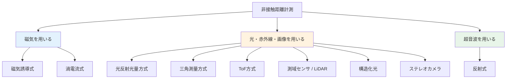
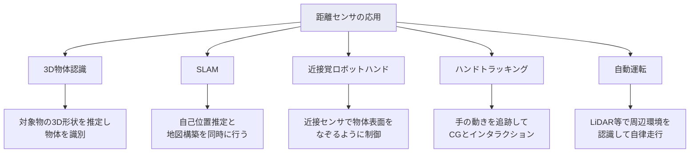

# 第9週：位置・距離センサ

> ⏱️ 読了時間：約35分 | 📝 確認問題：5問

## 学習目標

この週の講義を終えると、以下のことができるようになります：

- [ ] 非接触距離計測の主な方式を説明できる
- [ ] 磁気式距離センサの原理を理解できる
- [ ] 光学式距離計測（反射光量、三角測量、ToF）の原理を説明できる
- [ ] 画像を用いた距離計測（ステレオカメラ、構造化光）を理解できる
- [ ] 超音波距離センサの原理と特徴を説明できる

---

## 1. 非接触距離計測の概要

位置・距離を計測する方法は、大きく以下の3つに分類されます：

---

## 2. 磁気を用いた距離計測

### 2.1 磁気誘導式

::: info 原理
永久磁石が生じる磁束の変化を**コイル**で検出し、磁束の変化量から距離を推定する方式。
:::

<svg viewBox="0 0 450 180" xmlns="http://www.w3.org/2000/svg" style="max-width: 450px; margin: 20px auto; display: block;">
  <rect x="40" y="50" width="60" height="80" fill="#E3F2FD" stroke="#1565C0" stroke-width="2" rx="5"/>
  <text x="70" y="95" text-anchor="middle" font-size="11" fill="#1565C0" font-weight="bold">コイル</text>
  <rect x="300" y="50" width="60" height="80" fill="#FFCDD2" stroke="#F44336" stroke-width="2" rx="5"/>
  <text x="330" y="85" text-anchor="middle" font-size="10" fill="#F44336" font-weight="bold">N</text>
  <text x="330" y="105" text-anchor="middle" font-size="10" fill="#1565C0" font-weight="bold">S</text>
  <path d="M100,70 Q200,40 300,70" fill="none" stroke="#9C27B0" stroke-width="1.5" stroke-dasharray="5,3"/>
  <path d="M100,90 Q200,60 300,90" fill="none" stroke="#9C27B0" stroke-width="1.5" stroke-dasharray="5,3"/>
  <path d="M100,110 Q200,140 300,110" fill="none" stroke="#9C27B0" stroke-width="1.5" stroke-dasharray="5,3"/>
  <text x="200" y="55" text-anchor="middle" font-size="10" fill="#9C27B0">磁力線</text>
  <line x1="120" y1="150" x2="280" y2="150" stroke="#333" stroke-width="1.5"/>
  <line x1="120" y1="146" x2="120" y2="154" stroke="#333" stroke-width="1.5"/>
  <line x1="280" y1="146" x2="280" y2="154" stroke="#333" stroke-width="1.5"/>
  <text x="200" y="168" text-anchor="middle" font-size="11" fill="#333">距離 d</text>
</svg>

**特徴**：コイルと磁石の間に**非磁性体**があっても検出可能

### 2.2 渦電流式

::: info 原理
コイルに高周波磁界を発生させ、金属物体が接近すると**電磁誘導**により渦電流が発生する。この渦電流によるインピーダンス変化を検出する方式。
:::

<svg viewBox="0 0 450 180" xmlns="http://www.w3.org/2000/svg" style="max-width: 450px; margin: 20px auto; display: block;">
  <rect x="40" y="50" width="60" height="80" fill="#E3F2FD" stroke="#1565C0" stroke-width="2" rx="5"/>
  <text x="70" y="85" text-anchor="middle" font-size="10" fill="#1565C0" font-weight="bold">コイル</text>
  <text x="70" y="100" text-anchor="middle" font-size="9" fill="#1565C0">(高周波)</text>
  <rect x="300" y="40" width="80" height="100" fill="#E0E0E0" stroke="#757575" stroke-width="2" rx="3"/>
  <text x="340" y="85" text-anchor="middle" font-size="10" fill="#757575" font-weight="bold">金属</text>
  <text x="340" y="100" text-anchor="middle" font-size="9" fill="#757575">物体</text>
  <ellipse cx="320" cy="90" rx="15" ry="25" fill="none" stroke="#FF9800" stroke-width="1.5"/>
  <text x="320" y="125" text-anchor="middle" font-size="9" fill="#FF9800">渦電流</text>
  <path d="M100,60 Q200,30 300,60" fill="none" stroke="#9C27B0" stroke-width="1.5" stroke-dasharray="5,3"/>
  <path d="M100,90 Q200,120 300,90" fill="none" stroke="#9C27B0" stroke-width="1.5" stroke-dasharray="5,3"/>
  <text x="200" y="45" text-anchor="middle" font-size="10" fill="#9C27B0">磁束</text>
</svg>

### 2.3 磁気センサの原理例

| センサ | 原理 | 応用例 |
|--------|------|--------|
| **コイル** | 磁石の接近で磁束密度が変化 → 誘導起電力 | 近接検出 |
| **ホール素子** | 磁界中の導体に電流と磁界に直交する起電力が発生 | スマートフォンの電子コンパス |

---

## 3. 光を用いた距離計測

### 3.1 光反射光量方式

::: info 原理
LED の光が対象物で反射し、フォトトランジスタで受光する。受光量から距離を推定する。
:::

<svg viewBox="0 0 450 180" xmlns="http://www.w3.org/2000/svg" style="max-width: 450px; margin: 20px auto; display: block;">
  <rect x="30" y="40" width="80" height="30" fill="#FFF9C4" stroke="#F9A825" stroke-width="1.5" rx="3"/>
  <text x="70" y="60" text-anchor="middle" font-size="10" fill="#F9A825" font-weight="bold">LED（発光）</text>
  <rect x="30" y="100" width="80" height="30" fill="#E3F2FD" stroke="#1565C0" stroke-width="1.5" rx="3"/>
  <text x="70" y="120" text-anchor="middle" font-size="10" fill="#1565C0" font-weight="bold">受光素子</text>
  <rect x="340" y="30" width="40" height="120" fill="#E0E0E0" stroke="#757575" stroke-width="1.5" rx="3"/>
  <text x="360" y="95" text-anchor="middle" font-size="10" fill="#757575" font-weight="bold">対象物</text>
  <line x1="110" y1="55" x2="340" y2="70" stroke="#F9A825" stroke-width="2"/>
  <polygon points="336,67 344,70 336,73" fill="#F9A825"/>
  <line x1="340" y1="85" x2="110" y2="115" stroke="#1565C0" stroke-width="2" stroke-dasharray="5,3"/>
  <polygon points="114,112 106,115 114,118" fill="#1565C0"/>
  <text x="220" y="48" font-size="10" fill="#F9A825">発光</text>
  <text x="220" y="115" font-size="10" fill="#1565C0">反射光</text>
</svg>

::: warning ⚠️ 注意
**黒い物体**は光を吸収するため検出が困難です。一方、この性質を利用して白黒を区別する**ライントレーサ**などに使われます。
:::

### 3.2 三角測量方式（Triangulation）

::: info 原理
発光素子と受光素子（PSD：Position Sensitive Detector）の既知の距離と、反射光の入射角度から、対象物までの距離を**幾何学的に**算出する。
:::

<svg viewBox="0 0 450 220" xmlns="http://www.w3.org/2000/svg" style="max-width: 450px; margin: 20px auto; display: block;">
  <text x="225" y="18" text-anchor="middle" font-size="12" fill="#333" font-weight="bold">三角測量の原理</text>
  <circle cx="100" cy="180" r="15" fill="#FFF9C4" stroke="#F9A825" stroke-width="1.5"/>
  <text x="100" y="185" text-anchor="middle" font-size="8" fill="#F9A825">LED</text>
  <circle cx="300" cy="180" r="15" fill="#E3F2FD" stroke="#1565C0" stroke-width="1.5"/>
  <text x="300" y="185" text-anchor="middle" font-size="8" fill="#1565C0">PSD</text>
  <circle cx="200" cy="50" r="8" fill="#E0E0E0" stroke="#757575" stroke-width="1.5"/>
  <text x="200" y="40" text-anchor="middle" font-size="10" fill="#757575">対象物</text>
  <line x1="100" y1="165" x2="200" y2="55" stroke="#F9A825" stroke-width="2"/>
  <line x1="200" y1="55" x2="300" y2="165" stroke="#1565C0" stroke-width="2" stroke-dasharray="5,3"/>
  <line x1="100" y1="195" x2="300" y2="195" stroke="#333" stroke-width="1.5"/>
  <text x="200" y="210" text-anchor="middle" font-size="10" fill="#333">d（既知の距離）</text>
  <text x="140" y="110" font-size="10" fill="#F9A825" transform="rotate(-55,140,110)">発光</text>
  <text x="260" y="110" font-size="10" fill="#1565C0" transform="rotate(55,260,110)">反射光</text>
</svg>

スマートフォンにも小型化されて搭載されている技術です。

### 3.3 ToF方式（Time of Flight）

::: info 原理
レーザ光を対象物に照射し、反射して戻るまでの**往復時間**から距離を計測する方式。
:::

$$L = \frac{c \cdot t}{2}$$

- $L$：対象物までの距離 [m]
- $c$：光速 = $299{,}792{,}458$ m/s $\approx 3 \times 10^8$ m/s
- $t$：往復時間 [s]

::: details 演習：ToF計算
**問題**：レーザ光の反射時間が 84 ns のとき、対象物までの距離 $L$ [m] を求めよ。

**解答**：

$$\frac{2L}{3 \times 10^8} = 84 \times 10^{-9}$$

$$L = \frac{3 \times 10^8 \times 84 \times 10^{-9}}{2} = \frac{25.2}{2} = 12.6 \text{ [m]}$$

:::

### 3.4 測域センサ / LiDAR

::: info 定義
**測域センサ**：レーザ測距を**複数方向**に行い、周囲の障害物の位置を推定するセンサ。

別名：LRF（Laser Range Finder）、**LiDAR**（Light Detection and Ranging）
:::

<svg viewBox="0 0 450 200" xmlns="http://www.w3.org/2000/svg" style="max-width: 450px; margin: 20px auto; display: block;">
  <rect x="190" y="80" width="60" height="40" fill="#E3F2FD" stroke="#1565C0" stroke-width="2" rx="5"/>
  <text x="220" y="105" text-anchor="middle" font-size="9" fill="#1565C0" font-weight="bold">LiDAR</text>
  <line x1="220" y1="80" x2="220" y2="30" stroke="#F44336" stroke-width="1.5"/>
  <line x1="250" y1="85" x2="350" y2="40" stroke="#F44336" stroke-width="1.5"/>
  <line x1="250" y1="100" x2="370" y2="100" stroke="#F44336" stroke-width="1.5"/>
  <line x1="250" y1="115" x2="350" y2="160" stroke="#F44336" stroke-width="1.5"/>
  <line x1="220" y1="120" x2="220" y2="180" stroke="#F44336" stroke-width="1.5"/>
  <line x1="190" y1="115" x2="90" y2="160" stroke="#F44336" stroke-width="1.5"/>
  <line x1="190" y1="100" x2="70" y2="100" stroke="#F44336" stroke-width="1.5"/>
  <line x1="190" y1="85" x2="90" y2="40" stroke="#F44336" stroke-width="1.5"/>
  <circle cx="220" cy="30" r="4" fill="#F44336"/>
  <circle cx="350" cy="40" r="4" fill="#F44336"/>
  <circle cx="370" cy="100" r="4" fill="#F44336"/>
  <circle cx="350" cy="160" r="4" fill="#F44336"/>
  <circle cx="220" cy="180" r="4" fill="#F44336"/>
  <circle cx="90" cy="160" r="4" fill="#F44336"/>
  <circle cx="70" cy="100" r="4" fill="#F44336"/>
  <circle cx="90" cy="40" r="4" fill="#F44336"/>
  <text x="380" y="105" font-size="10" fill="#F44336">レーザ光</text>
  <text x="220" y="195" text-anchor="middle" font-size="10" fill="#333">走査（スキャン）</text>
</svg>

**走査（Scanning）**：計測点を順次移動しながら計測する操作。自動運転車やロボットで広く使用されています。

---

## 4. 画像を用いた距離計測

### 4.1 構造化光（Structured Light / Light Coding）

::: info 原理
赤外線などのランダムなドットパターンを照射し、カメラでパターンの**歪み**を検出して距離を推定する方式。
:::

ステレオビジョンの片方のカメラをプロジェクタに置き換えた方式とも言えます。

### 4.2 ステレオカメラ方式

::: info 原理
**2台のカメラ**をわずかに異なる位置に設置して撮影し、対象物の画像上のずれ（**視差 / disparity**）から距離を推定する。
:::

<svg viewBox="0 0 450 220" xmlns="http://www.w3.org/2000/svg" style="max-width: 450px; margin: 20px auto; display: block;">
  <text x="225" y="18" text-anchor="middle" font-size="12" fill="#333" font-weight="bold">ステレオカメラの原理</text>
  <rect x="80" y="160" width="50" height="35" fill="#E3F2FD" stroke="#1565C0" stroke-width="1.5" rx="3"/>
  <text x="105" y="182" text-anchor="middle" font-size="9" fill="#1565C0" font-weight="bold">カメラL</text>
  <rect x="300" y="160" width="50" height="35" fill="#E3F2FD" stroke="#1565C0" stroke-width="1.5" rx="3"/>
  <text x="325" y="182" text-anchor="middle" font-size="9" fill="#1565C0" font-weight="bold">カメラR</text>
  <circle cx="210" cy="50" r="10" fill="#FF9800" fill-opacity="0.3" stroke="#FF9800" stroke-width="1.5"/>
  <text x="210" y="35" text-anchor="middle" font-size="10" fill="#FF9800" font-weight="bold">対象物</text>
  <line x1="105" y1="160" x2="210" y2="55" stroke="#1565C0" stroke-width="1.5" stroke-dasharray="4,3"/>
  <line x1="325" y1="160" x2="210" y2="55" stroke="#1565C0" stroke-width="1.5" stroke-dasharray="4,3"/>
  <line x1="105" y1="200" x2="325" y2="200" stroke="#333" stroke-width="1.5"/>
  <text x="215" y="215" text-anchor="middle" font-size="10" fill="#333" font-weight="bold">B（ベースライン距離・既知）</text>
</svg>

$$Z = \frac{f \cdot B}{d}$$

- $Z$：対象物までの距離 [mm]
- $f$：焦点距離 [mm]
- $B$：ベースライン距離（カメラ間距離）[mm]
- $d$：視差（ピクセルのずれ）[px]

::: tip 💡 ポイント
対象物が**近い**ほど視差（画像上のずれ）が**大きく**なります。
:::

::: details 演習：ステレオカメラ計算
**問題**：焦点距離 $f = 4.2$ mm、ベースライン $B = 60$ mm、視差 $d = 20$ px のとき、距離 $Z$ は？

**解答**：

$$Z = \frac{4.2 \times 60}{20} = 12.6 \text{ [mm]}$$

:::

### 4.3 距離画像（Depth Image）

距離画像を取得するカメラを**RGB-Dカメラ**と呼びます。RGB（色）とDepth（深度）を同時に取得できます。

| デバイス | 方式 | 特徴 |
|----------|------|------|
| Microsoft Kinect | 構造化光 / ToF | ゲーム・研究向け |
| Intel RealSense | 構造化光 / ステレオ | 汎用・組込み向け |
| Stereolabs ZED | ステレオカメラ | 高精度・長距離 |
| Leap Motion | 赤外線ステレオ | 手のトラッキング |

::: info 点群（Point Cloud）
距離画像の各ピクセルに対応する3D座標データを**点群**と呼びます。3D物体認識やSLAMに利用されます。
:::

---

## 5. 超音波を用いた距離計測

### 5.1 反射式

::: info 原理
超音波パルスを発射し、対象物で反射して戻るまでの**時間**から距離を推定する（ToFと同じ原理）。
:::

| 特徴 | 内容 |
|------|------|
| **利点** | 物体の色や光の反射に影響されない |
| **欠点** | 音速が温度や媒質によって変化する |
| **生物での例** | イルカ、コウモリが利用 |

---

## 6. 光・画像計測の課題

### 6.1 光学計測の課題

| 課題 | 説明 |
|------|------|
| **非反射物体** | 透明な物体や真っ黒な物体は検出困難 |
| **屋外使用** | 赤外線が太陽光の影響を受ける |

### 6.2 画像計測の課題

| 課題 | 説明 |
|------|------|
| **撮影条件** | 照明・明るさにより見え方が変わる |
| **テンプレートマッチング** | 画像特徴の照合精度に限界がある |

---

## 7. 距離センサの応用事例

### 7.1 SLAM（Simultaneous Localization and Mapping）

::: info 定義
**SLAM**：周囲の障害物までの距離を計測しながら、**自己位置推定（Localization）** と**地図構築（Mapping）** を同時に行う技術。
:::

ロボットや自動運転車の自律走行に不可欠な技術です。

---

## 8. 演習問題

### 演習1：センサ値の正規化

反射光量の計測値 $[80, 120, 150, 90, 110]$ を $0$〜$1$ の範囲に正規化せよ。最大値は $150$ とする。

解答

$$v'_i = \frac{v_i}{150}$$

| 元の値 | 正規化後 |
|:------:|:--------:|
| 80 | 0.53 |
| 120 | 0.80 |
| 150 | 1.00 |
| 90 | 0.60 |
| 110 | 0.73 |

### 演習2：閾値判定

計測値 $[85, 130, 95, 140, 100]$、閾値 $= 110$ のとき、白線上か線外かを判定せよ。

解答

反射光量が閾値を超える → 白線上

| 値 | 判定 |
|:--:|:----:|
| 85 | 線外 |
| 130 | **白線上** |
| 95 | 線外 |
| 140 | **白線上** |
| 100 | 線外 |

---

## 📝 確認問題

### Q1. 磁気誘導式センサの特徴として正しいのは？

- [x] A. 非磁性体を挟んでも検出可能
- [ ] B. 金属以外の物体のみ検出可能
- [ ] C. 超音波を利用している
- [ ] D. 光の反射を利用している

### Q2. ToF方式の距離計測で使われる既知の定数は？

- [ ] A. 音速
- [x] B. 光速
- [ ] C. 重力加速度
- [ ] D. ボルツマン定数

### Q3. ステレオカメラで対象物が近いとき、視差はどうなるか？

- [x] A. 大きくなる
- [ ] B. 小さくなる
- [ ] C. 変わらない
- [ ] D. ゼロになる

### Q4. 光反射光量方式で検出が困難な対象は？

- [ ] A. 白い物体
- [x] B. 黒い物体
- [ ] C. 金属物体
- [ ] D. 丸い物体

### Q5. SLAMとは何の略か？

- [ ] A. Sensor Light And Measurement
- [ ] B. Signal Level Analysis Method
- [x] C. Simultaneous Localization and Mapping
- [ ] D. Standard Laser Array Module

---

## 📚 次週の予習

- **第10週**: 画像センサと計測
- 予習ポイント：CCDとCMOSの違い、画像処理の基本
