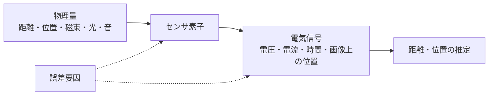
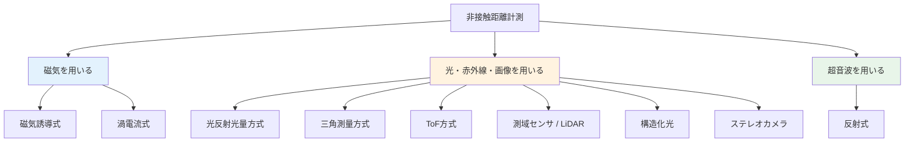
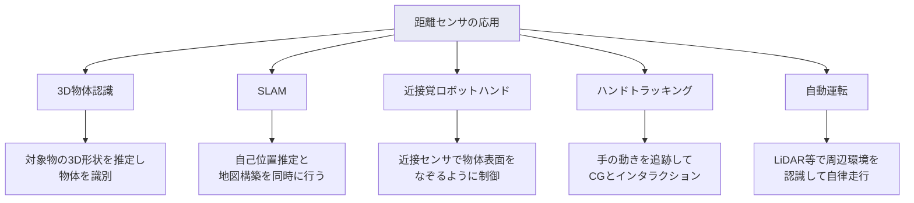

# 第9週：位置・距離センサ

> ⏱️ 読了時間：約50分 | 📝 演習問題：6問 | 概念理解チェック：10問

第9週からは、具体的なセンサ方式を扱います。今回は、ロボット・自動運転・スマートフォン・生産ラインでよく使われる**位置・距離センサ**を、原理ごとに整理します。

::: tip 今日の問い
距離そのものは直接見えません。では、各センサは「距離」をどの物理量や電気信号に変換して読んでいるのでしょうか。
:::

## 学習目標

この週の講義を終えると、以下のことができるようになります：

- [ ] 非接触距離計測の主な方式を説明できる
- [ ] 磁気式距離センサの原理を理解できる
- [ ] 光学式距離計測（反射光量、三角測量、ToF）の原理を説明できる
- [ ] 画像を用いた距離計測（ステレオカメラ、構造化光）を理解できる
- [ ] 超音波距離センサの原理と特徴を説明できる

---

## 0. 今日の全体像

今回の内容は、次の順番で進めます。

| 順番 | 内容 | 見るポイント |
|---:|---|---|
| 1 | 位置・距離計測の役割 | なぜロボットに距離情報が必要か |
| 2 | 磁気式 | 磁束・電圧・インピーダンスの変化を読む |
| 3 | 光反射式 | 受光量が距離と反射率の両方に影響される |
| 4 | 三角測量 | 受光位置のずれから距離を読む |
| 5 | ToF・LiDAR | 光の往復時間を距離に変換する |
| 6 | 超音波 | 音波の往復時間を距離に変換する |
| 7 | 演習 | 計算とセンサ選定を練習する |

### 原理を見るための共通テンプレート

どの方式でも、以下の流れで考えると整理しやすくなります。

```mermaid
graph LR
    A["物理量<br>距離・位置・磁束・光・音"] --> B["センサ素子"]
    B --> C["電気信号<br>電圧・電流・時間・画像上の位置"]
    C --> D["距離・位置の推定"]
    E["誤差要因"] -.-> B
    E -.-> C
```

::: warning 重要
センサの出力は「距離だけ」で決まるとは限りません。対象物の材質、色、表面の傾き、温度、外乱光などが同時に効きます。
:::

---

## 1. 非接触距離計測の概要

位置・距離を計測する方法は、大きく以下の3つに分類されます：

```mermaid
graph TD
    A["非接触距離計測"] --> B["磁気を用いる"]
    A --> C["光・赤外線・画像を用いる"]
    A --> D["超音波を用いる"]
    B --> B1["磁気誘導式"]
    B --> B2["渦電流式"]
    C --> C1["光反射光量方式"]
    C --> C2["三角測量方式"]
    C --> C3["ToF方式"]
    C --> C4["測域センサ / LiDAR"]
    C --> C5["構造化光"]
    C --> C6["ステレオカメラ"]
    D --> D1["反射式"]
    style B fill:#E3F2FD,color:#333
    style C fill:#FFF3E0,color:#333
    style D fill:#E8F5E9,color:#333
```

### 1.1 接触式と非接触式

| 方式 | 例 | 強い点 | 注意点 |
|---|---|---|---|
| 接触式 | 機械式スイッチ、ポテンショメータ | 構造が単純、状態が分かりやすい | 対象に触れる、摩耗や負荷が発生する |
| 非接触式 | 磁気、光、画像、超音波 | 高速、対象を乱しにくい、離れて測れる | 材質・環境・表面状態の影響を受ける |

ロボットでは、対象物に触れる前に距離を知る必要がある場面が多いため、非接触式センサが重要になります。

---

## 2. 磁気を用いた距離計測

### 2.1 磁気誘導式

::: info 原理
永久磁石が生じる磁束の変化を**コイル**で検出し、磁束の変化量から距離を推定する方式。
:::

<svg viewBox="0 0 450 180" xmlns="http://www.w3.org/2000/svg" style="max-width: 450px; margin: 20px auto; display: block;">
  <rect x="40" y="50" width="60" height="80" fill="#E3F2FD" stroke="#1565C0" stroke-width="2" rx="5"/>
  <text x="70" y="95" text-anchor="middle" font-size="11" fill="#1565C0" font-weight="bold">コイル</text>
  <rect x="300" y="50" width="60" height="80" fill="#FFCDD2" stroke="#F44336" stroke-width="2" rx="5"/>
  <text x="330" y="85" text-anchor="middle" font-size="10" fill="#F44336" font-weight="bold">N</text>
  <text x="330" y="105" text-anchor="middle" font-size="10" fill="#1565C0" font-weight="bold">S</text>
  <path d="M100,70 Q200,40 300,70" fill="none" stroke="#9C27B0" stroke-width="1.5" stroke-dasharray="5,3"/>
  <path d="M100,90 Q200,60 300,90" fill="none" stroke="#9C27B0" stroke-width="1.5" stroke-dasharray="5,3"/>
  <path d="M100,110 Q200,140 300,110" fill="none" stroke="#9C27B0" stroke-width="1.5" stroke-dasharray="5,3"/>
  <text x="200" y="55" text-anchor="middle" font-size="10" fill="#9C27B0">磁力線</text>
  <line x1="120" y1="150" x2="280" y2="150" stroke="#333" stroke-width="1.5"/>
  <line x1="120" y1="146" x2="120" y2="154" stroke="#333" stroke-width="1.5"/>
  <line x1="280" y1="146" x2="280" y2="154" stroke="#333" stroke-width="1.5"/>
  <text x="200" y="168" text-anchor="middle" font-size="11" fill="#333">距離 d</text>
</svg>

**特徴**：コイルと磁石の間に**非磁性体**があっても検出可能

### 2.2 渦電流式

::: info 原理
コイルに高周波磁界を発生させ、金属物体が接近すると**電磁誘導**により渦電流が発生する。この渦電流によるインピーダンス変化を検出する方式。
:::

<svg viewBox="0 0 450 180" xmlns="http://www.w3.org/2000/svg" style="max-width: 450px; margin: 20px auto; display: block;">
  <rect x="40" y="50" width="60" height="80" fill="#E3F2FD" stroke="#1565C0" stroke-width="2" rx="5"/>
  <text x="70" y="85" text-anchor="middle" font-size="10" fill="#1565C0" font-weight="bold">コイル</text>
  <text x="70" y="100" text-anchor="middle" font-size="9" fill="#1565C0">(高周波)</text>
  <rect x="300" y="40" width="80" height="100" fill="#E0E0E0" stroke="#757575" stroke-width="2" rx="3"/>
  <text x="340" y="85" text-anchor="middle" font-size="10" fill="#757575" font-weight="bold">金属</text>
  <text x="340" y="100" text-anchor="middle" font-size="9" fill="#757575">物体</text>
  <ellipse cx="320" cy="90" rx="15" ry="25" fill="none" stroke="#FF9800" stroke-width="1.5"/>
  <text x="320" y="125" text-anchor="middle" font-size="9" fill="#FF9800">渦電流</text>
  <path d="M100,60 Q200,30 300,60" fill="none" stroke="#9C27B0" stroke-width="1.5" stroke-dasharray="5,3"/>
  <path d="M100,90 Q200,120 300,90" fill="none" stroke="#9C27B0" stroke-width="1.5" stroke-dasharray="5,3"/>
  <text x="200" y="45" text-anchor="middle" font-size="10" fill="#9C27B0">磁束</text>
</svg>

### 2.3 磁気センサの原理例

| センサ | 原理 | 応用例 |
|--------|------|--------|
| **コイル** | 磁石の接近で磁束密度が変化 → 誘導起電力 | 近接検出 |
| **ホール素子** | 磁界中の導体に電流と磁界に直交する起電力が発生 | スマートフォンの電子コンパス |

---

## 3. 光を用いた距離計測

### 3.1 光反射光量方式

::: info 原理
LED の光が対象物で反射し、フォトトランジスタで受光する。受光量から距離を推定する。
:::

<svg viewBox="0 0 450 180" xmlns="http://www.w3.org/2000/svg" style="max-width: 450px; margin: 20px auto; display: block;">
  <rect x="30" y="40" width="80" height="30" fill="#FFF9C4" stroke="#F9A825" stroke-width="1.5" rx="3"/>
  <text x="70" y="60" text-anchor="middle" font-size="10" fill="#F9A825" font-weight="bold">LED（発光）</text>
  <rect x="30" y="100" width="80" height="30" fill="#E3F2FD" stroke="#1565C0" stroke-width="1.5" rx="3"/>
  <text x="70" y="120" text-anchor="middle" font-size="10" fill="#1565C0" font-weight="bold">受光素子</text>
  <rect x="340" y="30" width="40" height="120" fill="#E0E0E0" stroke="#757575" stroke-width="1.5" rx="3"/>
  <text x="360" y="95" text-anchor="middle" font-size="10" fill="#757575" font-weight="bold">対象物</text>
  <line x1="110" y1="55" x2="340" y2="70" stroke="#F9A825" stroke-width="2"/>
  <polygon points="336,67 344,70 336,73" fill="#F9A825"/>
  <line x1="340" y1="85" x2="110" y2="115" stroke="#1565C0" stroke-width="2" stroke-dasharray="5,3"/>
  <polygon points="114,112 106,115 114,118" fill="#1565C0"/>
  <text x="220" y="48" font-size="10" fill="#F9A825">発光</text>
  <text x="220" y="115" font-size="10" fill="#1565C0">反射光</text>
</svg>

::: warning ⚠️ 注意
**黒い物体**は光を吸収するため検出が困難です。一方、この性質を利用して白黒を区別する**ライントレーサ**などに使われます。
:::

### 3.2 三角測量方式（Triangulation）

::: info 原理
発光素子と受光素子（PSD：Position Sensitive Detector）の既知の距離と、反射光の入射角度から、対象物までの距離を**幾何学的に**算出する。
:::

<svg viewBox="0 0 450 240" xmlns="http://www.w3.org/2000/svg" style="max-width: 450px; margin: 20px auto; display: block;">
  
  <text x="225" y="18" text-anchor="middle" font-size="12" fill="#333" font-weight="bold">三角測量の原理（アニメーション）</text>
  <circle cx="100" cy="200" r="18" fill="#FFF9C4" stroke="#F9A825" stroke-width="1.5" class="tri-led-glow"/>
  <text x="100" y="204" text-anchor="middle" font-size="9" fill="#F9A825" font-weight="bold">LED</text>
  <circle cx="300" cy="200" r="18" fill="#E3F2FD" stroke="#1565C0" stroke-width="1.5"/>
  <text x="300" y="204" text-anchor="middle" font-size="9" fill="#1565C0" font-weight="bold">PSD</text>
  <circle cx="200" cy="55" r="8" fill="#FF9800" class="tri-target"/>
  <text x="200" y="38" text-anchor="middle" font-size="10" fill="#757575">対象物</text>
  <line x1="100" y1="182" x2="200" y2="60" stroke="#F9A825" stroke-width="2.5" class="tri-led-beam"/>
  <line x1="200" y1="60" x2="300" y2="182" stroke="#1565C0" stroke-width="2" stroke-dasharray="6,3" class="tri-reflect-beam"/>
  <line x1="100" y1="218" x2="300" y2="218" stroke="#333" stroke-width="1.5" class="tri-base-line"/>
  <text x="200" y="234" text-anchor="middle" font-size="10" fill="#333" class="tri-label">d（既知の距離）</text>
  <text x="138" y="125" font-size="10" fill="#F9A825" transform="rotate(-57,138,125)" class="tri-label">発光</text>
  <text x="262" y="125" font-size="10" fill="#1565C0" transform="rotate(57,262,125)" class="tri-label">反射光</text>
</svg>

スマートフォンにも小型化されて搭載されている技術です。

### 3.3 ToF方式（Time of Flight）

::: info 原理
レーザ光を対象物に照射し、反射して戻るまでの**往復時間**から距離を計測する方式。
:::

$$L = \frac{c \cdot t}{2}$$

- $L$：対象物までの距離 [m]
- $c$：光速 = $299{,}792{,}458$ m/s $\approx 3 \times 10^8$ m/s
- $t$：往復時間 [s]

<svg viewBox="0 0 520 160" xmlns="http://www.w3.org/2000/svg" style="max-width: 520px; margin: 20px auto; display: block;">
  
  <text x="260" y="18" text-anchor="middle" font-size="12" fill="#333" font-weight="bold">ToF方式（アニメーション）</text>
  <rect x="20" y="50" width="75" height="45" fill="#E3F2FD" stroke="#1565C0" stroke-width="2" rx="5"/>
  <text x="57" y="70" text-anchor="middle" font-size="9" fill="#1565C0" font-weight="bold">レーザ</text>
  <text x="57" y="83" text-anchor="middle" font-size="8" fill="#1565C0">発光器</text>
  <rect x="400" y="35" width="30" height="75" fill="#E0E0E0" stroke="#757575" stroke-width="1.5" rx="3"/>
  <text x="415" y="77" text-anchor="middle" font-size="9" fill="#757575" font-weight="bold">対象</text>
  <circle cx="400" cy="72" r="15" fill="#FF5722" class="tof-hit"/>
  <line x1="95" y1="66" x2="400" y2="66" stroke="#FF5722" stroke-width="1" stroke-dasharray="4,4" opacity="0.3"/>
  <circle cx="95" cy="66" r="5" fill="#FF5722" class="tof-dot-go"/>
  <line x1="95" y1="78" x2="400" y2="78" stroke="#4CAF50" stroke-width="1" stroke-dasharray="4,4" opacity="0.3"/>
  <circle cx="400" cy="78" r="5" fill="#4CAF50" class="tof-dot-back"/>
  <text x="250" y="58" text-anchor="middle" font-size="9" fill="#FF5722">レーザ光 →</text>
  <text x="250" y="96" text-anchor="middle" font-size="9" fill="#4CAF50">← 反射光</text>
  <rect x="95" y="110" width="0" height="6" fill="#9C27B0" rx="3" opacity="0.5" class="tof-timer"/>
  <line x1="95" y1="118" x2="95" y2="125" stroke="#333" stroke-width="1"/>
  <line x1="400" y1="118" x2="400" y2="125" stroke="#333" stroke-width="1"/>
  <text x="248" y="132" text-anchor="middle" font-size="9" fill="#9C27B0">往復時間 t</text>
  <text x="260" y="152" text-anchor="middle" font-size="13" fill="#1565C0" font-weight="bold" class="tof-formula">L = ct / 2</text>
</svg>

::: details 演習：ToF計算
**問題**：レーザ光の反射時間が 84 ns のとき、対象物までの距離 $L$ [m] を求めよ。

**解答**：

$$\frac{2L}{3 \times 10^8} = 84 \times 10^{-9}$$

$$L = \frac{3 \times 10^8 \times 84 \times 10^{-9}}{2} = \frac{25.2}{2} = 12.6 \text{ [m]}$$

:::

### 3.4 測域センサ / LiDAR

::: info 定義
**測域センサ**：レーザ測距を**複数方向**に行い、周囲の障害物の位置を推定するセンサ。

別名：LRF（Laser Range Finder）、**LiDAR**（Light Detection and Ranging）
:::

<svg viewBox="0 0 450 200" xmlns="http://www.w3.org/2000/svg" style="max-width: 450px; margin: 20px auto; display: block;">
  <rect x="190" y="80" width="60" height="40" fill="#E3F2FD" stroke="#1565C0" stroke-width="2" rx="5"/>
  <text x="220" y="105" text-anchor="middle" font-size="9" fill="#1565C0" font-weight="bold">LiDAR</text>
  <line x1="220" y1="80" x2="220" y2="30" stroke="#F44336" stroke-width="1.5"/>
  <line x1="250" y1="85" x2="350" y2="40" stroke="#F44336" stroke-width="1.5"/>
  <line x1="250" y1="100" x2="370" y2="100" stroke="#F44336" stroke-width="1.5"/>
  <line x1="250" y1="115" x2="350" y2="160" stroke="#F44336" stroke-width="1.5"/>
  <line x1="220" y1="120" x2="220" y2="180" stroke="#F44336" stroke-width="1.5"/>
  <line x1="190" y1="115" x2="90" y2="160" stroke="#F44336" stroke-width="1.5"/>
  <line x1="190" y1="100" x2="70" y2="100" stroke="#F44336" stroke-width="1.5"/>
  <line x1="190" y1="85" x2="90" y2="40" stroke="#F44336" stroke-width="1.5"/>
  <circle cx="220" cy="30" r="4" fill="#F44336"/>
  <circle cx="350" cy="40" r="4" fill="#F44336"/>
  <circle cx="370" cy="100" r="4" fill="#F44336"/>
  <circle cx="350" cy="160" r="4" fill="#F44336"/>
  <circle cx="220" cy="180" r="4" fill="#F44336"/>
  <circle cx="90" cy="160" r="4" fill="#F44336"/>
  <circle cx="70" cy="100" r="4" fill="#F44336"/>
  <circle cx="90" cy="40" r="4" fill="#F44336"/>
  <text x="380" y="105" font-size="10" fill="#F44336">レーザ光</text>
  <text x="220" y="195" text-anchor="middle" font-size="10" fill="#333">走査（スキャン）</text>
</svg>

**走査（Scanning）**：計測点を順次移動しながら計測する操作。自動運転車やロボットで広く使用されています。

---

## 4. 画像を用いた距離計測

### 4.1 構造化光（Structured Light / Light Coding）

::: info 原理
赤外線などのランダムなドットパターンを照射し、カメラでパターンの**歪み**を検出して距離を推定する方式。
:::

ステレオビジョンの片方のカメラをプロジェクタに置き換えた方式とも言えます。

### 4.2 ステレオカメラ方式

::: info 原理
**2台のカメラ**をわずかに異なる位置に設置して撮影し、対象物の画像上のずれ（**視差 / disparity**）から距離を推定する。
:::

<svg viewBox="0 0 450 220" xmlns="http://www.w3.org/2000/svg" style="max-width: 450px; margin: 20px auto; display: block;">
  <text x="225" y="18" text-anchor="middle" font-size="12" fill="#333" font-weight="bold">ステレオカメラの原理</text>
  <rect x="80" y="160" width="50" height="35" fill="#E3F2FD" stroke="#1565C0" stroke-width="1.5" rx="3"/>
  <text x="105" y="182" text-anchor="middle" font-size="9" fill="#1565C0" font-weight="bold">カメラL</text>
  <rect x="300" y="160" width="50" height="35" fill="#E3F2FD" stroke="#1565C0" stroke-width="1.5" rx="3"/>
  <text x="325" y="182" text-anchor="middle" font-size="9" fill="#1565C0" font-weight="bold">カメラR</text>
  <circle cx="210" cy="50" r="10" fill="#FF9800" fill-opacity="0.3" stroke="#FF9800" stroke-width="1.5"/>
  <text x="210" y="35" text-anchor="middle" font-size="10" fill="#FF9800" font-weight="bold">対象物</text>
  <line x1="105" y1="160" x2="210" y2="55" stroke="#1565C0" stroke-width="1.5" stroke-dasharray="4,3"/>
  <line x1="325" y1="160" x2="210" y2="55" stroke="#1565C0" stroke-width="1.5" stroke-dasharray="4,3"/>
  <line x1="105" y1="200" x2="325" y2="200" stroke="#333" stroke-width="1.5"/>
  <text x="215" y="215" text-anchor="middle" font-size="10" fill="#333" font-weight="bold">B（ベースライン距離・既知）</text>
</svg>

$$Z = \frac{f \cdot B}{d}$$

- $Z$：対象物までの距離 [mm]
- $f$：焦点距離 [mm]
- $B$：ベースライン距離（カメラ間距離）[mm]
- $d$：視差（ピクセルのずれ）[px]

::: tip 💡 ポイント
対象物が**近い**ほど視差（画像上のずれ）が**大きく**なります。
:::

::: details 演習：ステレオカメラ計算
**問題**：焦点距離 $f = 4.2$ mm、ベースライン $B = 60$ mm、視差 $d = 20$ px のとき、距離 $Z$ は？

**解答**：

$$Z = \frac{4.2 \times 60}{20} = 12.6 \text{ [mm]}$$

:::

### 4.3 距離画像（Depth Image）

距離画像を取得するカメラを**RGB-Dカメラ**と呼びます。RGB（色）とDepth（深度）を同時に取得できます。

| デバイス | 方式 | 特徴 |
|----------|------|------|
| Microsoft Kinect | 構造化光 / ToF | ゲーム・研究向け |
| Intel RealSense | 構造化光 / ステレオ | 汎用・組込み向け |
| Stereolabs ZED | ステレオカメラ | 高精度・長距離 |
| Leap Motion | 赤外線ステレオ | 手のトラッキング |

::: info 点群（Point Cloud）
距離画像の各ピクセルに対応する3D座標データを**点群**と呼びます。3D物体認識やSLAMに利用されます。
:::

---

## 5. 超音波を用いた距離計測

### 5.1 反射式

::: info 原理
超音波パルスを発射し、対象物で反射して戻るまでの**時間**から距離を推定する（ToFと同じ原理）。
:::

| 特徴 | 内容 |
|------|------|
| **利点** | 物体の色や光の反射に影響されない |
| **欠点** | 音速が温度や媒質によって変化する |
| **生物での例** | イルカ、コウモリが利用 |

---

## 6. 光・画像計測の課題

### 6.1 光学計測の課題

| 課題 | 説明 |
|------|------|
| **非反射物体** | 透明な物体や真っ黒な物体は検出困難 |
| **屋外使用** | 赤外線が太陽光の影響を受ける |

### 6.2 画像計測の課題

| 課題 | 説明 |
|------|------|
| **撮影条件** | 照明・明るさにより見え方が変わる |
| **テンプレートマッチング** | 画像特徴の照合精度に限界がある |

---

## 7. 距離センサの応用事例

```mermaid
graph TD
    A["距離センサの応用"] --> B["3D物体認識"]
    A --> C["SLAM"]
    A --> D["近接覚ロボットハンド"]
    A --> E["ハンドトラッキング"]
    A --> F["自動運転"]
    B --> B1["対象物の3D形状を推定し<br>物体を識別"]
    C --> C1["自己位置推定と<br>地図構築を同時に行う"]
    D --> D1["近接センサで物体表面を<br>なぞるように制御"]
    E --> E1["手の動きを追跡して<br>CGとインタラクション"]
    F --> F1["LiDAR等で周辺環境を<br>認識して自律走行"]
    style A fill:#E8EAF6,color:#333
```

### 7.1 SLAM（Simultaneous Localization and Mapping）

::: info 定義
**SLAM**：周囲の障害物までの距離を計測しながら、**自己位置推定（Localization）** と**地図構築（Mapping）** を同時に行う技術。
:::

ロボットや自動運転車の自律走行に不可欠な技術です。

---

## 8. 主要センサの比較

| 方式 | 距離を何に変換して読むか | 得意な場面 | 苦手な場面 |
|---|---|---|---|
| 磁気誘導式 | 磁束変化・誘導起電力 | 磁石との位置関係、非磁性体越しの検出 | 磁石や磁場条件に依存する |
| 渦電流式 | コイルのインピーダンス変化 | 金属対象の微小変位、高速応答 | 金属対象に限られる |
| 光反射光量方式 | 受光量 | 白黒判定、近接検出、ラインセンサ | 黒色・透明・反射率差の影響 |
| 三角測量方式 | 受光位置・角度 | 近〜中距離の距離計測 | 表面状態、外乱光、測定範囲 |
| ToF | 光の往復時間 | 比較的長い距離、3D距離計測 | 反射率、強い外乱光、時間分解能 |
| LiDAR | 多方向のToF距離 | 周囲認識、地図作成、自動運転 | 雨・霧・透明物体など |
| 超音波 | 音波の往復時間 | 安価な距離計測、色に依存しにくい | 温度、柔らかい物体、細い対象 |

::: tip センサ選定の考え方
「測りたい距離」だけでなく、対象物の材質、色、表面、周囲の光、必要な応答速度、コストを同時に考えて選定します。
:::

---

## 9. 演習問題

### 演習1：センサ値の正規化

反射光量の計測値 $[80, 120, 150, 90, 110]$ を $0$〜$1$ の範囲に正規化せよ。最大値は $150$ とする。

解答

$$v'_i = \frac{v_i}{150}$$

| 元の値 | 正規化後 |
|:------:|:--------:|
| 80 | 0.53 |
| 120 | 0.80 |
| 150 | 1.00 |
| 90 | 0.60 |
| 110 | 0.73 |

### 演習2：閾値判定

計測値 $[85, 130, 95, 140, 100]$、閾値 $= 110$ のとき、白線上か線外かを判定せよ。

解答

反射光量が閾値を超える → 白線上

| 値 | 判定 |
|:--:|:----:|
| 85 | 線外 |
| 130 | **白線上** |
| 95 | 線外 |
| 140 | **白線上** |
| 100 | 線外 |

### 演習3：ToF計算

レーザ光の反射時間が $84\,\mathrm{ns}$ のとき、光速を $3.0 \times 10^8\,\mathrm{m/s}$ として、対象物までの距離 $d$ を求めよ。

解答

ToFでは往復時間を測っているので、距離は次の式で求めます。

$$
d = \frac{ct}{2}
$$

$$
d = \frac{3.0 \times 10^8 \times 84 \times 10^{-9}}{2}
  = \frac{25.2}{2}
  = 12.6\,\mathrm{m}
$$

答えは **12.6 m** です。

### 演習4：超音波距離計算

超音波の反射波が戻るまでの時間が $20\,\mathrm{ms}$、音速を $340\,\mathrm{m/s}$ とする。対象物までの距離 $d$ を求めよ。

解答

超音波も往復時間を測るため、ToFと同じ形で計算します。

$$
d = \frac{vt}{2}
$$

$$
d = \frac{340 \times 20 \times 10^{-3}}{2}
  = \frac{6.8}{2}
  = 3.4\,\mathrm{m}
$$

答えは **3.4 m** です。

### 演習5：ステレオカメラ距離計算

焦点距離 $f = 4.2\,\mathrm{mm}$、ベースライン $B = 60\,\mathrm{mm}$、視差 $d = 20$ のとき、距離 $Z$ を次の式で求めよ。

$$
Z = \frac{fB}{d}
$$

解答

$$
Z = \frac{4.2 \times 60}{20}
  = \frac{252}{20}
  = 12.6\,\mathrm{mm}
$$

答えは **12.6 mm** です。

### 演習6：どのセンサを選ぶか

次の用途に適した方式を、理由とともに答えよ。

| 用途 | 候補として考える方式 |
|---|---|
| 1. 白黒ライン検出 |  |
| 2. 金属工件の微小変位測定 |  |
| 3. 自動運転車の周囲認識 |  |
| 4. 黒い物体までの簡易距離測定 |  |
| 5. 室内ロボットの簡易障害物回避 |  |

解答例

| 用途 | 解答例 | 理由 |
|---|---|---|
| 1. 白黒ライン検出 | 光反射光量方式 | 白と黒で反射光量が変わるため |
| 2. 金属工件の微小変位測定 | 渦電流式 | 金属対象の微小変位を高速に読めるため |
| 3. 自動運転車の周囲認識 | LiDAR | 多方向の距離分布を得られるため |
| 4. 黒い物体までの簡易距離測定 | 超音波方式 | 光反射率に依存しにくいため |
| 5. 室内ロボットの簡易障害物回避 | ToF または超音波 | 距離を簡単に取得でき、実装しやすいため |

用途によって正解が1つに決まらない場合があります。重要なのは、対象物と環境から理由を説明できることです。

---

## 🧠 概念理解チェック

計算に入る前に、各方式の「何を測っているのか」「何が弱点になるのか」を確認しましょう。

### 概念1：距離センサの基本

距離センサの説明として最も適切なものはどれか。

- A. 距離を直接そのまま電圧として取り出している
- B. 距離に関係する物理量を、電気信号や画像上の位置に変換して推定している
- C. すべての距離センサは光を使っている
- D. 距離センサは対象物の材質に影響されない

解答

正解：**B**

距離そのものを直接読むのではなく、磁束、受光量、受光位置、往復時間、画像上の視差などに変換して推定します。

### 概念2：光反射光量方式

光反射光量方式で、同じ距離にある白い物体と黒い物体を測ったときに起こりやすいことはどれか。

- A. 必ず同じ出力になる
- B. 白い物体の方が受光量が大きくなりやすい
- C. 黒い物体の方が受光量が大きくなりやすい
- D. 距離が同じなら反射率は関係ない

解答

正解：**B**

光反射光量方式の出力は、距離だけでなく対象物の反射率にも影響されます。白い物体は反射光が強く、黒い物体は弱くなりやすいです。

### 概念3：光反射光量方式の注意点

光反射光量方式だけで「距離」を正確に求めにくい理由として最も適切なものはどれか。

- A. 光速が遅すぎるため
- B. 受光量が距離だけでなく色や表面状態にも左右されるため
- C. 音速が温度で変わるため
- D. 金属物体でしか使えないため

解答

正解：**B**

受光量は、距離、反射率、表面の傾き、外乱光などの影響を同時に受けます。そのため、出力だけから距離だけを切り分けるのが難しい場合があります。

### 概念4：三角測量方式

三角測量方式で距離推定に主に使う情報はどれか。

- A. 反射光が戻るまでの時間
- B. 受光位置や入射角度の変化
- C. 音波の周波数
- D. 金属中の渦電流だけ

解答

正解：**B**

三角測量方式では、発光部と受光部の位置関係を使い、反射光が受光素子上のどこに入るかを読んで距離を推定します。

### 概念5：ToF方式

ToF方式で距離を求める式に $1/2$ が入る理由はどれか。

- A. 光の速度が半分になるため
- B. 測っている時間が行きと帰りを合わせた往復時間だから
- C. センサの電圧を半分にするため
- D. 誤差を小さく見積もるため

解答

正解：**B**

ToFで測る時間 $t$ は、光が対象物まで行って戻ってくる往復時間です。片道距離を求めるために $ct$ を2で割ります。

### 概念6：LiDAR

LiDARの説明として最も適切なものはどれか。

- A. 1点の温度だけを測るセンサ
- B. 多方向の距離を測り、周囲の形を点の集合として得るセンサ
- C. 金属にだけ反応する近接センサ
- D. 黒い線だけを検出するセンサ

解答

正解：**B**

LiDARはレーザ測距を多方向に行い、距離と角度の情報から周囲の形を点群や2Dスキャンとして得ます。

### 概念7：渦電流式センサ

渦電流式センサが特に得意とする対象はどれか。

- A. 金属物体
- B. 透明なガラスだけ
- C. 黒い布だけ
- D. 音を吸収する柔らかい物体

解答

正解：**A**

渦電流式では、金属中に発生する渦電流によってコイルのインピーダンスが変化します。そのため金属対象の変位測定に向いています。

### 概念8：ステレオカメラ

ステレオカメラで対象物が近い場合、一般に視差はどうなるか。

- A. 大きくなる
- B. 小さくなる
- C. 常に0になる
- D. 距離とは無関係である

解答

正解：**A**

近い対象物ほど、左右カメラの画像上でのずれが大きくなります。遠い対象物ほど視差は小さくなります。

### 概念9：超音波センサ

黒い物体の簡易距離測定で、光反射方式より超音波方式を検討する理由として適切なものはどれか。

- A. 超音波は対象物の色や反射率に依存しにくいため
- B. 超音波は必ず光より速いため
- C. 超音波は金属にしか反応しないため
- D. 超音波では往復時間を測らないため

解答

正解：**A**

超音波方式は音波の反射を使うため、光反射方式のように色や光の反射率に強く依存しません。ただし、柔らかい物体や細い物体、温度変化には注意が必要です。

### 概念10：センサ選定

センサを選ぶときに最も重要な考え方はどれか。

- A. どの場面でも一番高価なセンサを使う
- B. 測定対象、環境、必要精度、応答速度、コストを合わせて考える
- C. 方式名だけを覚えれば十分である
- D. 距離が測れれば誤差要因は考えなくてよい

解答

正解：**B**

センサ選定では、対象物の材質・色・表面、周囲光、温度、必要な距離範囲、応答速度、コストなどを総合的に判断します。

---

## 期末試験のための復習メモ

この週で扱ったセンサ・方式について、**測りたい量 → センサ内部で変化する量 → 読み出す信号**の因果関係を整理しておきましょう。

| センサ・方式 | 測りたい量 | 変換の流れ | 読み出す信号 |
|---|---|---|---|
| 磁気誘導式 | 磁石との距離・位置 | 距離が変わる → 磁束が変わる → コイルに起電力が生じる | 電圧 |
| 渦電流式変位センサ | 金属までの距離・微小変位 | 金属との距離が変わる → 渦電流が変わる → コイルのインピーダンスが変わる | 電圧・インピーダンス変化 |
| ホール素子 | 磁界・磁石の位置 | 磁界が加わる → ホール電圧が発生する | 電圧 |
| 光反射光量方式 | 近接・白黒・簡易距離 | 距離や反射率が変わる → 反射光量が変わる | 受光量・電圧 |
| 三角測量方式 | 距離・変位 | 距離が変わる → 反射光の入射位置が変わる | 受光位置 |
| ToF方式 | 距離 | 距離が長くなる → 光や音の往復時間が長くなる | 時間 |
| LiDAR / 測域センサ | 周囲の距離分布 | 多方向にToF測定する → 各方向の距離が得られる | 距離分布・点群 |
| 構造化光 | 3次元形状 | パターン光を投影する → 物体表面でパターンが歪む | 画像上のパターン変形 |
| ステレオカメラ | 奥行き・距離 | 距離が変わる → 左右画像の視差が変わる | 視差 |
| 超音波距離センサ | 距離 | 距離が長くなる → 超音波の往復時間が長くなる | 時間 |

## 📚 次週の予習

- **第10週**: 画像センサと計測
- 予習ポイント：CCDとCMOSの違い、画像処理の基本
