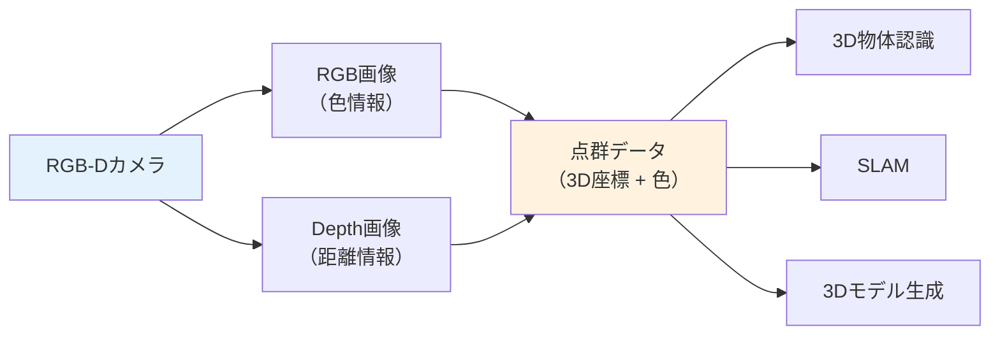

# 第10週：画像センサと計測

> ⏱️ 読了時間：約20分 | 📝 確認問題：5問

## 学習目標

この週の講義を終えると、以下のことができるようになります：

- [ ] 距離画像（Depth Image）の取得方法を説明できる
- [ ] RGB-Dカメラの概念を理解できる
- [ ] 点群（Point Cloud）データの意味を説明できる
- [ ] 画像計測の課題と限界を理解できる
- [ ] 画像センサの応用事例を説明できる

---

## 1. 距離画像（Depth Image）

### 1.1 距離画像とは

::: info 定義
**距離画像**：各ピクセルに対象物までの距離情報を持つ画像。通常の画像（色情報）に加えて、奥行き情報を取得できます。
:::

距離画像を取得する方法は、第9週で学んだ以下の原理に基づいています：

| 方式 | 原理 | 特徴 |
|------|------|------|
| **ToF** | 光の往復時間 | 高精度、屋外対応 |
| **構造化光** | パターンの歪み | 室内向き、高解像度 |
| **ステレオカメラ** | 視差（disparity） | パッシブ、長距離対応 |

### 1.2 RGB-Dカメラ

::: info 定義
**RGB-Dカメラ**：通常のカラー画像（RGB）と距離画像（Depth）を**同時に**取得できるカメラ。
:::

| デバイス | 方式 | 主な用途 |
|----------|------|----------|
| Microsoft Kinect | 構造化光 / ToF | ゲーム、研究 |
| Intel RealSense | 構造化光 / ステレオ | 組込み、ロボット |
| Stereolabs ZED | ステレオカメラ | 自動運転、ドローン |
| Leap Motion | 赤外線ステレオ | ハンドトラッキング |

---

## 2. 点群（Point Cloud）

::: info 定義
**点群**：距離画像の各ピクセルに対応する**3D座標データ**の集合。
:::

---

## 3. 画像計測の課題

### 3.1 光学計測の課題

| 課題 | 説明 | 対策 |
|------|------|------|
| **非反射物体** | 透明・黒色物体は反射が弱い | 複数方式の併用 |
| **屋外利用** | 太陽光が赤外線センサに干渉 | ToF・ステレオの使用 |
| **遮蔽** | 物体の裏側が見えない | 複数視点からの計測 |

### 3.2 画像処理の課題

| 課題 | 説明 |
|------|------|
| **照明条件** | 明るさの変化で見え方が変わる |
| **テンプレートマッチング** | 特徴照合の精度に限界がある |
| **計算コスト** | リアルタイム処理には高性能ハードが必要 |

---

## 4. 応用事例

### 4.1 3D物体認識

対象物の表面までの距離を各点で計測し、**3D形状を推定**して物体を識別する技術。

把持計画（Grasp Planning）と組み合わせて、ロボットが物体を掴む動作の自動計画に利用されます。

### 4.2 SLAM（再掲）

::: info 定義
**SLAM**（Simultaneous Localization and Mapping）：距離センサや画像を用いて、**自己位置推定**と**環境地図構築**を同時に行う技術。
:::

### 4.3 ハンドトラッキング

距離画像を用いて手の形状を追跡し、VR/MRなどのインタラクションに利用します。

### 4.4 自動運転

LiDAR やカメラの画像処理を組み合わせて、周辺環境を認識し自律走行を実現します。

---

## 📝 確認問題

### Q1. RGB-Dカメラの「D」は何を意味するか？

- [ ] A. Digital
- [x] B. Depth（深度）
- [ ] C. Direction
- [ ] D. Display

### Q2. 点群データとは？

- [ ] A. 2D画像のピクセル集合
- [x] B. 各ピクセルに対応する3D座標データの集合
- [ ] C. 音声データの時系列
- [ ] D. センサの誤差データ

### Q3. 構造化光方式の原理は？

- [ ] A. 音波の反射を利用
- [ ] B. 磁界の変化を検出
- [x] C. 投影したパターンの歪みから距離を推定
- [ ] D. 温度変化を検出

### Q4. 画像計測で透明な物体の検出が困難な理由は？

- [x] A. 光が透過して反射が弱いから
- [ ] B. 温度が低いから
- [ ] C. 磁性がないから
- [ ] D. 音を反射しないから

### Q5. SLAMで同時に行う2つの処理は？

- [ ] A. 撮影と録音
- [x] B. 自己位置推定と地図構築
- [ ] C. 圧縮と解凍
- [ ] D. 暗号化と復号化

---

## 📚 次週の予習

- **第11週**: 角度、回転方向、回転速度の計測原理
- 予習ポイント：ポテンショメータ、ロータリエンコーダの概念
