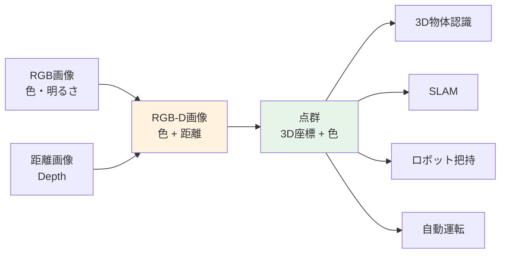
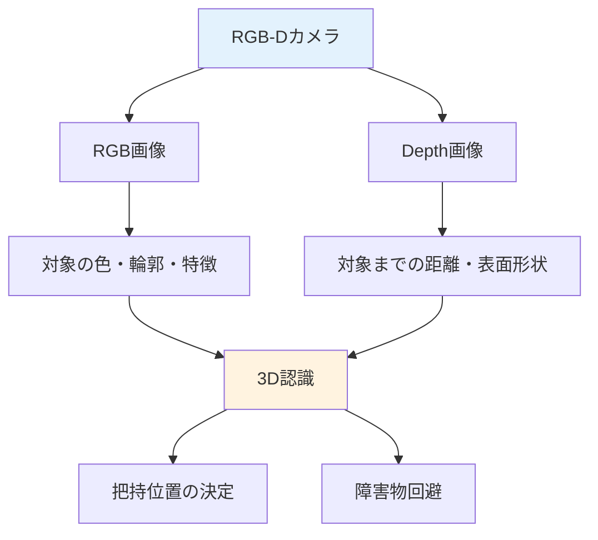

# 第10週：画像センサと3D計測

> ⏱️ 目安：60分 | 📝 演習問題：6問 | 図解・デモ：10点

第9週では、距離センサが「距離」を直接読むのではなく、光量、時間、画像上の位置、視差などの**別の量に変換して推定する**ことを学びました。第10週では、その考え方を画像センサへ広げます。

::: tip 今日の問い
カメラは本来2次元の画像を撮る装置です。では、どうすれば「奥行き」や「3D形状」を測れるのでしょうか。
:::

## 学習目標

この週の講義を終えると、以下のことができるようになります：

- [ ] 距離画像（Depth Image）が何を表すか説明できる
- [ ] RGB-Dカメラと通常カメラの違いを説明できる
- [ ] Depth画像から点群（Point Cloud）へ変換する考え方を説明できる
- [ ] ステレオカメラの視差と距離の関係を説明できる
- [ ] 画像計測が失敗しやすい条件を挙げられる
- [ ] 用途に応じて画像センサ方式を選ぶ観点を説明できる

---

## 0. 60分の進行

| 時間 | 内容 | 授業中に止めるポイント |
|---:|---|---|
| 0-8分 | 第9回の復習 | 距離を何に変換して読んだか |
| 8-18分 | Depth画像 | 画素ごとに距離を持つとは何か |
| 18-30分 | RGB-Dと点群 | 2D画素を3D座標に戻す |
| 30-45分 | ステレオ原理 | 視差 $d$ と距離 $Z$ の関係 |
| 45-55分 | 画像計測の落とし穴 | 透明・黒色・外乱光・遮蔽 |
| 55-60分 | 演習 | 方式選定と公式の読み方 |

::: warning 授業で速く進みすぎるとき
各ブロックの最初に「予想」を1つ入れると、内容を増やさなくても理解の時間を作れます。例：**対象物が近づくと視差は大きくなるか、小さくなるか**を先に考えさせてから図を動かします。
:::

---

## 1. 第10週の全体像

画像センサによる3D計測は、次の流れで考えると整理しやすくなります。

```mermaid
graph LR
    A["RGB画像<br>色・明るさ"] --> C["RGB-D画像<br>色 + 距離"]
    B["距離画像<br>Depth"] --> C
    C --> D["点群<br>3D座標 + 色"]
    D --> E["3D物体認識"]
    D --> F["SLAM"]
    D --> G["ロボット把持"]
    D --> H["自動運転"]
    style C fill:#FFF3E0,color:#333
    style D fill:#E8F5E9,color:#333
```

第9週で扱った ToF、構造化光、ステレオカメラは、ここでは**距離画像を作る方法**として再登場します。

| 方式 | 距離を読むための量 | 得意な場面 | 注意点 |
|---|---|---|---|
| ToF | 光の往復時間 | 比較的広い範囲のDepth取得 | 外乱光、反射率、時間分解能 |
| 構造化光 | 投影パターンの歪み | 室内・近距離・高密度Depth | 強い外乱光、対象表面 |
| ステレオ | 左右画像の視差 | パッシブ計測、屋外・長距離 | 対応点探索、低テクスチャ |

---

## 2. 距離画像（Depth Image）

::: info 定義
**距離画像（Depth Image）**：各ピクセルに、対象物までの距離情報を持たせた画像。
:::

通常のRGB画像は、各ピクセルが色を持ちます。一方、Depth画像では、各ピクセルが「カメラからその点までの距離」を持ちます。

| 画像 | 各ピクセルが持つ情報 | 例 |
|---|---|---|
| RGB画像 | 赤・緑・青の強度 | 色、模様、明るさ |
| グレースケール画像 | 明るさ | 濃淡、形状の輪郭 |
| Depth画像 | 距離 $Z$ | 近い・遠い、表面形状 |

::: tip その場で考える
人間には「近く見える」画像でも、コンピュータにはRGB値しかありません。Depth画像を追加すると、どの処理が簡単になるでしょうか。
:::

---

## 3. RGB-Dカメラ

::: info 定義
**RGB-Dカメラ**：通常のカラー画像（RGB）と距離画像（Depth）を同時に取得できるカメラ。
:::

RGB-Dカメラは、画像処理と距離計測を同時に使うためのセンサです。ロボットでは、対象物の色や輪郭を見るだけでなく、「どこにあるか」「どのくらい手前にあるか」を知る必要があります。

| デバイス例 | 方式 | 主な用途 |
|---|---|---|
| Microsoft Kinect | 構造化光 / ToF | ゲーム、研究、動作計測 |
| Intel RealSense | ステレオ / 構造化光 / ToF | ロボット、組込み、3D認識 |
| Stereolabs ZED | ステレオカメラ | 自動運転、ドローン、屋外計測 |
| Leap Motion | 赤外線ステレオ | ハンドトラッキング |

### RGB-Dで分かること

```mermaid
graph TD
    A["RGB-Dカメラ"] --> B["RGB画像"]
    A --> C["Depth画像"]
    B --> D["対象の色・輪郭・特徴"]
    C --> E["対象までの距離・表面形状"]
    D --> F["3D認識"]
    E --> F
    F --> G["把持位置の決定"]
    F --> H["障害物回避"]
    style A fill:#E3F2FD,color:#333
    style F fill:#FFF3E0,color:#333
```

---

## 4. 点群（Point Cloud）

::: info 定義
**点群（Point Cloud）**：距離画像の各ピクセルに対応する3D座標データの集合。
:::

Depth画像の1画素には、画像上の位置 $(u, v)$ と距離 $Z$ があります。カメラの焦点距離と主点が分かっていれば、その画素を3D空間の点に戻せます。

$$
X = \frac{(u - c_x)Z}{f_x}, \quad
Y = \frac{(v - c_y)Z}{f_y}
$$

- $(u, v)$：画像上の画素位置
- $(c_x, c_y)$：画像中心に対応する主点
- $f_x, f_y$：カメラの焦点距離をピクセル単位で表したもの
- $(X, Y, Z)$：カメラ座標系での3D座標

::: tip ポイント
点群は「画像を3Dにしたもの」と考えると分かりやすいです。ただし、カメラから見えていない裏側の点は取得できません。
:::

### 点群が使われる処理

| 処理 | 何をするか |
|---|---|
| 3D物体認識 | 点の分布から物体の形や姿勢を推定する |
| SLAM | 周囲の3D構造を使って自己位置と地図を同時に推定する |
| ロボット把持 | 物体表面の点から掴む位置や向きを決める |
| 障害物回避 | 周囲の点の距離から安全な経路を選ぶ |

---

## 5. ステレオカメラの原理

ステレオカメラでは、2台のカメラを少し離して設置します。同じ対象物が左右画像で少しずれて写ります。このずれを**視差（disparity）**と呼びます。

::: info 原理
左右カメラの距離 $B$（ベースライン）と焦点距離 $f$ が既知なら、視差 $d$ から対象物までの距離 $Z$ を求められます。
:::

$$
Z = \frac{fB}{d}
$$

- $Z$：対象物までの距離
- $f$：焦点距離
- $B$：左右カメラ間の距離（ベースライン）
- $d$：左右画像上の対応点のずれ（視差）

### 公式の読み方

| 変化 | 結果 | 直感 |
|---|---|---|
| $d$ が大きい | $Z$ は小さい | 近い物体ほど左右画像のずれが大きい |
| $d$ が小さい | $Z$ は大きい | 遠い物体ほど左右画像のずれが小さい |
| $B$ を大きくする | 同じ距離でも $d$ が大きい | カメラ間隔を広げると奥行き差を読みやすい |

### 授業用デモ

<iframe src="/keisoku-kogaku/apps/week10-stereo-demo/index.html" style="width:100%; height:980px; border:1px solid #d8e0e8; border-radius:8px; background:#fff;"></iframe>

::: tip デモの使い方
最初にスライダーを動かさず、学生に「$d$は実空間のどこにある量か」を確認させます。次に、左右画像を重ねた領域で $d=x_L-x_R$ を見せ、最後に「$Z$を半分にすると$d$は何倍になるか」を予想させてからスライダーで確認します。
:::

### 計算例

焦点距離 $f = 4.0\,\mathrm{mm}$、ベースライン $B = 120\,\mathrm{mm}$、視差 $d = 0.60\,\mathrm{mm}$ のとき、

$$
Z = \frac{fB}{d}
  = \frac{4.0 \times 120}{0.60}
  = 800\,\mathrm{mm}
$$

したがって、対象物までの距離は **800 mm** です。

---

## 6. 画像計測の落とし穴

画像センサは多くの情報を取得できますが、万能ではありません。特にDepth画像では、対象物の表面や光環境によって距離値が欠落したり、不安定になったりします。

| 課題 | 何が起きるか | 対策の考え方 |
|---|---|---|
| 透明物体 | 光が透過・屈折し、正しい反射が得られない | 複数視点、別方式センサ、偏光など |
| 黒色物体 | 反射光が弱く、Depthが欠落しやすい | 露光調整、照明、超音波や接触計測の併用 |
| 強い外乱光 | 赤外線や画像露光に干渉する | フィルタ、屋外対応方式、遮光 |
| 遮蔽 | カメラから見えない部分は測れない | 複数カメラ、視点移動、SLAM |
| 低テクスチャ | ステレオで対応点を探しにくい | パターン投影、特徴量設計、別方式 |

::: warning 重要
「画像に写っている」ことと「距離が正しく測れている」ことは同じではありません。Depth画像を見るときは、欠落点、ノイズ、外れ値を必ず確認します。
:::

---

## 7. 応用事例

### 7.1 3D物体認識

RGB画像だけでは、物体の輪郭や色は分かっても、奥行き方向の形状が曖昧です。点群を使うと、物体の表面形状や姿勢を推定できます。

### 7.2 ロボット把持

ロボットが物体を掴むには、物体の位置だけでなく、表面の向き、厚み、周囲の障害物も重要です。RGB-Dカメラやステレオカメラは、把持計画の入力として使われます。

### 7.3 SLAM

::: info 定義
**SLAM**（Simultaneous Localization and Mapping）：自己位置推定と環境地図構築を同時に行う技術。
:::

Depth画像や点群を使うと、周囲の壁・机・障害物の3D構造を地図として扱えます。

### 7.4 ハンドトラッキング

手の形状や指先の位置を3Dで追跡すると、VR/MR、ジェスチャ入力、ロボット操作に利用できます。

---

## 8. 演習問題

### 演習1：Depth画像の読み取り

RGB画像とDepth画像を同時に取得した。次の説明のうち、Depth画像について正しいものをすべて選べ。

- A. 各ピクセルに対象物までの距離情報が入っている
- B. RGB画像と同じく、赤・緑・青の3成分だけを持つ
- C. 近い点と遠い点を画像上で区別できる
- D. カメラから見えていない裏側の形状も必ず分かる

解答

正解：**A, C**

Depth画像では、各ピクセルにカメラから対象点までの距離が入ります。そのため、近い点と遠い点を区別できます。一方、カメラから見えていない裏側の情報は取得できません。

### 演習2：ステレオカメラ距離計算

焦点距離 $f = 4.0\,\mathrm{mm}$、ベースライン $B = 120\,\mathrm{mm}$、視差 $d = 0.80\,\mathrm{mm}$ のとき、対象物までの距離 $Z$ を求めよ。

$$
Z = \frac{fB}{d}
$$

解答

$$
Z = \frac{4.0 \times 120}{0.80}
  = \frac{480}{0.80}
  = 600\,\mathrm{mm}
$$

答えは **600 mm** です。

### 演習3：視差と距離の関係

同じステレオカメラで、視差が $0.80\,\mathrm{mm}$ から $0.40\,\mathrm{mm}$ に小さくなった。このとき、対象物までの距離はどう変化するか。理由も述べよ。

解答

距離は **2倍** になります。

$$
Z = \frac{fB}{d}
$$

なので、$f$ と $B$ が一定なら、$Z$ は $d$ に反比例します。視差 $d$ が半分になると、距離 $Z$ は2倍になります。

### 演習4：Depth画像から3D座標へ

Depth画像のある画素について、画像座標が $u=420$、$v=260$、主点が $c_x=320$、$c_y=240$、焦点距離が $f_x=f_y=500$ pixel、距離が $Z=1000\,\mathrm{mm}$ であった。カメラ座標系での $X, Y$ を求めよ。

$$
X = \frac{(u - c_x)Z}{f_x}, \quad
Y = \frac{(v - c_y)Z}{f_y}
$$

解答

$$
X = \frac{(420 - 320) \times 1000}{500}
  = \frac{100 \times 1000}{500}
  = 200\,\mathrm{mm}
$$

$$
Y = \frac{(260 - 240) \times 1000}{500}
  = \frac{20 \times 1000}{500}
  = 40\,\mathrm{mm}
$$

したがって、3D座標はおよそ **$(X, Y, Z) = (200, 40, 1000)\,\mathrm{mm}$** です。

### 演習5：画像計測が難しい条件

次の対象をRGB-Dカメラで計測するとき、起こりやすい問題と対策の考え方を表にまとめよ。

| 対象・環境 | 起こりやすい問題 | 対策の考え方 |
|---|---|---|
| 透明なコップ |  |  |
| 真っ黒な箱 |  |  |
| 屋外の強い日差し |  |  |
| 物体の裏側 |  |  |

解答例

| 対象・環境 | 起こりやすい問題 | 対策の考え方 |
|---|---|---|
| 透明なコップ | 光が透過・屈折し、Depthが欠落しやすい | 複数視点、別方式センサ、照明条件の調整 |
| 真っ黒な箱 | 反射光が弱く、距離値が不安定になりやすい | 露光調整、補助照明、超音波や接触計測の併用 |
| 屋外の強い日差し | 赤外線や露光に外乱が入る | 屋外対応方式、フィルタ、遮光 |
| 物体の裏側 | カメラから見えないため点群が得られない | 視点移動、複数カメラ、SLAM |

重要なのは、「画像に写るか」だけでなく、「Depthが正しく得られるか」を確認することです。

### 演習6：用途に合う画像センサ方式を選ぶ

次の用途に対して、候補となる方式を選び、理由を1行で説明せよ。

| 用途 | 候補方式 | 理由 |
|---|---|---|
| 1. 室内で手の動きを追跡する |  |  |
| 2. 屋外ロボットで前方の障害物までの距離を得る |  |  |
| 3. 机の上の物体をロボットが掴む |  |  |
| 4. テクスチャの少ない白い壁までの距離を測る |  |  |

解答例

| 用途 | 候補方式 | 理由 |
|---|---|---|
| 1. 室内で手の動きを追跡する | 赤外線ステレオ / RGB-D | 手の3D位置や指先位置を連続的に取得しやすい |
| 2. 屋外ロボットで前方の障害物までの距離を得る | ステレオ / ToF / LiDAR | 屋外で周囲距離を取得し、障害物回避に使える |
| 3. 机の上の物体をロボットが掴む | RGB-Dカメラ | 色・輪郭とDepthを組み合わせて、物体位置と表面形状を得られる |
| 4. テクスチャの少ない白い壁までの距離を測る | ToF / 構造化光 | ステレオは対応点が少なく不利なため、時間または投影パターンを使う方式を検討する |

用途によって正解が1つに決まらない場合があります。対象物、距離範囲、屋内外、外乱光、リアルタイム性を同時に考えて選びます。

---

## 期末試験のための復習メモ

この週で扱ったセンサ・方式について、**測りたい量 → センサ内部で変化する量 → 読み出す信号**の因果関係を整理しておきましょう。

| センサ・方式 | 測りたい量 | 変換の流れ | 読み出す信号 |
|---|---|---|---|
| RGBカメラ | 色・明るさ・形 | 光がレンズを通る → 画素ごとに光量を受ける | RGB値・輝度 |
| Depthカメラ | 奥行き | 対象までの距離が変わる → 各画素の距離値が変わる | Depth値 |
| RGB-Dカメラ | 色と奥行き | RGB画像とDepth画像を同時に得る → 物体の見た目と距離を対応させる | RGB値 + Depth値 |
| ToF型Depth | 奥行き | 距離が変わる → 光の往復時間または位相差が変わる | 時間・位相差 |
| 構造化光型Depth | 奥行き・表面形状 | パターン光を投影する → 表面形状によりパターンが歪む | 画像上の歪み |
| ステレオ方式 | 奥行き | 距離が変わる → 左右画像の対応点のずれが変わる | 視差 |
| 赤外線ステレオ | 手や物体の3D位置 | 赤外線画像を左右で撮る → 対応点の視差を求める | 赤外線画像上の視差 |
| 点群 | 3次元形状 | Depthや視差から各点の3次元座標を計算する | $(X,Y,Z)$ 座標 |

## 9. 次週の予習

- **第11週**：角度、回転方向、回転速度の計測原理
- 予習ポイント：ポテンショメータ、ロータリエンコーダ、回転角を電気信号に変換する考え方
