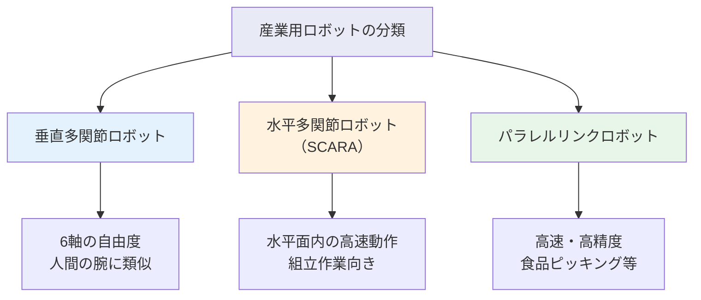
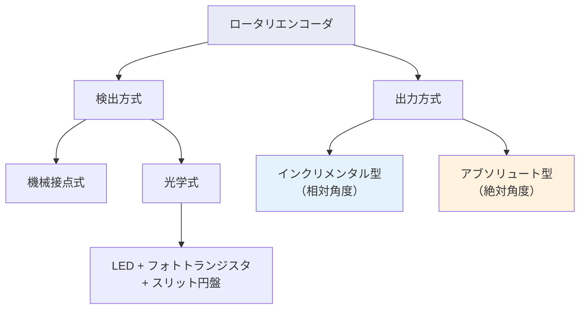

# 第11週：角度・回転方向・回転速度の計測

> ⏱️ 読了時間：約40分 | 📝 確認問題：5問

## 学習目標

この週の講義を終えると、以下のことができるようになります：

- [ ] ロボットの関節構造とモータの役割を説明できる
- [ ] ポテンショメータの原理と分圧回路を理解できる
- [ ] インクリメンタル型とアブソリュート型ロータリエンコーダの違いを説明できる
- [ ] エンコーダの分解能を計算できる
- [ ] タコジェネレータによる回転速度計測の原理を説明できる

---

## 1. ロボットと関節（モータ）の関係

産業用ロボットの動作は、各関節に取り付けられた**モータ**によって実現されます。モータは電気エネルギーを回転運動に変換する装置であり、その**回転角**と**回転速度**を正確に計測することが制御の基本となります。

### 1.1 産業用ロボットの分類

::: info モータの基礎
**モータ**は電気エネルギーを回転運動に変換するアクチュエータです。ロボットの各関節にはモータが配置され、関節角度を制御することでロボット全体の姿勢を決定します。正確な制御のためには、**回転角**と**回転速度**の計測が不可欠です。
:::

---

## 2. ポテンショメータ（Potentiometer）

### 2.1 原理

::: info 原理
**ポテンショメータ**は、回転角を電圧変化に変換するセンサです。可変抵抗器の摺動子（ワイパー）の位置に応じて抵抗値が変化し、分圧回路の原理により出力電圧が変わります。
:::

<svg viewBox="0 0 450 200" xmlns="http://www.w3.org/2000/svg" style="max-width: 450px; margin: 20px auto; display: block;">
  <text x="225" y="18" text-anchor="middle" font-size="12" fill="#333" font-weight="bold">ポテンショメータの分圧回路</text>
  <line x1="100" y1="40" x2="100" y2="160" stroke="#333" stroke-width="2"/>
  <rect x="85" y="60" width="30" height="80" fill="#E3F2FD" stroke="#1565C0" stroke-width="2" rx="3"/>
  <text x="100" y="90" text-anchor="middle" font-size="10" fill="#1565C0" font-weight="bold">R₁</text>
  <text x="100" y="120" text-anchor="middle" font-size="10" fill="#1565C0" font-weight="bold">R₂</text>
  <line x1="85" y1="100" x2="55" y2="100" stroke="#333" stroke-width="1.5"/>
  <line x1="115" y1="100" x2="160" y2="100" stroke="#FF9800" stroke-width="2"/>
  <polygon points="155,97 163,100 155,103" fill="#FF9800"/>
  <text x="140" y="93" font-size="9" fill="#FF9800">摺動子</text>
  <text x="100" y="35" text-anchor="middle" font-size="10" fill="#333">V_in</text>
  <text x="100" y="175" text-anchor="middle" font-size="10" fill="#333">GND</text>
  <text x="40" y="105" text-anchor="middle" font-size="10" fill="#F44336" font-weight="bold">V_out</text>
  <rect x="230" y="50" width="190" height="80" fill="#FFF9C4" stroke="#F9A825" stroke-width="1.5" rx="5"/>
  <text x="325" y="75" text-anchor="middle" font-size="11" fill="#333" font-weight="bold">分圧の公式</text>
  <text x="325" y="100" text-anchor="middle" font-size="11" fill="#1565C0">V_out = V_in × R₂/(R₁+R₂)</text>
  <text x="325" y="120" text-anchor="middle" font-size="10" fill="#757575">回転角θに比例して R₂ が変化</text>
</svg>

### 2.2 線形マッピング

ポテンショメータの出力電圧から回転角への変換は、以下の線形関係を用います：

$$\theta = \theta_{\min} + \frac{V_{out} - V_{\min}}{V_{\max} - V_{\min}} \times (\theta_{\max} - \theta_{\min})$$

::: details 演習：ポテンショメータの線形マッピング
**問題**：ポテンショメータの出力電圧が 0〜5 V で回転角 0°〜270° に対応する場合、出力電圧 3.2 V のときの回転角を求めよ。

**解答**：

$$\theta = 0 + \frac{3.2 - 0}{5 - 0} \times (270 - 0) = \frac{3.2}{5} \times 270 = 172.8°$$
:::

---

## 3. ロータリエンコーダ（Rotary Encoder）

### 3.1 検出方式の分類

### 3.2 光学式エンコーダの構造

::: info 光学式の構造
光学式エンコーダは、**LED**（発光素子）と**フォトトランジスタ**（受光素子）の間にスリット（溝）のある円盤を配置した構造です。円盤が回転すると、スリットを通過する光がパルス信号を生成します。
:::

<svg viewBox="0 0 450 200" xmlns="http://www.w3.org/2000/svg" style="max-width: 450px; margin: 20px auto; display: block;">
  <text x="225" y="18" text-anchor="middle" font-size="12" fill="#333" font-weight="bold">光学式エンコーダの構造</text>
  <circle cx="225" cy="110" r="60" fill="none" stroke="#757575" stroke-width="2"/>
  <circle cx="225" cy="110" r="55" fill="none" stroke="#757575" stroke-width="1" stroke-dasharray="8,4"/>
  <circle cx="225" cy="110" r="5" fill="#333"/>
  <text x="225" y="185" text-anchor="middle" font-size="10" fill="#757575">スリット円盤</text>
  <line x1="225" y1="55" x2="225" y2="45" stroke="#333" stroke-width="2"/>
  <line x1="265" y1="62" x2="272" y2="55" stroke="#333" stroke-width="2"/>
  <line x1="280" y1="90" x2="290" y2="85" stroke="#333" stroke-width="2"/>
  <line x1="185" y1="62" x2="178" y2="55" stroke="#333" stroke-width="2"/>
  <line x1="170" y1="90" x2="160" y2="85" stroke="#333" stroke-width="2"/>
  <rect x="60" y="95" width="50" height="30" fill="#FFF9C4" stroke="#F9A825" stroke-width="1.5" rx="3"/>
  <text x="85" y="115" text-anchor="middle" font-size="9" fill="#F9A825" font-weight="bold">LED</text>
  <rect x="340" y="95" width="50" height="30" fill="#E3F2FD" stroke="#1565C0" stroke-width="1.5" rx="3"/>
  <text x="365" y="115" text-anchor="middle" font-size="8" fill="#1565C0" font-weight="bold">フォトTr</text>
  <line x1="110" y1="110" x2="165" y2="110" stroke="#F9A825" stroke-width="1.5"/>
  <polygon points="161,107 169,110 161,113" fill="#F9A825"/>
  <line x1="285" y1="110" x2="340" y2="110" stroke="#1565C0" stroke-width="1.5" stroke-dasharray="4,3"/>
  <polygon points="336,107 344,110 336,113" fill="#1565C0"/>
</svg>

### 3.3 インクリメンタル型エンコーダ

::: info インクリメンタル型
**相対角度**を計測する方式。パルスの数をカウントして、基準位置からの回転量を求めます。
:::

#### A相・B相による回転方向検出

A相とB相は互いに $\pi/2$（90°）の位相差を持つパルス信号です。この位相差の符号から**回転方向**を判別できます。

<svg viewBox="0 0 450 180" xmlns="http://www.w3.org/2000/svg" style="max-width: 450px; margin: 20px auto; display: block;">
  <text x="225" y="18" text-anchor="middle" font-size="12" fill="#333" font-weight="bold">A相・B相の位相差（正転時）</text>
  <text x="40" y="60" text-anchor="middle" font-size="11" fill="#1565C0" font-weight="bold">A相</text>
  <text x="40" y="130" text-anchor="middle" font-size="11" fill="#F44336" font-weight="bold">B相</text>
  <polyline points="70,70 70,40 120,40 120,70 170,70 170,40 220,40 220,70 270,70 270,40 320,40 320,70 370,70 370,40 420,40 420,70" fill="none" stroke="#1565C0" stroke-width="2"/>
  <polyline points="95,140 95,110 145,110 145,140 195,140 195,110 245,110 245,140 295,140 295,110 345,110 345,140 395,140 395,110" fill="none" stroke="#F44336" stroke-width="2"/>
  <line x1="95" y1="30" x2="95" y2="155" stroke="#9C27B0" stroke-width="1" stroke-dasharray="3,3"/>
  <text x="95" y="170" text-anchor="middle" font-size="9" fill="#9C27B0">π/2 位相差</text>
</svg>

- **正転**：A相がB相より先行（A相の立ち上がり時にB相が Low）
- **逆転**：B相がA相より先行（A相の立ち上がり時にB相が High）

#### Z相（原点信号）

**Z相**は1回転に1パルスだけ出力され、**原点位置**の検出に使用されます。

### 3.4 アブソリュート型エンコーダ

::: info アブソリュート型
**絶対角度**を計測する方式。円盤上のビットパターンにより、各位置が一意に特定されます。電源投入時にも現在位置がわかるのが利点です。
:::

<svg viewBox="0 0 450 180" xmlns="http://www.w3.org/2000/svg" style="max-width: 450px; margin: 20px auto; display: block;">
  <text x="225" y="18" text-anchor="middle" font-size="12" fill="#333" font-weight="bold">アブソリュート型エンコーダ（3ビットの例）</text>
  <circle cx="150" cy="105" r="60" fill="none" stroke="#757575" stroke-width="2"/>
  <circle cx="150" cy="105" r="45" fill="none" stroke="#757575" stroke-width="1"/>
  <circle cx="150" cy="105" r="30" fill="none" stroke="#757575" stroke-width="1"/>
  <circle cx="150" cy="105" r="15" fill="none" stroke="#757575" stroke-width="1"/>
  <circle cx="150" cy="105" r="5" fill="#333"/>
  <line x1="150" y1="45" x2="150" y2="165" stroke="#757575" stroke-width="0.5"/>
  <line x1="90" y1="105" x2="210" y2="105" stroke="#757575" stroke-width="0.5"/>
  <text x="150" y="180" text-anchor="middle" font-size="10" fill="#757575">3トラック（3ビット）</text>
  <rect x="270" y="40" width="160" height="120" fill="#F5F5F5" stroke="#E0E0E0" stroke-width="1" rx="5"/>
  <text x="350" y="60" text-anchor="middle" font-size="10" fill="#333" font-weight="bold">ビットパターン例</text>
  <text x="350" y="80" text-anchor="middle" font-size="10" fill="#333">位置0 → 000</text>
  <text x="350" y="95" text-anchor="middle" font-size="10" fill="#333">位置1 → 001</text>
  <text x="350" y="110" text-anchor="middle" font-size="10" fill="#333">位置2 → 010</text>
  <text x="350" y="125" text-anchor="middle" font-size="10" fill="#333">位置3 → 011</text>
  <text x="350" y="145" text-anchor="middle" font-size="9" fill="#757575">n ビット → 2ⁿ 分割</text>
</svg>

| 特性 | インクリメンタル型 | アブソリュート型 |
|------|-------------------|-----------------|
| **出力** | パルス（相対角度） | ビットパターン（絶対角度） |
| **電源OFF後** | 位置情報喪失 | 位置情報保持 |
| **構造** | 1〜2トラック | nトラック（nビット） |
| **LED-PD対** | 2〜3対（A,B,Z相） | n対（ビット数分） |
| **コスト** | 低い | 高い |

### 3.5 分解能の計算

#### インクリメンタル型

スリット数 $n$ 個の場合：

$$\text{分解能} = \frac{2\pi}{n} \text{ [rad]}$$

#### アブソリュート型

$n$ ビットの場合、$2^n$ 分割：

$$\text{分解能} = \frac{2\pi}{2^n} = \frac{\pi}{2^{n-1}} \text{ [rad]}$$

::: details 演習1：インクリメンタル型の分解能
**問題**：分解能 0.03° を実現するために必要なスリット数を求めよ。

**解答**：

$$0.03° = \frac{360°}{n}$$

$$n = \frac{360}{0.03} = 12{,}000 \text{ スリット}$$
:::

::: details 演習2：アブソリュート型の分解能
**問題**：10ビットのアブソリュート型エンコーダの分解能は何度か？

**解答**：

$$\text{分解能} = \frac{360°}{2^{10}} = \frac{360}{1024} \approx 0.3516°$$
:::

---

## 4. 速度（角速度）の計測

### 4.1 逆起電力（Back EMF）

::: info 原理
モータは回転すると、回転速度に比例した**逆起電力**（Back EMF）を発生します。この電圧を計測することで回転速度を推定できます。
:::

### 4.2 タコジェネレータ（Tachogenerator）

::: info 定義
**タコジェネレータ**は、回転速度に比例した電圧を出力する発電機型のセンサです。
:::

<svg viewBox="0 0 450 160" xmlns="http://www.w3.org/2000/svg" style="max-width: 450px; margin: 20px auto; display: block;">
  <text x="225" y="18" text-anchor="middle" font-size="12" fill="#333" font-weight="bold">タコジェネレータの種類</text>
  <rect x="30" y="40" width="170" height="100" fill="#E3F2FD" stroke="#1565C0" stroke-width="2" rx="5"/>
  <text x="115" y="60" text-anchor="middle" font-size="11" fill="#1565C0" font-weight="bold">DCタコジェネレータ</text>
  <text x="115" y="80" text-anchor="middle" font-size="10" fill="#333">出力：直流電圧</text>
  <text x="115" y="95" text-anchor="middle" font-size="10" fill="#333">V ∝ ω（角速度）</text>
  <text x="115" y="115" text-anchor="middle" font-size="9" fill="#757575">回転方向も検出可能</text>
  <text x="115" y="130" text-anchor="middle" font-size="9" fill="#757575">（電圧の極性で判別）</text>
  <rect x="250" y="40" width="170" height="100" fill="#FFF3E0" stroke="#FF9800" stroke-width="2" rx="5"/>
  <text x="335" y="60" text-anchor="middle" font-size="11" fill="#FF9800" font-weight="bold">ACタコジェネレータ</text>
  <text x="335" y="80" text-anchor="middle" font-size="10" fill="#333">出力：交流電圧</text>
  <text x="335" y="95" text-anchor="middle" font-size="10" fill="#333">振幅 ∝ ω</text>
  <text x="335" y="115" text-anchor="middle" font-size="9" fill="#757575">周波数も速度に比例</text>
  <text x="335" y="130" text-anchor="middle" font-size="9" fill="#757575">ブラシレスで長寿命</text>
</svg>

| 方式 | 出力信号 | 回転方向検出 | 特徴 |
|------|---------|-------------|------|
| **DC型** | 直流電圧 | 可（極性で判別） | 構造が単純、ブラシ摩耗あり |
| **AC型** | 交流電圧 | 周波数から推定 | ブラシレス、長寿命 |

---

## 5. 演習問題

### 演習3：角度センサの選定

ある用途で「電源OFF後も位置を記憶したい」「分解能 0.1° 以上が必要」という要件がある場合、どのセンサが適切か？

解答

**アブソリュート型エンコーダ**が適切です。

- 電源OFF後も位置情報を保持できる → アブソリュート型の利点
- 分解能 0.1° を実現するために必要なビット数：

$$2^n \geq \frac{360}{0.1} = 3600$$

$$n \geq \log_2 3600 \approx 11.81$$

よって、**12ビット以上**のアブソリュート型エンコーダが必要です（$2^{12} = 4096$ 分割、分解能 $\approx 0.088°$）。

---

## 📝 確認問題

### Q1. ポテンショメータの出力電圧を決定する回路原理は？

- [ ] A. ホイートストンブリッジ
- [x] B. 分圧回路
- [ ] C. LC共振回路
- [ ] D. 差動増幅回路

### Q2. インクリメンタル型エンコーダでA相とB相の位相差はいくらか？

- [ ] A. π [rad]
- [x] B. π/2 [rad]
- [ ] C. π/4 [rad]
- [ ] D. 2π [rad]

### Q3. アブソリュート型エンコーダの利点として正しいのは？

- [ ] A. 構造が単純で安価
- [ ] B. LED-PD対が1つで済む
- [x] C. 電源OFF後も位置情報を保持できる
- [ ] D. インクリメンタル型より分解能が高い

### Q4. スリット数 3600 のインクリメンタル型エンコーダの分解能は？

- [ ] A. 0.01°
- [x] B. 0.1°
- [ ] C. 1.0°
- [ ] D. 3.6°

### Q5. DCタコジェネレータで回転方向を検出する方法は？

- [ ] A. 出力電圧の振幅
- [ ] B. 出力周波数の変化
- [x] C. 出力電圧の極性（正負）
- [ ] D. パルス数のカウント

---

## 📚 次週の予習

- **第12週**: センサ信号の微分・積分と加速度センサ
- 予習ポイント：位置・速度・加速度の微積分関係、数値微分と数値積分の基礎
