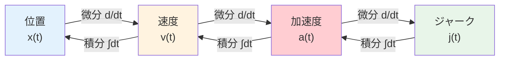

# 第12週：センサ信号の微分・積分と加速度センサ

> ⏱️ 読了時間：約35分 | 📝 確認問題：5問

## 学習目標

この週の講義を終えると、以下のことができるようになります：

- [ ] 位置・速度・加速度・ジャークの微積分関係を説明できる
- [ ] 微分型センサと積分型センサの違いを理解できる
- [ ] 離散差分による数値微分を計算できる
- [ ] 台形法による数値積分を計算できる
- [ ] 加速度センサ（サイズモ系）の原理と運動方程式を説明できる

---

## 1. 位置・速度・加速度・ジャークの関係

物理量間の微分・積分関係は、センサの選定と信号処理の基礎です。

$$v(t) = \frac{dx}{dt}, \quad a(t) = \frac{dv}{dt} = \frac{d^2x}{dt^2}, \quad j(t) = \frac{da}{dt} = \frac{d^3x}{dt^3}$$

### 1.1 微分型センサと積分型センサ

| 種別 | 説明 | 例 |
|------|------|-----|
| **微分型センサ** | ある物理量を計測し、微分処理で別の量を得る | 位置センサ → 速度（微分） |
| **積分型センサ** | ある物理量を計測し、積分処理で別の量を得る | 加速度センサ → 速度（積分） |

::: tip 💡 ポイント
計測したい物理量を直接計測できない場合、関連する物理量を計測し、**微分**または**積分**で目的の量を算出します。
:::

---

## 2. 微分と差分

### 2.1 アナログ微分と離散差分

連続信号の微分は、ディジタル計測では**離散差分**で近似します。

::: info テイラー展開による1次近似
関数 $f(x)$ の $x = a$ における**テイラー展開**の1次近似：

$$f(a + h) \approx f(a) + f'(a) \cdot h$$

これを変形すると：

$$f'(a) \approx \frac{f(a + h) - f(a)}{h}$$

これが**前進差分**（Forward Difference）です。
:::

<svg viewBox="0 0 450 200" xmlns="http://www.w3.org/2000/svg" style="max-width: 450px; margin: 20px auto; display: block;">
  <text x="225" y="18" text-anchor="middle" font-size="12" fill="#333" font-weight="bold">前進差分の概念</text>
  <line x1="60" y1="170" x2="420" y2="170" stroke="#333" stroke-width="1.5"/>
  <line x1="60" y1="170" x2="60" y2="30" stroke="#333" stroke-width="1.5"/>
  <text x="420" y="185" text-anchor="end" font-size="10" fill="#333">x</text>
  <text x="55" y="35" text-anchor="end" font-size="10" fill="#333">f(x)</text>
  <path d="M80,150 Q150,120 200,80 Q250,50 350,40" fill="none" stroke="#1565C0" stroke-width="2"/>
  <circle cx="150" cy="115" r="4" fill="#F44336"/>
  <circle cx="250" cy="60" r="4" fill="#F44336"/>
  <line x1="150" y1="115" x2="250" y2="60" stroke="#FF9800" stroke-width="2" stroke-dasharray="5,3"/>
  <line x1="150" y1="170" x2="150" y2="115" stroke="#757575" stroke-width="1" stroke-dasharray="3,3"/>
  <line x1="250" y1="170" x2="250" y2="60" stroke="#757575" stroke-width="1" stroke-dasharray="3,3"/>
  <text x="150" y="185" text-anchor="middle" font-size="10" fill="#333">a</text>
  <text x="250" y="185" text-anchor="middle" font-size="10" fill="#333">a+h</text>
  <line x1="155" y1="162" x2="245" y2="162" stroke="#9C27B0" stroke-width="1.5"/>
  <text x="200" y="158" text-anchor="middle" font-size="9" fill="#9C27B0">h</text>
  <text x="310" y="90" font-size="10" fill="#FF9800">差分近似（傾き）</text>
  <text x="310" y="75" font-size="10" fill="#1565C0">真の曲線</text>
</svg>

### 2.2 差分の種類

| 種類 | 公式 | 精度 |
|------|------|------|
| **前進差分** | $f'(x) \approx \dfrac{f(x+h)-f(x)}{h}$ | 1次 |
| **後退差分** | $f'(x) \approx \dfrac{f(x)-f(x-h)}{h}$ | 1次 |
| **中心差分** | $f'(x) \approx \dfrac{f(x+h)-f(x-h)}{2h}$ | 2次 |

::: warning ⚠️ 注意
離散差分では、サンプリング間隔 $h$ が小さすぎるとノイズの影響が大きくなり、大きすぎると近似精度が下がります。適切な $h$ の選択が重要です。
:::

---

## 3. 積分型センサと数値積分

### 3.1 台形法（Trapezoidal Rule）

::: info 台形法の原理
区間 $[a, b]$ を $N$ 等分し、各小区間を**台形**で近似して面積を求める方法です。
:::

$$\int_a^b f(x)\,dx \approx \sum_{k=0}^{N-1} \frac{1}{2}\bigl(f(x_k) + f(x_{k+1})\bigr)(x_{k+1} - x_k)$$

<svg viewBox="0 0 450 200" xmlns="http://www.w3.org/2000/svg" style="max-width: 450px; margin: 20px auto; display: block;">
  <text x="225" y="18" text-anchor="middle" font-size="12" fill="#333" font-weight="bold">台形法による数値積分</text>
  <line x1="60" y1="170" x2="400" y2="170" stroke="#333" stroke-width="1.5"/>
  <line x1="60" y1="170" x2="60" y2="30" stroke="#333" stroke-width="1.5"/>
  <path d="M100,140 Q150,100 200,70 Q250,50 300,55 Q350,70 370,90" fill="none" stroke="#1565C0" stroke-width="2"/>
  <polygon points="100,170 100,140 160,95 160,170" fill="#E3F2FD" fill-opacity="0.6" stroke="#1565C0" stroke-width="1"/>
  <polygon points="160,170 160,95 220,62 220,170" fill="#E3F2FD" fill-opacity="0.6" stroke="#1565C0" stroke-width="1"/>
  <polygon points="220,170 220,62 280,52 280,170" fill="#E3F2FD" fill-opacity="0.6" stroke="#1565C0" stroke-width="1"/>
  <polygon points="280,170 280,52 340,65 340,170" fill="#E3F2FD" fill-opacity="0.6" stroke="#1565C0" stroke-width="1"/>
  <circle cx="100" cy="140" r="3" fill="#F44336"/>
  <circle cx="160" cy="95" r="3" fill="#F44336"/>
  <circle cx="220" cy="62" r="3" fill="#F44336"/>
  <circle cx="280" cy="52" r="3" fill="#F44336"/>
  <circle cx="340" cy="65" r="3" fill="#F44336"/>
  <text x="100" y="185" text-anchor="middle" font-size="9" fill="#333">x₀</text>
  <text x="160" y="185" text-anchor="middle" font-size="9" fill="#333">x₁</text>
  <text x="220" y="185" text-anchor="middle" font-size="9" fill="#333">x₂</text>
  <text x="280" y="185" text-anchor="middle" font-size="9" fill="#333">x₃</text>
  <text x="340" y="185" text-anchor="middle" font-size="9" fill="#333">x₄</text>
</svg>

### 3.2 演習：台形法

::: details 演習：解析解と数値解の比較
**問題**：$\displaystyle\int_{-2}^{2}(x^3 - 2x + 4)\,dx$ を解析的に求め、台形法（分割数 $N=4$）の結果と比較せよ。

**解析解**：

$$\int_{-2}^{2}(x^3 - 2x + 4)\,dx = \left[\frac{x^4}{4} - x^2 + 4x\right]_{-2}^{2}$$

$$= \left(\frac{16}{4} - 4 + 8\right) - \left(\frac{16}{4} - 4 - 8\right) = 8 - (-8) = 16$$

**台形法**（$h = 1$, 分割点：$x = -2, -1, 0, 1, 2$）：

| $x_k$ | $f(x_k) = x^3 - 2x + 4$ |
|:------:|:------------------------:|
| $-2$ | $-8 + 4 + 4 = 0$ |
| $-1$ | $-1 + 2 + 4 = 5$ |
| $0$ | $0 - 0 + 4 = 4$ |
| $1$ | $1 - 2 + 4 = 3$ |
| $2$ | $8 - 4 + 4 = 8$ |

$$I \approx \frac{1}{2}(0+5)\cdot1 + \frac{1}{2}(5+4)\cdot1 + \frac{1}{2}(4+3)\cdot1 + \frac{1}{2}(3+8)\cdot1$$

$$= 2.5 + 4.5 + 3.5 + 5.5 = 16.0$$

この場合、3次関数に対して台形法でも正確な結果が得られました（奇関数成分が対称区間で打ち消し合うため）。
:::

---

## 4. 加速度センサ（サイズモ系）

### 4.1 構造と原理

::: info サイズモ系（Seismic System）
加速度センサの基本構造は、**バネ-マス-ダンパ系**です。筐体に加速度が加わると、内部の質量体が慣性により相対変位を起こし、その変位量から加速度を計測します。
:::

<svg viewBox="0 0 450 220" xmlns="http://www.w3.org/2000/svg" style="max-width: 450px; margin: 20px auto; display: block;">
  <text x="225" y="18" text-anchor="middle" font-size="12" fill="#333" font-weight="bold">サイズモ系（バネ-マス-ダンパ）</text>
  <rect x="100" y="30" width="250" height="170" fill="none" stroke="#757575" stroke-width="2" rx="5"/>
  <text x="225" y="215" text-anchor="middle" font-size="10" fill="#757575">筐体（加速度を受ける）</text>
  <rect x="180" y="100" width="90" height="50" fill="#E3F2FD" stroke="#1565C0" stroke-width="2" rx="3"/>
  <text x="225" y="130" text-anchor="middle" font-size="11" fill="#1565C0" font-weight="bold">質量 M</text>
  <line x1="140" y1="70" x2="140" y2="100" stroke="#F44336" stroke-width="2"/>
  <path d="M140,70 L130,78 L150,86 L130,94 L140,100" fill="none" stroke="#F44336" stroke-width="2"/>
  <text x="120" y="85" text-anchor="end" font-size="10" fill="#F44336">k</text>
  <line x1="180" y1="125" x2="140" y2="125" stroke="none"/>
  <rect x="290" y="75" width="15" height="50" fill="#FF9800" fill-opacity="0.3" stroke="#FF9800" stroke-width="1.5" rx="2"/>
  <line x1="297" y1="125" x2="297" y2="100" stroke="#FF9800" stroke-width="2"/>
  <text x="325" y="100" font-size="10" fill="#FF9800">c</text>
  <line x1="270" y1="125" x2="310" y2="125" stroke="#FF9800" stroke-width="1.5"/>
  <line x1="100" y1="70" x2="160" y2="70" stroke="#333" stroke-width="1.5"/>
  <line x1="100" y1="70" x2="100" y2="30" stroke="#333" stroke-width="1.5"/>
  <line x1="350" y1="70" x2="290" y2="70" stroke="#333" stroke-width="1.5"/>
  <line x1="350" y1="70" x2="350" y2="30" stroke="#333" stroke-width="1.5"/>
  <line x1="140" y1="70" x2="140" y2="45" stroke="#333" stroke-width="1"/>
  <line x1="297" y1="70" x2="297" y2="45" stroke="#333" stroke-width="1"/>
</svg>

### 4.2 運動方程式

筐体の加速度を $\alpha$、質量体の筐体に対する相対変位を $x$ とすると：

$$M\alpha = M\frac{d^2x}{dt^2} + kx + c\frac{dx}{dt}$$

ここで：
- $M$：質量体の質量 [kg]
- $k$：バネ定数 [N/m]
- $c$：ダンパの減衰係数 [N·s/m]
- $x$：質量体の相対変位 [m]
- $\alpha$：筐体の加速度 [m/s²]

::: tip 💡 ポイント
加速度が一定の場合（定常状態）、$\ddot{x} = 0$, $\dot{x} = 0$ となり：

$$M\alpha = kx \quad \Rightarrow \quad \alpha = \frac{k}{M}x$$

つまり、**変位 $x$ を計測すれば加速度 $\alpha$ が求まります**。
:::

### 4.3 変位の検出方法

質量体の相対変位を検出する方法はいくつかあります：

| 検出方式 | 原理 | 特徴 |
|---------|------|------|
| **ひずみゲージ** | 変形による抵抗変化 | 高精度、広帯域 |
| **静電容量式** | 電極間距離の変化で容量変化 | 小型化に適する（MEMS） |
| **圧電セラミックス** | 応力による電荷発生 | 高感度、AC成分のみ |

::: info MEMS加速度センサ
スマートフォンに内蔵されている加速度センサの多くは**静電容量式MEMS**です。シリコン基板上に微小なバネ-マス構造を形成し、電極間の容量変化を検出します。
:::

---

## 5. 演習問題

### 演習：加速度から速度への変換

::: details 演習：台形法による速度算出
**問題**：加速度センサの計測値が以下のとき、台形法で各時刻の速度を求めよ（初速 $v_0 = 0$）。

| $t$ [s] | 0.0 | 0.1 | 0.2 | 0.3 | 0.4 |
|---------|-----|-----|-----|-----|-----|
| $a$ [m/s²] | 0.0 | 2.0 | 4.0 | 3.0 | 1.0 |

**解答**：

$v(t_{k+1}) = v(t_k) + \dfrac{1}{2}(a_k + a_{k+1}) \cdot \Delta t$（$\Delta t = 0.1$ s）

- $v(0.1) = 0 + \frac{1}{2}(0.0 + 2.0) \times 0.1 = 0.10$ m/s
- $v(0.2) = 0.10 + \frac{1}{2}(2.0 + 4.0) \times 0.1 = 0.40$ m/s
- $v(0.3) = 0.40 + \frac{1}{2}(4.0 + 3.0) \times 0.1 = 0.75$ m/s
- $v(0.4) = 0.75 + \frac{1}{2}(3.0 + 1.0) \times 0.1 = 0.95$ m/s
:::

---

## 📝 確認問題

### Q1. 加速度を積分すると得られる物理量は？

- [ ] A. 位置
- [x] B. 速度
- [ ] C. ジャーク
- [ ] D. 力

### Q2. 中心差分が前進差分・後退差分より優れている点は？

- [ ] A. 計算量が少ない
- [x] B. 近似精度が高い（2次精度）
- [ ] C. 未来のデータが不要
- [ ] D. ノイズに強い

### Q3. 台形法の数値積分で、分割数を増やすとどうなるか？

- [x] A. 一般に近似精度が向上する
- [ ] B. 計算が不要になる
- [ ] C. 常に解析解と一致する
- [ ] D. 精度が低下する

### Q4. サイズモ系加速度センサの基本構造は？

- [ ] A. コイルと磁石
- [ ] B. LEDとフォトトランジスタ
- [x] C. バネ-マス-ダンパ系
- [ ] D. 分圧回路

### Q5. MEMS加速度センサで一般的に使用される検出原理は？

- [ ] A. 圧電効果
- [x] B. 静電容量変化
- [ ] C. 光反射光量
- [ ] D. 電磁誘導

---

## 📚 次週の予習

- **第13週**: 力センサとひずみゲージ
- 予習ポイント：応力とひずみの関係（フックの法則）、ホイートストンブリッジの基本
