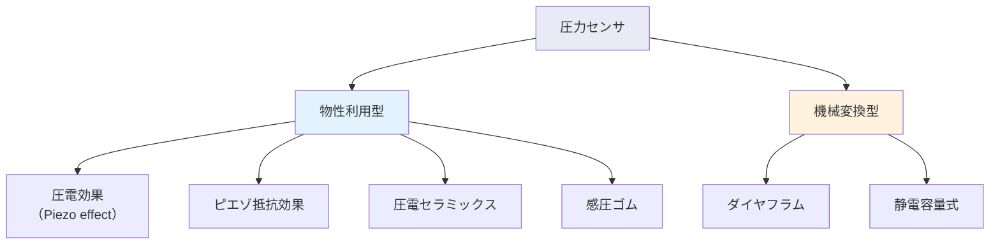

# 第14週：圧力センサ

> ⏱️ 読了時間：約35分 | 📝 確認問題：5問

## 学習目標

この週の講義を終えると、以下のことができるようになります：

- [ ] 圧力の定義と単位を説明できる
- [ ] 圧電効果・ダイヤフラム・ピエゾ抵抗効果の原理を説明できる
- [ ] 静電容量式圧力センサの原理と計算ができる
- [ ] 感圧ゴムの動作原理を理解できる
- [ ] LC共振回路を用いた容量計測の原理を説明できる

---

## 1. 圧力の基礎

### 1.1 圧力の定義

::: info 定義
**圧力**とは、単位面積あたりに作用する力です。

$$P = \frac{F}{A} \quad [\text{Pa}]$$

- $P$：圧力 [Pa = N/m²]
- $F$：力 [N]
- $A$：面積 [m²]
:::

### 1.2 圧力センサの分類

---

## 2. 圧電効果（Piezo Effect）

### 2.1 原理

::: info 圧電効果
**強誘電体結晶**（水晶、チタン酸バリウムなど）に圧力を加えると、結晶表面に**電荷**が発生する現象。圧力に比例した電圧を得ることができます。
:::

<svg viewBox="0 0 450 180" xmlns="http://www.w3.org/2000/svg" style="max-width: 450px; margin: 20px auto; display: block;">
  <text x="225" y="18" text-anchor="middle" font-size="12" fill="#333" font-weight="bold">圧電効果の原理</text>
  <rect x="150" y="40" width="150" height="100" fill="#E3F2FD" stroke="#1565C0" stroke-width="2" rx="3"/>
  <text x="225" y="95" text-anchor="middle" font-size="11" fill="#1565C0" font-weight="bold">圧電結晶</text>
  <line x1="160" y1="40" x2="290" y2="40" stroke="#FF9800" stroke-width="3"/>
  <line x1="160" y1="140" x2="290" y2="140" stroke="#FF9800" stroke-width="3"/>
  <text x="225" y="35" text-anchor="middle" font-size="10" fill="#FF9800">電極（+）</text>
  <text x="225" y="155" text-anchor="middle" font-size="10" fill="#FF9800">電極（−）</text>
  <line x1="225" y1="40" x2="225" y2="25" stroke="#F44336" stroke-width="2"/>
  <polygon points="220,28 225,18 230,28" fill="#F44336"/>
  <text x="225" y="15" text-anchor="middle" font-size="9" fill="#F44336">F（圧力）</text>
  <line x1="225" y1="140" x2="225" y2="155" stroke="#F44336" stroke-width="2"/>
  <polygon points="220,152 225,162 230,152" fill="#F44336"/>
  <text x="340" y="75" font-size="10" fill="#9C27B0">圧力 → 電荷発生</text>
  <text x="340" y="95" font-size="10" fill="#9C27B0">Q ∝ F</text>
  <text x="340" y="115" font-size="10" fill="#9C27B0">V = Q/C</text>
</svg>

::: tip 💡 ポイント
圧電素子はAC成分（動的圧力変化）のみ検出でき、静的な一定圧力の計測には向きません（電荷がリークするため）。
:::

---

## 3. ダイヤフラム方式

### 3.1 原理

::: info ダイヤフラムの原理
薄い弾性膜（ダイヤフラム）の片面に圧力を加えると、膜がたわみ変形します。この変形量を検出して圧力を計測します。固定端梁のたわみ変位の理論に基づきます。
:::

<svg viewBox="0 0 450 180" xmlns="http://www.w3.org/2000/svg" style="max-width: 450px; margin: 20px auto; display: block;">
  <text x="225" y="18" text-anchor="middle" font-size="12" fill="#333" font-weight="bold">ダイヤフラム式圧力センサ</text>
  <rect x="80" y="60" width="290" height="10" fill="#757575" stroke="#333" stroke-width="1"/>
  <rect x="80" y="110" width="290" height="10" fill="#757575" stroke="#333" stroke-width="1"/>
  <line x1="80" y1="60" x2="80" y2="120" stroke="#333" stroke-width="2"/>
  <line x1="370" y1="60" x2="370" y2="120" stroke="#333" stroke-width="2"/>
  <path d="M80,90 Q225,110 370,90" fill="none" stroke="#1565C0" stroke-width="2.5"/>
  <path d="M80,90 L370,90" fill="none" stroke="#1565C0" stroke-width="1" stroke-dasharray="4,3"/>
  <text x="225" y="55" text-anchor="middle" font-size="10" fill="#F44336">P（圧力）</text>
  <line x1="150" y1="58" x2="150" y2="75" stroke="#F44336" stroke-width="1.5"/>
  <polygon points="147,72 150,80 153,72" fill="#F44336"/>
  <line x1="225" y1="58" x2="225" y2="75" stroke="#F44336" stroke-width="1.5"/>
  <polygon points="222,72 225,80 228,72" fill="#F44336"/>
  <line x1="300" y1="58" x2="300" y2="75" stroke="#F44336" stroke-width="1.5"/>
  <polygon points="297,72 300,80 303,72" fill="#F44336"/>
  <line x1="380" y1="90" x2="420" y2="90" stroke="#757575" stroke-width="1" stroke-dasharray="3,3"/>
  <line x1="380" y1="105" x2="420" y2="105" stroke="#757575" stroke-width="1" stroke-dasharray="3,3"/>
  <line x1="415" y1="90" x2="415" y2="105" stroke="#9C27B0" stroke-width="1.5"/>
  <text x="435" y="100" font-size="9" fill="#9C27B0">Δd</text>
  <text x="225" y="145" text-anchor="middle" font-size="10" fill="#1565C0">ダイヤフラム（弾性膜）</text>
</svg>

### 3.2 ピエゾ抵抗効果

::: info ピエゾ抵抗効果
圧力によるダイヤフラムの変形が、膜上に形成された抵抗体の**抵抗値を変化**させる効果。ひずみゲージと同様の原理ですが、半導体の結晶構造を利用するため高感度です。
:::

---

## 4. 圧電セラミックスと感圧ゴム

### 4.1 圧電セラミックス

::: info 特徴
圧電セラミックス（PZT等）は、応力の方向に**依存しない**電荷を発生させます。多結晶体のため等方的な応答が得られます。
:::

### 4.2 感圧ゴム

::: info 感圧ゴムの原理
ゴム中に**炭素粒子**（カーボン）が分散されています。荷重が増加すると炭素粒子同士の**接触面積が増加**し、電気抵抗が**減少**します。
:::

<svg viewBox="0 0 400 200" xmlns="http://www.w3.org/2000/svg" style="max-width: 400px; margin: 20px auto; display: block;">
  
  <text x="200" y="18" text-anchor="middle" font-size="12" fill="#333" font-weight="bold">感圧ゴムの原理（アニメーション）</text>
  <rect x="55" y="40" width="290" height="110" fill="#FFF9C4" fill-opacity="0.5" stroke="#F9A825" stroke-width="1.5" rx="5" class="pr-body"/>
  <polygon points="200,25 195,35 205,35" fill="#F44336" class="pr-arrow"/>
  <text x="200" y="23" text-anchor="middle" font-size="9" fill="#F44336" class="pr-arrow">F</text>
  <circle cx="90" cy="70" r="7" fill="#333" style="animation: p1Move 6s ease-in-out infinite;"/>
  <circle cx="180" cy="60" r="7" fill="#333" style="animation: p2Move 6s ease-in-out infinite;"/>
  <circle cx="280" cy="85" r="7" fill="#333" style="animation: p3Move 6s ease-in-out infinite;"/>
  <circle cx="120" cy="110" r="7" fill="#333" style="animation: p4Move 6s ease-in-out infinite;"/>
  <circle cx="250" cy="120" r="7" fill="#333" style="animation: p5Move 6s ease-in-out infinite;"/>
  <circle cx="310" cy="130" r="7" fill="#333" style="animation: p6Move 6s ease-in-out infinite;"/>
  <circle cx="70" cy="130" r="7" fill="#333" style="animation: p7Move 6s ease-in-out infinite;"/>
  <circle cx="200" cy="100" r="7" fill="#333" style="animation: p8Move 6s ease-in-out infinite;"/>
  <text x="200" y="175" text-anchor="middle" font-size="11" fill="#FF5722" font-weight="bold" class="pr-label-spread">R：大（粒子分散）</text>
  <text x="200" y="175" text-anchor="middle" font-size="11" fill="#4CAF50" font-weight="bold" class="pr-label-compressed">R：小（粒子接触）</text>
  <text x="200" y="193" text-anchor="middle" font-size="9" fill="#757575">炭素粒子が圧縮されると接触が増え抵抗が減少</text>
</svg>

| 特性 | 内容 |
|------|------|
| **入力** | 荷重（圧力） |
| **出力** | 抵抗値の変化 |
| **荷重増加時** | 炭素粒子の接触増 → 抵抗減少 |
| **利点** | 柔軟、安価、面状センサ化が容易 |
| **欠点** | 精度が低い、ヒステリシスが大きい |

---

## 5. 静電容量式圧力センサ

### 5.1 原理

::: info 静電容量の基本式
平行平板コンデンサの静電容量：

$$C = \varepsilon \frac{A}{d}$$

- $C$：静電容量 [F]
- $\varepsilon$：誘電率 [F/m]
- $A$：電極面積 [m²]
- $d$：電極間距離 [m]
:::

<svg viewBox="0 0 450 210" xmlns="http://www.w3.org/2000/svg" style="max-width: 450px; margin: 20px auto; display: block;">
  
  <text x="225" y="18" text-anchor="middle" font-size="12" fill="#333" font-weight="bold">静電容量式圧力センサ（アニメーション）</text>
  <rect x="100" y="50" width="200" height="8" fill="#1565C0" rx="2" class="cap-top"/>
  <rect x="100" y="130" width="200" height="8" fill="#1565C0" rx="2"/>
  <text x="330" y="58" font-size="10" fill="#1565C0">上部電極（可動）</text>
  <text x="330" y="138" font-size="10" fill="#1565C0">下部電極（固定）</text>
  <line x1="130" y1="70" x2="130" y2="120" stroke="#9C27B0" stroke-width="1" stroke-dasharray="8,12" class="cap-field"/>
  <line x1="170" y1="70" x2="170" y2="120" stroke="#9C27B0" stroke-width="1" stroke-dasharray="8,12" class="cap-field"/>
  <line x1="230" y1="70" x2="230" y2="120" stroke="#9C27B0" stroke-width="1" stroke-dasharray="8,12" class="cap-field"/>
  <line x1="270" y1="70" x2="270" y2="120" stroke="#9C27B0" stroke-width="1" stroke-dasharray="8,12" class="cap-field"/>
  <line x1="200" y1="58" x2="200" y2="130" stroke="#9C27B0" stroke-width="1.5" stroke-dasharray="4,3" class="cap-gap"/>
  <text x="215" y="95" font-size="10" fill="#9C27B0" class="cap-label-d">d</text>
  <text x="215" y="118" font-size="10" fill="#FF5722" class="cap-label-dprime">d’</text>
  <polygon points="197,38 200,30 203,38" fill="#F44336" class="cap-arrow"/>
  <text x="200" y="28" text-anchor="middle" font-size="10" fill="#F44336" class="cap-arrow">F</text>
  <rect x="80" y="160" width="240" height="20" fill="#E0E0E0" stroke="#757575" stroke-width="1.5" rx="3"/>
  <text x="200" y="175" text-anchor="middle" font-size="10" fill="#757575">基板</text>
  <text x="200" y="198" text-anchor="middle" font-size="11" fill="#4CAF50" font-weight="bold" class="cap-c-increase">d ↓ → C ↑</text>
  <text x="200" y="198" text-anchor="middle" font-size="10" fill="#333" class="cap-label-d">荷重 F → d 減少 → C 増加</text>
</svg>

荷重による電極間距離の変化：

$$d' = d - \Delta d$$

$$C' = \varepsilon \frac{A}{d - \Delta d} > C$$

### 5.2 荷重の算出

バネ定数 $k$ のダイヤフラムの場合：

$$\omega = -k \Delta d = k(d - d')$$

::: details 演習：静電容量式圧力センサの計算
**問題**：電極面積 $A = 1$ mm²、初期間隔 $d = 100\ \mu$m、誘電率 $\varepsilon = 8.854 \times 10^{-12}$ F/m の静電容量式センサに荷重を加えて間隔が $80\ \mu$m に変化した。バネ定数 $k = 5000$ N/m のとき、容量変化と荷重を求めよ。

**解答**：

1. 初期容量：

$$C = \varepsilon \frac{A}{d} = 8.854 \times 10^{-12} \times \frac{1 \times 10^{-6}}{100 \times 10^{-6}} = 0.0886 \text{ [pF]}$$

2. 変化後の容量：

$$C' = 8.854 \times 10^{-12} \times \frac{1 \times 10^{-6}}{80 \times 10^{-6}} = 0.1107 \text{ [pF]}$$

3. 荷重：

$$\omega = k \cdot \Delta d = 5000 \times (100 - 80) \times 10^{-6} = 0.1 \text{ [N]}$$
:::

---

## 6. LC共振回路による容量計測

### 6.1 原理

::: info LC共振回路
インダクタ $L$ とコンデンサ $C$ を接続した回路の**共振周波数**は：

$$f = \frac{1}{2\pi\sqrt{LC}}$$

静電容量 $C$ が変化すると共振周波数が変化するため、**周波数を計測**することで容量変化（＝圧力）を検出できます。
:::

<svg viewBox="0 0 450 160" xmlns="http://www.w3.org/2000/svg" style="max-width: 450px; margin: 20px auto; display: block;">
  <text x="225" y="18" text-anchor="middle" font-size="12" fill="#333" font-weight="bold">LC共振回路</text>
  <rect x="100" y="50" width="80" height="60" fill="none" stroke="#333" stroke-width="2" rx="3"/>
  <path d="M120,60 L120,100" fill="none" stroke="#1565C0" stroke-width="2"/>
  <path d="M115,70 L125,75 L115,80 L125,85 L115,90" fill="none" stroke="#1565C0" stroke-width="2"/>
  <text x="140" y="85" font-size="10" fill="#1565C0" font-weight="bold">L</text>
  <line x1="155" y1="70" x2="165" y2="70" stroke="#F44336" stroke-width="2"/>
  <line x1="155" y1="90" x2="165" y2="90" stroke="#F44336" stroke-width="2"/>
  <text x="162" y="85" font-size="10" fill="#F44336" font-weight="bold">C</text>
  <text x="300" y="60" font-size="10" fill="#333">C が変化すると</text>
  <text x="300" y="80" font-size="10" fill="#333">f が変化する</text>
  <text x="300" y="105" font-size="11" fill="#9C27B0" font-weight="bold">f = 1/(2π√LC)</text>
  <text x="300" y="130" font-size="10" fill="#757575">C↑ → f↓</text>
  <text x="300" y="145" font-size="10" fill="#757575">C↓ → f↑</text>
</svg>

::: tip 💡 ポイント
周波数計測は**ノイズに強い**という利点があります。電圧の大きさは伝送中に減衰しますが、周波数は変化しないためです。
:::

---

## 7. 圧力センサの比較まとめ

| センサ方式 | 検出量 | 静的計測 | 動的計測 | 特徴 |
|-----------|--------|:-------:|:-------:|------|
| **圧電式** | 電荷 | ✗ | ✓ | 高感度、AC成分のみ |
| **ピエゾ抵抗式** | 抵抗変化 | ✓ | ✓ | 高精度、MEMS化容易 |
| **静電容量式** | 容量変化 | ✓ | ✓ | 小型、低消費電力 |
| **感圧ゴム** | 抵抗変化 | ✓ | △ | 安価、面状化容易 |
| **ダイヤフラム+ゲージ** | ひずみ | ✓ | ✓ | 高精度、産業用途 |

---

## 📝 確認問題

### Q1. 圧力の定義として正しいのは？

- [x] A. 単位面積あたりの力
- [ ] B. 単位体積あたりの力
- [ ] C. 単位長さあたりの力
- [ ] D. 単位質量あたりの力

### Q2. 圧電効果で検出できないのは？

- [ ] A. 振動
- [ ] B. 衝撃
- [x] C. 静的な一定圧力
- [ ] D. 音波

### Q3. 静電容量式圧力センサで荷重を加えると容量はどうなるか？

- [x] A. 増加する（電極間距離が減少するため）
- [ ] B. 減少する
- [ ] C. 変化しない
- [ ] D. ゼロになる

### Q4. 感圧ゴムに荷重を加えると電気抵抗はどうなるか？

- [ ] A. 増加する
- [x] B. 減少する（炭素粒子の接触が増えるため）
- [ ] C. 変化しない
- [ ] D. 無限大になる

### Q5. LC共振回路の共振周波数の式として正しいのは？

- [ ] A. f = 2πLC
- [ ] B. f = 2π√(LC)
- [x] C. f = 1/(2π√(LC))
- [ ] D. f = √(LC)/(2π)

---

## 📚 次週の予習

- **第15週**: まとめと総合演習
- 予習ポイント：第1週〜第14週の全体を振り返り、各センサの原理と特徴を整理しておく
