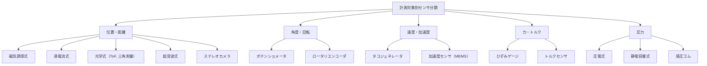
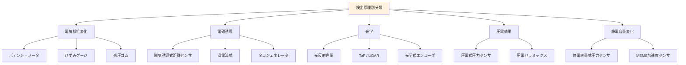
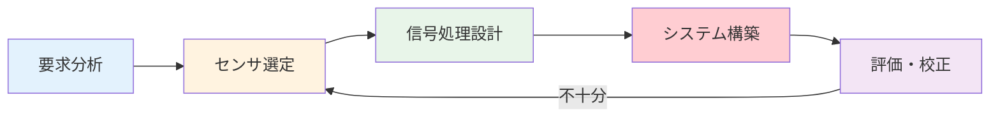

# 第15週：まとめと総合演習

> ⏱️ 読了時間：約45分 | 📝 確認問題：5問

## 学習目標

この週の講義を終えると、以下のことができるようになります：

- [ ] 全14週の講義内容を体系的に整理できる
- [ ] センサを物理量別・検出原理別に分類できる
- [ ] 計測システム設計の基本的な流れを説明できる
- [ ] 各週の内容を横断する応用問題を解くことができる
- [ ] 期末試験に向けた重要ポイントを把握できる

---

## 1. 全体の振り返り

### 1.1 各週の要点まとめ

| 週 | テーマ | 重要キーワード |
|:--:|--------|--------------|
| 1 | センサの基礎 | 内界/外界センサ、物理量変換、フィードバック制御 |
| 2 | 誤差と精度 | 人為的/系統/不定誤差、確度vs精度、補正vs改ざん |
| 3 | 統計処理(1) | 平均、分散、標準偏差、最小二乗法 |
| 4 | 統計処理(2) | 回帰分析、相関係数、疑似相関 |
| 5 | 統計処理(3) | 内挿、外挿、ゼロ次ホールド、線形補間、スプライン |
| 6 | 信号処理 | A/D変換、サンプリング定理、分解能、移動平均 |
| 7 | 信号特性 | 線形性、ヒステリシス、繰り返し精度、過渡応答 |
| 8 | 中間試験 | 第1〜7週の総合 |
| 9 | 位置・距離 | 磁気式、光学式（ToF, 三角測量）、超音波、LiDAR |
| 10 | 画像センサ | CCD, CMOS、画像処理、色空間 |
| 11 | 角度・回転 | ポテンショメータ、ロータリエンコーダ、タコジェネレータ |
| 12 | 微分・積分 | 数値微分（差分）、台形法、加速度センサ（サイズモ系） |
| 13 | 力・ひずみ | ひずみゲージ、ホイートストンブリッジ、トルクセンサ |
| 14 | 圧力 | 圧電効果、静電容量式、感圧ゴム、LC共振 |

---

## 2. センサの分類体系

### 2.1 計測対象（物理量）別の分類

### 2.2 検出原理別の分類

---

## 3. 計測システム設計の考え方

| ステップ | 内容 | 考慮事項 |
|---------|------|---------|
| **要求分析** | 何を、どの精度で計測するか | 計測範囲、分解能、応答速度 |
| **センサ選定** | 原理・方式の選択 | コスト、環境条件、設置制約 |
| **信号処理設計** | A/D変換、フィルタリング、校正 | サンプリング周波数、ノイズ対策 |
| **システム構築** | ハード・ソフトの実装 | 配線、電源、プログラム |
| **評価・校正** | 精度評価、誤差分析 | 確度、精度、再現性、ヒステリシス |

::: tip 💡 設計の鍵
センサ選定では、「直接計測できるか？」を最初に考えます。直接計測が困難な場合は、微分型・積分型センサの組み合わせや、間接計測を検討します。
:::

---

## 4. 総合演習問題

### 演習1：エンコーダの分解能と信号処理

::: details 問題と解答
**問題**：8ビットのアブソリュート型エンコーダの分解能を求め、さらに分解能 0.05° を実現するために必要なビット数を求めよ。

**解答**：

1. 8ビットの分解能：

$$\text{分解能} = \frac{360°}{2^8} = \frac{360}{256} = 1.406°$$

2. 0.05° を実現するビット数：

$$2^n \geq \frac{360}{0.05} = 7200$$

$$n \geq \log_2 7200 = \frac{\ln 7200}{\ln 2} \approx 12.81$$

よって **13ビット以上** が必要（$2^{13} = 8192$ 分割、分解能 $\approx 0.044°$）。
:::

### 演習2：ひずみゲージとホイートストンブリッジ

::: details 問題と解答
**問題**：アルミニウム（$E = 70$ GPa）の棒（断面積 $A = 20$ mm²）に引張荷重 $\omega = 700$ N を加えた。ゲージ率 $K = 2.1$、入力電圧 $V_{in} = 5$ V のホイートストンブリッジにおける出力電圧を求めよ。

**解答**：

1. 応力：$\sigma = \dfrac{700}{20 \times 10^{-6}} = 35 \times 10^6$ Pa $= 35$ MPa

2. ひずみ：$\varepsilon = \dfrac{35 \times 10^6}{70 \times 10^9} = 5 \times 10^{-4}$

3. 出力電圧（1ゲージ構成）：

$$V_{out} = \frac{V_{in}}{4} \cdot K\varepsilon = \frac{5}{4} \times 2.1 \times 5 \times 10^{-4} = 1.3125 \text{ [mV]}$$
:::

### 演習3：ToF方式と超音波の比較

::: details 問題と解答
**問題**：同じ距離 $L = 5$ m の物体を計測するとき、(a) レーザ ToF と (b) 超音波（音速 340 m/s）のそれぞれの往復時間を求めよ。

**解答**：

(a) レーザ ToF（$c = 3 \times 10^8$ m/s）：

$$t = \frac{2L}{c} = \frac{2 \times 5}{3 \times 10^8} = 3.33 \times 10^{-8} \text{ [s]} \approx 33.3 \text{ [ns]}$$

(b) 超音波（$v = 340$ m/s）：

$$t = \frac{2L}{v} = \frac{2 \times 5}{340} = 0.0294 \text{ [s]} \approx 29.4 \text{ [ms]}$$

超音波の方が約 $10^6$ 倍遅いため、計時回路の精度要件が緩くなります。
:::

### 演習4：静電容量式センサと数値積分

::: details 問題と解答
**問題**：静電容量式加速度センサの出力が以下の加速度データを示した。台形法で $t = 0$ s から $t = 0.4$ s までの速度変化を求めよ（初速 $v_0 = 0$）。

| $t$ [s] | 0.0 | 0.1 | 0.2 | 0.3 | 0.4 |
|---------|-----|-----|-----|-----|-----|
| $a$ [m/s²] | 0 | 5 | 10 | 8 | 3 |

**解答**：

$$v(0.4) = \sum_{k=0}^{3} \frac{1}{2}(a_k + a_{k+1}) \cdot \Delta t$$

$$= \frac{1}{2}(0+5)(0.1) + \frac{1}{2}(5+10)(0.1) + \frac{1}{2}(10+8)(0.1) + \frac{1}{2}(8+3)(0.1)$$

$$= 0.25 + 0.75 + 0.90 + 0.55 = 2.45 \text{ [m/s]}$$
:::

### 演習5：センサの選定（総合判断）

::: details 問題と解答
**問題**：以下の要件を満たすセンサの組み合わせを提案せよ。

- ロボットアームの6つの関節角度を計測（電源OFF後も位置保持）
- アーム先端にかかる力を検出
- 高速で動く対象物までの距離を非接触で計測

**解答**：

1. **関節角度**：アブソリュート型ロータリエンコーダ（6個）
   - 理由：電源OFF後も位置情報を保持、絶対角度が必要

2. **力検出**：ひずみゲージ（ホイートストンブリッジ構成）
   - 理由：高精度な力計測、6軸力覚センサとしても構成可能

3. **非接触距離計測**：ToF方式（LiDAR）
   - 理由：高速走査が可能、屋内外で使用可能
   - 代替案：超音波（低コスト）、ステレオカメラ（3D情報取得可能）
:::

---

## 5. 期末試験対策のポイント

### 5.1 頻出テーマ

::: danger 🔴 最重要（計算問題として出題されやすい）
1. **エンコーダの分解能計算**（インクリメンタル/アブソリュート）
2. **ひずみゲージの計算**（応力→ひずみ→抵抗変化→出力電圧）
3. **ホイートストンブリッジ**（平衡条件、出力電圧の公式）
4. **ToF計算**（距離 = 光速 × 時間 / 2）
5. **台形法による数値積分**
:::

::: warning ⚠️ 重要（記述・選択問題として出題されやすい）
1. 各センサの**動作原理**の説明
2. **誤差の分類**（人為的/系統/不定）
3. **確度と精度の違い**
4. **補正と改ざんの違い**
5. センサの**比較・選定**の判断
:::

### 5.2 公式一覧

| 公式 | 内容 | 関連週 |
|------|------|:------:|
| $L = ct/2$ | ToF距離計測 | 9 |
| $Z = fB/d$ | ステレオカメラ | 9 |
| 分解能 $= 2\pi/n$ | インクリメンタルエンコーダ | 11 |
| 分解能 $= 2\pi/2^n$ | アブソリュートエンコーダ | 11 |
| $\sigma = E\varepsilon$ | フックの法則 | 13 |
| $\Delta R/R = K\varepsilon$ | ひずみゲージ | 13 |
| $R_1 R_4 = R_2 R_3$ | ブリッジ平衡条件 | 13 |
| $C = \varepsilon A/d$ | 静電容量 | 14 |
| $f = 1/(2\pi\sqrt{LC})$ | LC共振 | 14 |

---

## 📝 確認問題

### Q1. 微分型センサの例として正しいのは？

- [x] A. 位置センサの出力を微分して速度を得る
- [ ] B. 加速度センサの出力を微分して速度を得る
- [ ] C. ひずみゲージの出力を微分して力を得る
- [ ] D. 圧力センサの出力を微分して温度を得る

### Q2. ホイートストンブリッジの利点として最も適切なのは？

- [ ] A. 回路が単純で安価
- [x] B. 微小な抵抗変化を高精度に検出できる
- [ ] C. 交流信号の周波数を検出できる
- [ ] D. 大電流を流すことができる

### Q3. アブソリュート型エンコーダがインクリメンタル型より優れている点は？

- [ ] A. コストが低い
- [ ] B. 分解能が必ず高い
- [x] C. 電源OFF後も位置情報を保持できる
- [ ] D. 構造が単純

### Q4. 加速度センサ（サイズモ系）の基本モデルはどれか？

- [ ] A. LC共振回路
- [x] B. バネ-マス-ダンパ系
- [ ] C. ホイートストンブリッジ
- [ ] D. 分圧回路

### Q5. 計測システム設計で最初に行うべきステップは？

- [x] A. 要求分析（計測対象と必要精度の明確化）
- [ ] B. センサの購入
- [ ] C. プログラムの作成
- [ ] D. データの解析

---

## 📚 次週の予習

- **第16週**: 期末試験（理解度確認テスト）
- 準備：本ページの公式一覧と各週の確認問題を復習しておくこと
